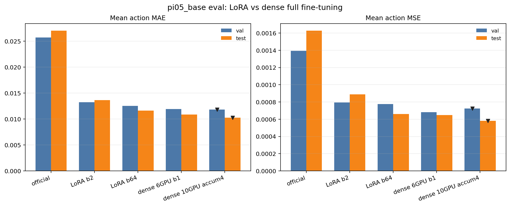
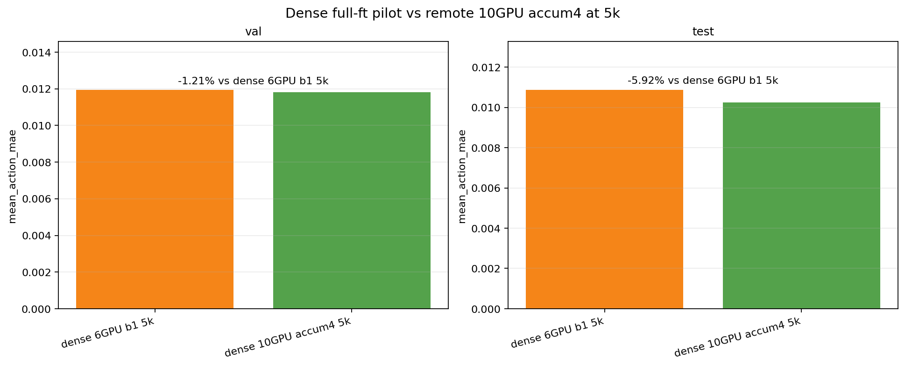
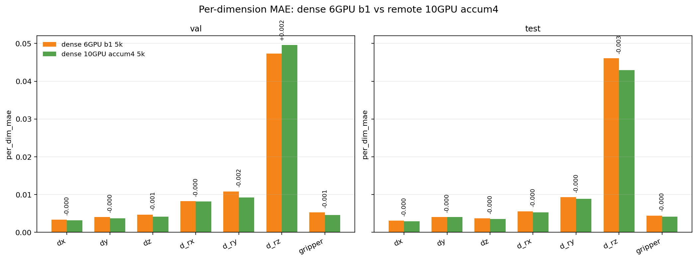
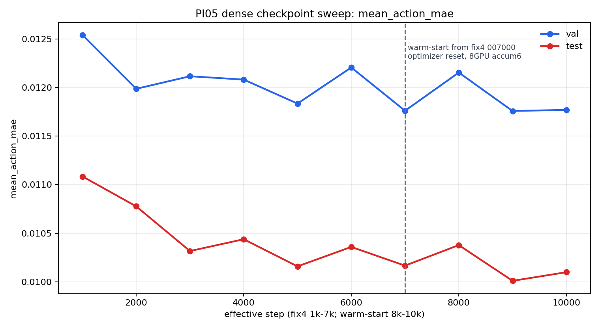
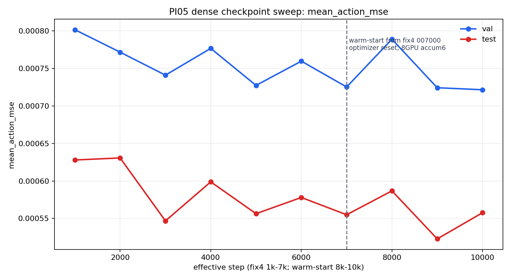
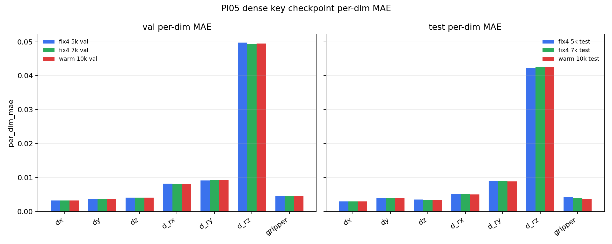
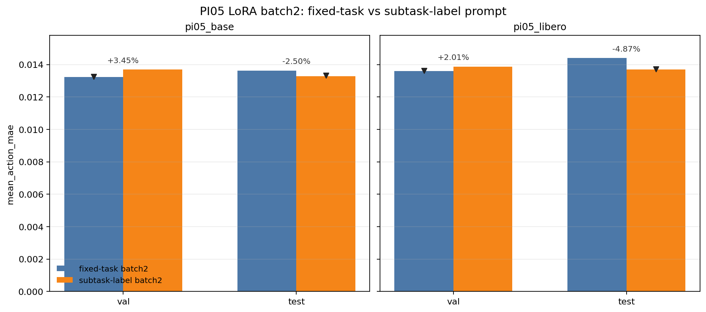
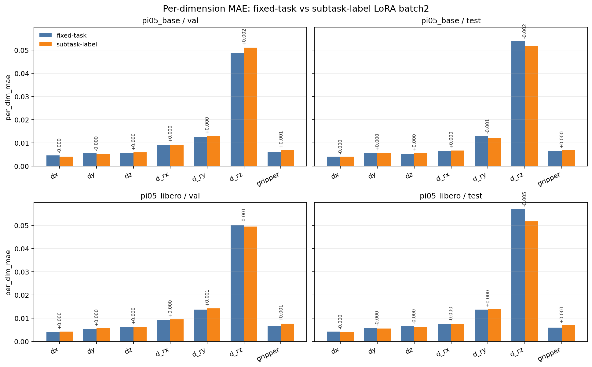
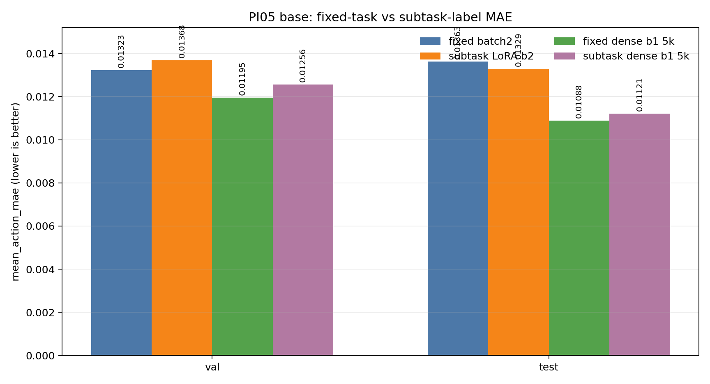
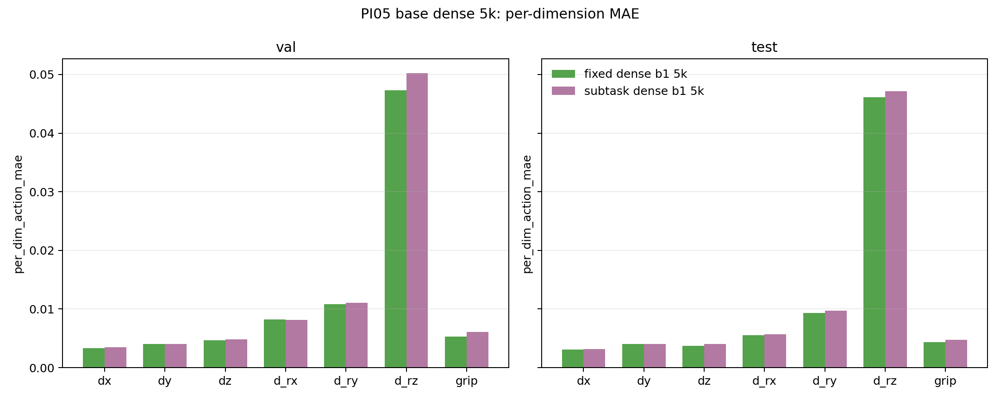

# PI05 Official vs Batch2 vs Batch64 vs Dense Pilot Training / Eval Report

- Generated at: `2026-04-23 12:40:06`
- Last updated: `2026-05-02 18:20 CST`
- Report assets dir: `/home/wjz/rl-vla/docs/pi05_batch_report_20260422_assets`

## 1. 训练状态总览

| run | step | progress | loss | grad_norm | lr | update_s | global_batch | samples/s | ETA to finish | last metric ts |
| --- | ---: | ---: | ---: | ---: | ---: | ---: | ---: | ---: | --- | --- |
| pi05_base batch2 | 20000/20000 | 100.0% | 0.1110 | 0.3000 | 2.50e-06 | 0.353 | 8 | 21.7 | 0.0 h | 2026-04-21 21:57:53 |
| pi05_libero batch2 | 20000/20000 | 100.0% | 0.1260 | 0.3490 | 2.50e-06 | 0.354 | 8 | 22.2 | 0.0 h | 2026-04-21 21:43:46 |
| pi05_base batch64 | 20000/20000 | 100.0% | 0.0860 | 0.1030 | 2.50e-06 | 4.770 | 256 | 52.9 | 0.0 h | 2026-04-23 01:33:53 |
| pi05_libero batch64 | 20000/20000 | 100.0% | 0.0940 | 0.1080 | 2.50e-06 | 4.763 | 256 | 52.2 | 0.0 h | 2026-04-23 01:54:49 |

### 1.1 关键信息

- `pi05_base batch64` 当前已到 `20000/20000`，预计剩余 `0.0 h`。
- `pi05_libero batch64` 当前已到 `20000/20000`，预计剩余 `0.0 h`。
- `official/untrained` eval 已经齐全；第 4 节统一按 `official / batch2 / batch64` 三组 setup 展示。
- `batch2` 已有完整 val/test eval；`batch64` eval 已经齐全。
- `dense full-ft batch1 pilot5k`（pi05_base）离线评估 已经齐全。
- 2026-04-29 新增 subtask-label 数据阶段性实验：
  - `pi05_base subtask-label LoRA batch2 20k` 已完成并完成 val/test eval。
  - `pi05_libero subtask-label LoRA batch2 20k` 已完成并完成 val/test eval。
  - `pi05_base subtask-label dense full-ft 6GPU batch1 5k` 已完成训练和 val/test eval；final checkpoint 为 `005000`。
  - 远端 fixed-task `pi05_base dense full-ft 10GPU accum4 5k` 已完成训练和 val/test eval；final checkpoint 为 `005000`。
  - 远端 fixed-task strict resume 已推进到 fix4 `007000`；之后因为 10GPU -> 8GPU 会导致 DeepSpeed ZeRO optimizer state world-size 不匹配，改为从 fix4 `007000/pretrained_model` warm-start 到约 `010000` 权重。
  - 2026-05-02 已完成 dense checkpoint sweep eval：fix4 `001000-007000` 与 warm-start `001000-003000` 的 val/test 共 20 份 JSON 均已落盘。
- `consistency_flow_resnet18` 离线评估 已经齐全；由于 `eval_carm.py` 与 `eval_pi05.py` 指标族不同，第 4 节使用同一张总览图中的独立子图展示。
- 从最近 logged `update_s` 看，`batch64` 单步开销约为 batch2 的 13.5x（base）和 13.5x（libero）。
- `consistency_flow_resnet18` 的 EMA probe 已完成，`EMA` 相比 `non-EMA` 的 `total_mae` 改善约 +0.00%（基于 probe episodes）。

## 2. 训练曲线

## 3. batch64 资源监控

## 4. 离线评估与 official-vs-batch2-vs-batch64 对比

### 4.1 PI05

| model | setup | split | mean_action_mse | mean_action_mae |
| --- | --- | --- | ---: | ---: |
| pi05_base | official | val | 0.001393465 | 0.025721947 |
| pi05_base | official | test | 0.001629165 | 0.027058739 |
| pi05_base | batch2 | val | 0.000795267 | 0.013228226 |
| pi05_base | batch2 | test | 0.000889470 | 0.013626480 |
| pi05_base | batch64 | val | 0.000776744 | 0.012528465 |
| pi05_base | batch64 | test | 0.000659740 | 0.011627396 |
| pi05_base | dense_b1_5k | val | 0.000682199 | 0.011953394 |
| pi05_base | dense_b1_5k | test | 0.000648833 | 0.010883795 |
| pi05_base | dense_10gpu_accum4_5k | val | 0.000725663 | 0.011808591 |
| pi05_base | dense_10gpu_accum4_5k | test | 0.000580494 | 0.010239382 |
| pi05_base | dense_10gpu_accum4_warmstart_9k | val | 0.000724312 | 0.011757970 |
| pi05_base | dense_10gpu_accum4_warmstart_9k | test | 0.000522746 | 0.010010072 |
| pi05_base | subtask_label_batch2 | val | 0.000882732 | 0.013684660 |
| pi05_base | subtask_label_batch2 | test | 0.000849962 | 0.013285874 |
| pi05_base | subtask_label_dense_b1_5k | val | 0.000782130 | 0.012555292 |
| pi05_base | subtask_label_dense_b1_5k | test | 0.000704987 | 0.011207595 |
| pi05_libero | official | val | 0.001596810 | 0.024907069 |
| pi05_libero | official | test | 0.001791922 | 0.025030607 |
| pi05_libero | batch2 | val | 0.000854825 | 0.013601317 |
| pi05_libero | batch2 | test | 0.001001430 | 0.014402588 |
| pi05_libero | batch64 | val | 0.000826569 | 0.012923067 |
| pi05_libero | batch64 | test | 0.000662772 | 0.011890293 |
| pi05_libero | subtask_label_batch2 | val | 0.000830104 | 0.013875361 |
| pi05_libero | subtask_label_batch2 | test | 0.000837569 | 0.013701068 |

### 4.1.1 2026-04-29 remote dense fix4 对比

远端 `pi05_base dense_10gpu_accum4_5k` 使用 fixed-task 数据，训练配置为 10GPU、batch1、gradient accumulation 4、ZeRO-2、bf16，从 `pi05_base` 初始化训练到 `5000` step。

关键观察：

- 相比 `pi05_base batch64`，remote dense fix4 的 `val/test mean_action_mae` 分别改善 `5.75% / 11.94%`。
- 相比本地 `dense_b1_5k`，remote dense fix4 的 `val/test mean_action_mae` 进一步改善 `1.21% / 5.92%`。
- test split 收益比 val 更明显，主要来自 `d_rz` 维度误差下降；这与此前 PI05 eval 中旋转维度主导总体 MAE 的现象一致。
- remote dense fix4 现在作为 fixed-task dense 新基线；其 `005000-007000` strict checkpoints 与 `007000 -> 010000` warm-start checkpoints 已完成 sweep eval，详见下一节。

### 4.1.2 2026-05-02 dense checkpoint sweep

本轮把远端 dense fixed-task 训练的主要 checkpoint 都重新跑了一遍离线评估：

- fix4 `001000-007000` 是 10GPU、ZeRO-2、accum4 的 strict training checkpoints。
- warm-start `001000-003000` 是从 fix4 `007000/pretrained_model` 初始化，在 8GPU、accum6 下继续训练 3000 step，等价于权重层面的约 `8k-10k`，但不是 optimizer/scheduler state 的严格连续 resume。
- 本轮 sweep 重新评估了 fix4 `005000`，其结果和 2026-04-28 单次 eval 有轻微差异；表格和曲线统一使用本轮 sweep JSON，旧单次 eval 仍保留在上一节作为历史记录。

| run | checkpoint step | effective step | split | mean_action_mse | mean_action_mae |
| --- | ---: | ---: | --- | ---: | ---: |
| fix4 strict 10GPU | 001000 | 1000 | val | 0.000801719 | 0.012541017 |
| fix4 strict 10GPU | 001000 | 1000 | test | 0.000627955 | 0.011084470 |
| fix4 strict 10GPU | 002000 | 2000 | val | 0.000771739 | 0.011986190 |
| fix4 strict 10GPU | 002000 | 2000 | test | 0.000630668 | 0.010776667 |
| fix4 strict 10GPU | 003000 | 3000 | val | 0.000741087 | 0.012115531 |
| fix4 strict 10GPU | 003000 | 3000 | test | 0.000546753 | 0.010316649 |
| fix4 strict 10GPU | 004000 | 4000 | val | 0.000776757 | 0.012081027 |
| fix4 strict 10GPU | 004000 | 4000 | test | 0.000598787 | 0.010438255 |
| fix4 strict 10GPU | 005000 | 5000 | val | 0.000727436 | 0.011834241 |
| fix4 strict 10GPU | 005000 | 5000 | test | 0.000556353 | 0.010158854 |
| fix4 strict 10GPU | 006000 | 6000 | val | 0.000759755 | 0.012206076 |
| fix4 strict 10GPU | 006000 | 6000 | test | 0.000577978 | 0.010359065 |
| fix4 strict 10GPU | 007000 | 7000 | val | 0.000725304 | 0.011760371 |
| fix4 strict 10GPU | 007000 | 7000 | test | 0.000554923 | 0.010166399 |
| warm-start 8GPU accum6 | 001000 | 8000 | val | 0.000789014 | 0.012153683 |
| warm-start 8GPU accum6 | 001000 | 8000 | test | 0.000586779 | 0.010377846 |
| warm-start 8GPU accum6 | 002000 | 9000 | val | 0.000724312 | 0.011757970 |
| warm-start 8GPU accum6 | 002000 | 9000 | test | 0.000522746 | 0.010010072 |
| warm-start 8GPU accum6 | 003000 | 10000 | val | 0.000721616 | 0.011769370 |
| warm-start 8GPU accum6 | 003000 | 10000 | test | 0.000557655 | 0.010098862 |

关键观察：

- 本轮 sweep 的最佳 val/test MAE 都出现在 warm-start `002000`，即 effective `9000` step：`val=0.011757970`，`test=0.010010072`。
- 相比本轮 sweep 的 fix4 `005000`，effective `9000` 的 `val/test mean_action_mae` 分别改善 `0.64% / 1.46%`。
- 相比 fix4 `007000`，effective `9000` 的 val 基本持平，仅改善 `0.02%`；test 继续改善 `1.54%`。
- effective `10000` 没有继续超过 `9000`：`val/test MAE` 相对 `9000` 分别回退 `0.10% / 0.89%`。当前 offline eval 更支持把 warm-start `002000` 作为 dense fixed-task sweep 的最佳候选，而不是盲目使用最后的 `003000`。
- 分维度上，总体变化仍主要由 `d_rz` 主导；warm-start 到 `9000` 的 test 改善也集中在旋转与 gripper 维度。

### 4.1.3 2026-04-29 subtask-label 阶段性对比

本轮 subtask-label 使用 rule-detector sidecar 重导出的 PI05 数据：

- 数据集 root：`/mnt/disk_2/wjz/datasets/pi05_ee_delta_ee_only_subtask_prompt_rule_detector_full`
- 每帧主 `task` prompt 变为“总任务描述 + Current subtask: ...”。
- sidecar 中仍有 `needs_review` episode；这是用户确认 pilot 后显式跳过人工 review gate 的工程版本。

已完成 LoRA batch2 对照：

| model | split | fixed-task batch2 MAE | subtask-label batch2 MAE | relative change |
| --- | --- | ---: | ---: | ---: |
| pi05_base | val | 0.013228226 | 0.013684660 | +3.45% |
| pi05_base | test | 0.013626480 | 0.013285874 | -2.50% |
| pi05_libero | val | 0.013601317 | 0.013875361 | +2.01% |
| pi05_libero | test | 0.014402588 | 0.013701068 | -4.87% |

已完成 `pi05_base` dense full-ft batch1 5k 对照：

| comparison | split | reference MAE | subtask-label dense MAE | relative change |
| --- | --- | ---: | ---: | ---: |
| vs subtask-label LoRA batch2 | val | 0.013684660 | 0.012555292 | -8.25% |
| vs subtask-label LoRA batch2 | test | 0.013285874 | 0.011207595 | -15.64% |
| vs fixed-task batch2 | val | 0.013228226 | 0.012555292 | -5.09% |
| vs fixed-task batch2 | test | 0.013626480 | 0.011207595 | -17.75% |
| vs fixed-task dense b1 5k | val | 0.011953394 | 0.012555292 | +5.04% |
| vs fixed-task dense b1 5k | test | 0.010883795 | 0.011207595 | +2.98% |

阶段性观察：

- subtask-label LoRA batch2 在 test split 上对 `pi05_base` 与 `pi05_libero` 都有改善。
- val split 结果混合：`pi05_base` MAE 变差，`pi05_libero` MSE 变好但 MAE 小幅变差。
- subtask-label dense full-ft 相比 subtask-label LoRA batch2 明显更好，`val/test mean_action_mae` 分别下降 `8.25% / 15.64%`，说明 dense full-ft 在当前 subtask-label 数据上仍然有效。
- 但 subtask-label dense full-ft 没有超过 fixed-task dense b1 5k：`val/test mean_action_mae` 分别高 `5.04% / 2.98%`。因此在 5k offline eval 上，当前证据还不能说明 subtask prompt 本身优于 fixed-task prompt。
- 分维度看，subtask-label dense 的主要劣势仍集中在旋转相关维度，尤其 `d_rz`；这也解释了总体 MAE 与此前 fixed-task dense 的差距。

### 4.2 PI05 + consistency_flow_resnet18 总览图

- 左两幅子图为 PI05 的 `mean_action_mse / mean_action_mae`，其中 `pi05_base` 额外包含 `dense_b1_5k`。
- 右侧子图为 `consistency_flow_resnet18` 的 `eval_carm.py` 指标：`total_mae / pose_mae / gripper_mae`。
- 两套指标不是严格同口径，因此放在同一张总览图中做并列展示，而不是强行混成同一根柱子。

### 4.3 consistency_flow_resnet18

| model | split | total_mae | ee_mae | pose_mae | gripper_mae | episodes |
| --- | --- | ---: | ---: | ---: | ---: | ---: |
| consistency_flow_resnet18 | val | 0.004518 | 0.004518 | 0.002335 | 0.019799 | 13 |
| consistency_flow_resnet18 | test | 0.004754 | 0.004754 | 0.002458 | 0.020829 | 13 |

## 5. 结论

- `batch64` 四份 eval 已齐，可以直接把本报告视为最终对比版。
- 建议下一步把 `batch64` 的 checkpoint 和 `batch2` 结果一起做更正式的结论归纳。
- `pi05_base dense_b1_5k` 在仅训练 `5000` step 时，`val/test mean_action_mae` 已较 `pi05_base batch64` 再下降 `4.59% / 6.40%`。
- 远端 `pi05_base dense_10gpu_accum4_5k` 的 `val/test mean_action_mae` 为 `0.011808591 / 0.010239382`，较本地 `dense_b1_5k` 进一步改善约 `1.21% / 5.92%`。
- 2026-05-02 dense checkpoint sweep 显示，fixed-task dense 的最佳候选是 warm-start effective `9000`：`val/test mean_action_mae = 0.011757970 / 0.010010072`；effective `10000` 略有回退，因此不应只按最后 step 选 checkpoint。
- 2026-04-29 subtask-label LoRA batch2 阶段性结果显示 test split 有收益，但 val/test 不完全一致。
- `pi05_base subtask-label dense_b1_5k` 已完成：相比 subtask-label LoRA batch2 的 `val/test mean_action_mae` 改善 `8.25% / 15.64%`，但相比 fixed-task dense b1 5k 仍差 `5.04% / 2.98%`；当前 5k offline eval 不支持“subtask prompt 已优于 fixed-task prompt”的结论。
