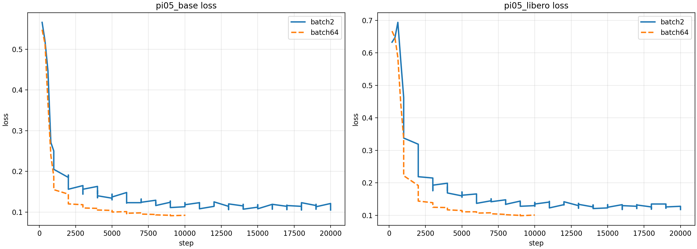
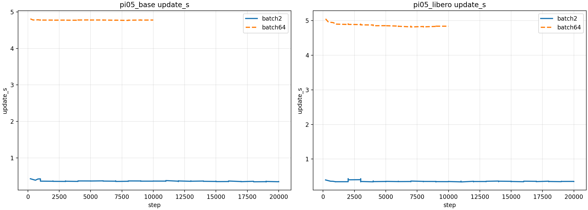
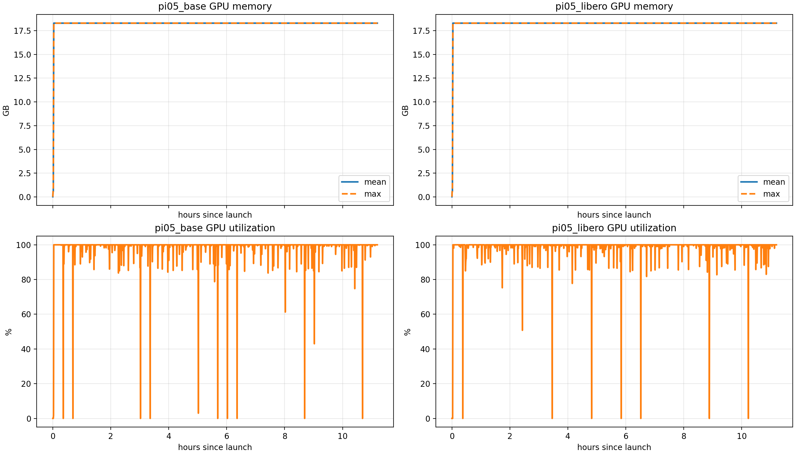
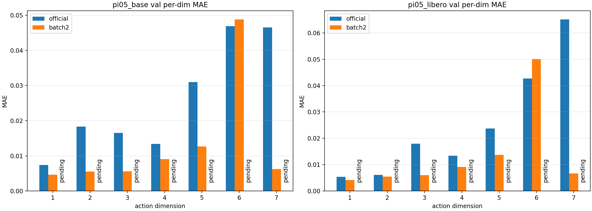
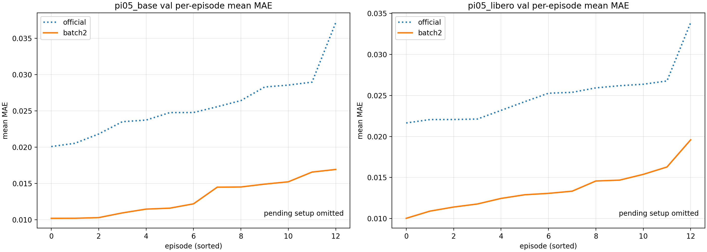
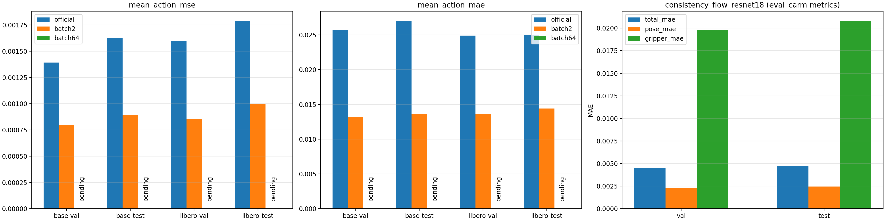

# PI05 Official vs Batch2 vs Batch64 Training / Eval Report

- Generated at: `2026-04-22 12:10:37`
- Report assets dir: `/home/wjz/rl-vla/docs/pi05_batch_report_20260422_assets`

## 1. 训练状态总览

| run | step | progress | loss | grad_norm | lr | update_s | global_batch | samples/s | ETA to finish | last metric ts |
| --- | ---: | ---: | ---: | ---: | ---: | ---: | ---: | ---: | --- | --- |
| pi05_base batch2 | 20000/20000 | 100.0% | 0.1110 | 0.3000 | 2.50e-06 | 0.353 | 8 | 21.7 | 0.0 h | 2026-04-21 21:57:53 |
| pi05_libero batch2 | 20000/20000 | 100.0% | 0.1260 | 0.3490 | 2.50e-06 | 0.354 | 8 | 22.2 | 0.0 h | 2026-04-21 21:43:46 |
| pi05_base batch64 | 9821/20000 | 49.1% | 0.0910 | 0.0940 | 1.40e-05 | 4.778 | 256 | 53.3 | 13.6 h | 2026-04-22 12:08:20 |
| pi05_libero batch64 | 9644/20000 | 48.2% | 0.1010 | 0.0940 | 1.50e-05 | 4.839 | 256 | 52.9 | 13.9 h | 2026-04-22 12:06:27 |

### 1.1 关键信息

- `pi05_base batch64` 当前已到 `9821/20000`，预计剩余 `13.6 h`。
- `pi05_libero batch64` 当前已到 `9644/20000`，预计剩余 `13.9 h`。
- `official/untrained` eval 已经齐全；第 4 节统一按 `official / batch2 / batch64` 三组 setup 展示。
- `batch2` 已有完整 val/test eval；`batch64` eval 仍在等待 020000 checkpoint 触发。
- `consistency_flow_resnet18` 离线评估 已经齐全；由于 `eval_carm.py` 与 `eval_pi05.py` 指标族不同，第 4 节使用同一张总览图中的独立子图展示。
- 从最近 logged `update_s` 看，`batch64` 单步开销约为 batch2 的 13.5x（base）和 13.7x（libero）。
- `consistency_flow_resnet18` 的 EMA probe 已完成，`EMA` 相比 `non-EMA` 的 `total_mae` 改善约 +0.00%（基于 probe episodes）。

## 2. 训练曲线

## 3. batch64 资源监控

## 4. 离线评估与 official-vs-batch2-vs-batch64 对比

### 4.1 PI05

| model | setup | split | mean_action_mse | mean_action_mae |
| --- | --- | --- | ---: | ---: |
| pi05_base | official | val | 0.001393465 | 0.025721947 |
| pi05_base | official | test | 0.001629165 | 0.027058739 |
| pi05_base | batch2 | val | 0.000795267 | 0.013228226 |
| pi05_base | batch2 | test | 0.000889470 | 0.013626480 |
| pi05_base | batch64 | val | pending | pending |
| pi05_base | batch64 | test | pending | pending |
| pi05_libero | official | val | 0.001596810 | 0.024907069 |
| pi05_libero | official | test | 0.001791922 | 0.025030607 |
| pi05_libero | batch2 | val | 0.000854825 | 0.013601317 |
| pi05_libero | batch2 | test | 0.001001430 | 0.014402588 |
| pi05_libero | batch64 | val | pending | pending |
| pi05_libero | batch64 | test | pending | pending |

### 4.2 PI05 + consistency_flow_resnet18 总览图

- 左两幅子图为 PI05 的 `mean_action_mse / mean_action_mae`。
- 右侧子图为 `consistency_flow_resnet18` 的 `eval_carm.py` 指标：`total_mae / pose_mae / gripper_mae`。
- 两套指标不是严格同口径，因此放在同一张总览图中做并列展示，而不是强行混成同一根柱子。

### 4.3 consistency_flow_resnet18

| model | split | total_mae | ee_mae | pose_mae | gripper_mae | episodes |
| --- | --- | ---: | ---: | ---: | ---: | ---: |
| consistency_flow_resnet18 | val | 0.004518 | 0.004518 | 0.002335 | 0.019799 | 13 |
| consistency_flow_resnet18 | test | 0.004754 | 0.004754 | 0.002458 | 0.020829 | 13 |

## 5. 结论

- 当前报告是进度版：训练曲线和资源曲线已经能稳定反映 batch64 的中期状态。
- `batch64` 四份 eval json 一旦落盘，只需要用同一脚本再跑一次，就会自动刷新成最终对比版。
- 远端现有 watcher 仍在等待 `020000/pretrained_model`，当前不需要额外人工补触发。
