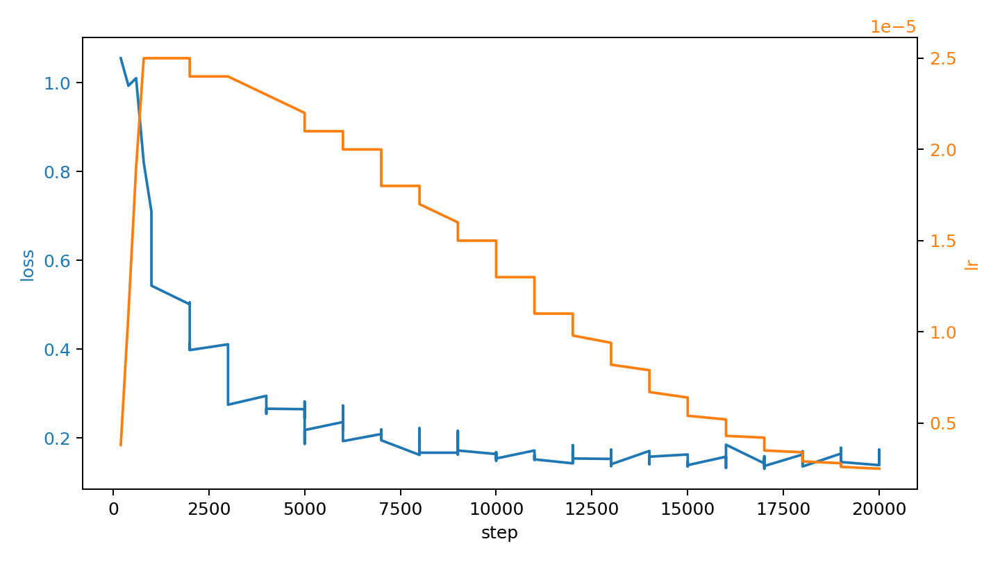
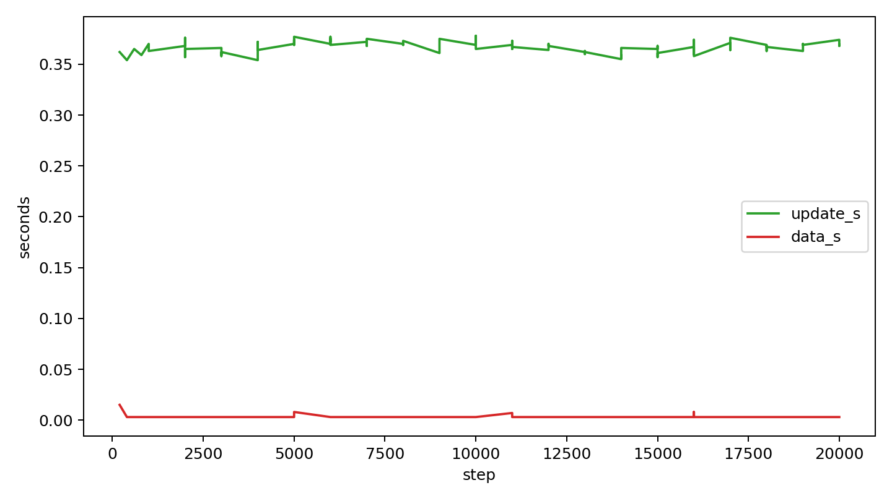
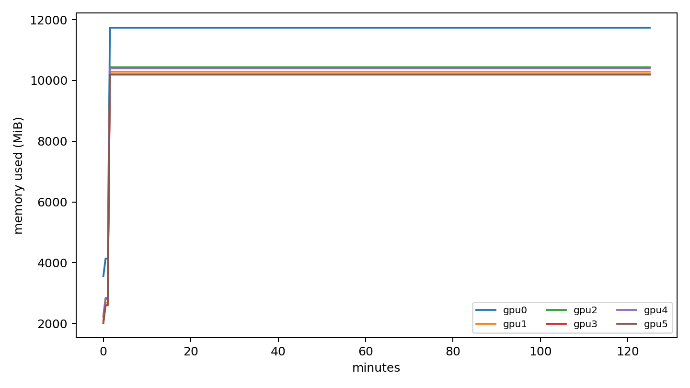
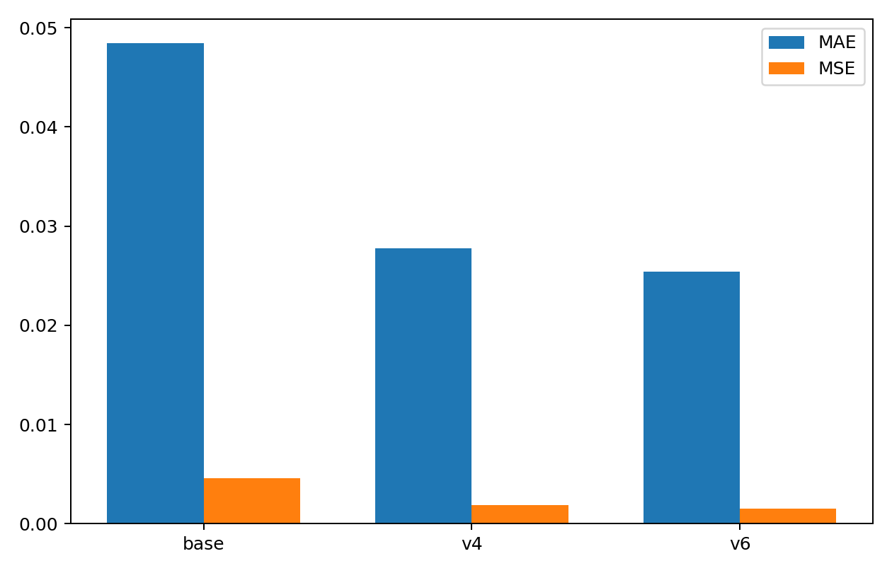
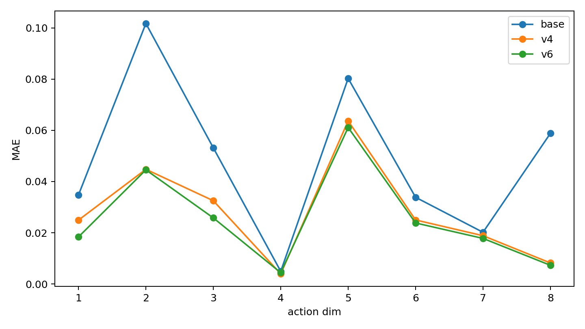

# pi05 全量数据 LoRA 微调实验报告（2026-03-30）

## 1. 实验目的

本次实验的目标是验证：

1. 是否可以基于 **official OpenPI `pi05_droid` checkpoint** 完成对当前全量 CARM 数据的 LoRA 微调；
2. 微调后的模型在离线 test split 上，是否优于 base official checkpoint；
3. 在当前机器上，6 卡训练的显存占用和吞吐是否支持更激进的下一轮配置。

---

## 2. 数据与划分

数据根目录：
- `/home/wjz/rl-vla/recorded_data`

本次使用的全量数据共 **127 episodes**，来自 4 个子集：

- `fixed_dual_light`: 26
- `fixed_left_light`: 25
- `fixed_no_light`: 50
- `random_no_light`: 26

使用脚本：
- [rlft/offline/prepare_pi05_splits.py](../rlft/offline/prepare_pi05_splits.py)

确定性分割（seed=1）：
- train: **101** episodes
- val: **13** episodes
- test: **13** episodes

split summary 文件：
- `/home/wjz/rl-vla/recorded_data_splits/split_summary.json`

训练 / 验证 / 测试导出为 LeRobot dataset 的目录：
- train: `/mnt/disk_2/wjz/runs/pi05_full_export/train`
- val: `/mnt/disk_2/wjz/runs/pi05_full_export/val`
- test: `/mnt/disk_2/wjz/runs/pi05_full_export/test`

---

## 3. 预训练模型与训练设置

预训练 checkpoint：
- `/mnt/disk_2/wjz/openpi/pi05_droid_pytorch`

训练使用 LoRA，关键设置：
- policy type: `pi05`
- LoRA rank: `r=16`
- learning rate: `5e-5`
- dtype: `bfloat16`
- `gradient_checkpointing=true`
- `freeze_vision_encoder=true`
- `train_expert_only=true`

### 第一轮 full-data run（v2）
- GPUs: 2
- batch_size: 2
- effective batch ≈ 4
- steps: 5000
- 问题：最初被 train split 导出损坏阻塞，后修复

### 第二轮 full-data run（v4，正式结果）
- GPUs: `0,1,2,3,4,5`
- num_processes: 6
- batch_size: 2
- effective batch ≈ **12**
- steps: **20000**
- output dir:
  - `/mnt/disk_2/wjz/runs/pi05-full-lora-openpi-droid-v4`
- launcher / 日志 dir:
  - `/mnt/disk_2/wjz/runs/pi05-full-lora-openpi-droid-v4_launcher`

日志文件：
- `train.log`: `/mnt/disk_2/wjz/runs/pi05-full-lora-openpi-droid-v4_launcher/train.log`
- `resource_monitor.jsonl`: `/mnt/disk_2/wjz/runs/pi05-full-lora-openpi-droid-v4_launcher/resource_monitor.jsonl`
- `launch_command.sh`: `/mnt/disk_2/wjz/runs/pi05-full-lora-openpi-droid-v4_launcher/launch_command.sh`
- `launch_config.json`: `/mnt/disk_2/wjz/runs/pi05-full-lora-openpi-droid-v4_launcher/launch_config.json`

---

## 4. 训练过程可视化

### 4.1 Loss / LR 曲线

### 4.2 Step timing（update/data）

### 4.3 GPU 显存曲线（6 张卡）

---

## 5. 训练结果摘要

从 `train.log` 抽取的 100 个周期性日志点显示：

- step 200 时 loss ≈ **1.055**
- step 1000 时 loss ≈ **0.710**
- step 18000 时 loss ≈ **0.167**
- step 20000 时 loss ≈ **0.143**

训练尾部日志：
- `step:20K smpl:240K ep:383 epch:3.79 loss:0.143 grdn:0.715 lr:2.5e-06`
- `Checkpoint policy after step 20000`
- `End of training`

最终 checkpoint：
- `/mnt/disk_2/wjz/runs/pi05-full-lora-openpi-droid-v4/checkpoints/020000/pretrained_model`

其中包含：
- `adapter_config.json`
- `adapter_model.safetensors`
- `config.json`
- `policy_preprocessor.json`
- `policy_postprocessor.json`
- `train_config.json`

---

## 6. 离线测试设置

测试脚本：
- [rlft/offline/eval_pi05.py](../rlft/offline/eval_pi05.py)

测试数据：
- `/mnt/disk_2/wjz/runs/pi05_full_export/test`
- 共 **13 episodes / 8168 frames**

对比对象：
1. **Base official checkpoint**
2. **Finetuned v4 LoRA adapter**

结果文件：
- base: `/mnt/disk_2/wjz/runs/pi05_eval_base_official.json`
- finetuned v4: `/mnt/disk_2/wjz/runs/pi05_eval_finetuned_v4.json`
- finetuned v6: `/mnt/disk_2/wjz/runs/pi05_eval_finetuned_v6.json`

---

## 7. 离线测试结果

### 7.1 Overall 指标

| Model | Setting | Mean Action MSE | Mean Action MAE |
|------|---------|------------------:|----------------:|
| Base official | OpenPI `pi05_droid` | 0.004564 | 0.048454 |
| Finetuned v4 | 6卡 × batch2 × 20k | 0.001841 | 0.027732 |
| Finetuned v6 | 6卡 × batch4 × 30k | 0.001553 | 0.025390 |

相对改进：
- **v4 vs base**
  - MSE 降低约 59.7%
  - MAE 降低约 42.8%
- **v6 vs base**
  - MSE 降低约 66.0%
  - MAE 降低约 47.6%
- **v6 vs v4**
  - MSE 进一步降低约 15.6%
  - MAE 进一步降低约 8.45%

### 7.2 Overall 可视化

### 7.3 Per-dimension MAE 可视化

### 7.4 Per-dimension 结果

Base official `per_dim_mae`:
- [0.0347, 0.1017, 0.0532, 0.00494, 0.0803, 0.0338, 0.0202, 0.0588]

Finetuned v4 `per_dim_mae`:
- [0.0249, 0.0448, 0.0325, 0.00395, 0.0637, 0.0250, 0.0188, 0.00820]

Finetuned v6 `per_dim_mae`:
- [0.0184, 0.0446, 0.0258, 0.00441, 0.0611, 0.0238, 0.0178, 0.00729]

观察：
- v4 相对 base 在 8 个 action 维度上均有改善
- v6 相对 v4 继续在大多数维度上改善，尤其是第 1 / 3 / 8 维
- 第 8 维从 base 到 v6：**0.0588 → 0.00729**，改善最显著

### 7.5 Per-episode 结果

Base official 每个 episode 的 mean MAE 大致范围：
- **0.0349 ~ 0.0553**

Finetuned v4 每个 episode 的 mean MAE 大致范围：
- **0.0216 ~ 0.0329**

Finetuned v6 每个 episode 的 mean MAE 大致范围：
- **0.0177 ~ 0.0300**

说明：
- v4 相对 base 是整体改进，而不是局部改进
- v6 又在 v4 基础上继续带来一致的 test split 收益

---

## 8. 显存占用与 batch size 分析

### 8.1 当前 6 卡训练的显存情况

从 v4 `resource_monitor.jsonl` 的末尾快照（6卡 × batch2 × 20k）：

- GPU0: **11736 MiB / 24564 MiB**
- GPU1: **10287 MiB / 24564 MiB**
- GPU2: **10435 MiB / 24564 MiB**
- GPU3: **10197 MiB / 24564 MiB**
- GPU4: **10401 MiB / 24564 MiB**
- GPU5: **10197 MiB / 24564 MiB**

即：
- **per-GPU batch size = 2** 时
- 单卡显存大致在 **10.2GB ~ 11.7GB**

从 batch4 smoke（6卡 × batch4 × 1000）末尾监控看：

- GPU0: **12112 MiB / 24564 MiB**
- GPU1: **10663 MiB / 24564 MiB**
- GPU2: **10811 MiB / 24564 MiB**
- GPU3: **10573 MiB / 24564 MiB**
- GPU4: **10777 MiB / 24564 MiB**
- GPU5: **10573 MiB / 24564 MiB**

即：
- **per-GPU batch size = 4** 时
- 单卡显存大致在 **10.6GB ~ 12.1GB**

### 8.2 为什么当前 per-GPU batch size 先设成 2，然后又尝试到 4

最早设成 2 的原因不是“单卡只能到 2”，而是：

1. 当时链路刚打通，需要先确认：
   - official checkpoint 可训练
   - full-data export 可用
   - 6 卡分布式可稳定跑通；
2. 在这个目标下，batch 2 的工程风险最低；
3. 随后从 v4→v6 的结果看，增大 batch / 增加 steps 仍然有效，因此继续尝试 batch 4 是合理的。

结论：
- **batch size = 2 只是保守起点，不是硬上限。**

### 8.3 关于 batch scaling sweep 的异常现象

在 4 张空闲卡上做的辅助 sweep（batch 4 / 6 / 8 / 10 / 12）曾出现：

- 所有 batch 的 `returncode` 都是 1
- 所有 batch 的 `max_memory_mib` 几乎完全相同

这并不意味着 batch 6/8/10/12 都真实等价，根因有两点：

1. **probe 脚本按 warmup 秒数主动发 SIGTERM**
   - 如果 run 只是被 probe 主动终止，不应该把它直接当成失败
2. **早期统计逻辑对显存峰值的解释不够严格**
   - 它只能说明“在有限 warmup 内，观测到的显存没有明显突破”
   - 不能证明更大 batch 已经稳定跑进和 batch 4 一样深的训练阶段

因此，辅助 sweep 只能作为参考，不能作为唯一决策依据。

### 8.4 当前最可信的 batch 结论

当前真正被**完整实测验证**的只有：

- **6卡 × batch 4**
  - smoke 成功
  - 1000-step 跑通
  - checkpoint 成功落盘
- **6卡 × batch 4 × 30k**
  - 正式训练成功完成（v6）

而 batch 6+：
- 尚未被严格证明稳定可用
- 需要单独、长一点的 smoke 才能给出可信结论

因此，以“最稳路径”为目标，当前最合理的正式配置是：

- **6卡 × batch 4 × 30k**

---

## 9. 有没有过拟合迹象？

当前没有明显过拟合证据，理由：

1. 训练 loss 从 ~1.055 平稳降到 ~0.143；
2. test split 上的 offline MAE / MSE 相对 base 明显改善；
3. per-episode 结果整体改善，而不是只在少数 episode 上变好。

但要注意：
- 当前我们还没有单独输出一条随训练 step 变化的 val 曲线
- 因此“没有明显过拟合证据”不等于“已经完全排除过拟合”

更准确的说法是：
- **按当前离线 test 结果看，这一轮更像是有效学习，而不是过拟合。**

---

## 10. 建议的下一轮训练配置

基于当前结果，推荐的正式配置优先级如下：

### 首选（当前最稳妥）
- GPUs: 6
- per-GPU batch size: **4**
- effective batch: **24**
- steps: **30000**
- learning rate: **5e-5**
- LoRA rank: **16**
- 保持：
  - `gradient_checkpointing=true`
  - `freeze_vision_encoder=true`
  - `train_expert_only=true`
  - `dtype=bfloat16`

理由：
- batch 4 short smoke 成功；
- batch 4 的 30k 正式训练（v6）已成功跑完；
- v6 相对 v4 继续带来显著 offline eval 提升。

### 次选（进一步探索上限）
- 单独做 **6卡 × batch 6** 的更长 smoke（1000~2000 steps）
- 只有在它被明确证明稳定后，再考虑正式 30k

原因：
- 当前辅助 sweep 不能可靠证明 batch 6+ 已经稳定可用
- 因此 batch 6/8/10/12 仍然需要更严格的单独验证

---

## 11. 结论

本次 full-data 实验已经完成，并给出明确的正向结果：

- 使用 official OpenPI `pi05_droid` checkpoint 作为初始化；
- 在 127 个 episode 划分出的 full-data split 上做 LoRA 微调；
- v4（6卡 × batch2 × 20k）相对 base official 已显著提升；
- v6（6卡 × batch4 × 30k）又在 v4 基础上继续提升；
- 当前最可信、最稳的正式配置已经升级为：
  - **6卡 × batch4 × 30k**

当前可以确认：

> **full-data LoRA 微调在当前 CARM 数据上是有效的，而且从 batch2/20k 提升到 batch4/30k 仍能继续改善 test split 的离线指标。**

同时也可以确认：

> **batch 6 及以上仍未被严格证明稳定，因此下一步若要继续提升，应优先在 batch4 继续稳定推进，或单独对 batch6 做更严格的 smoke。**
