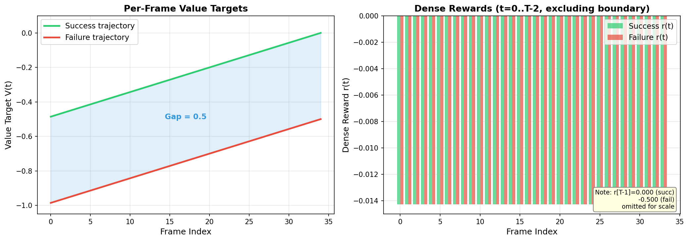
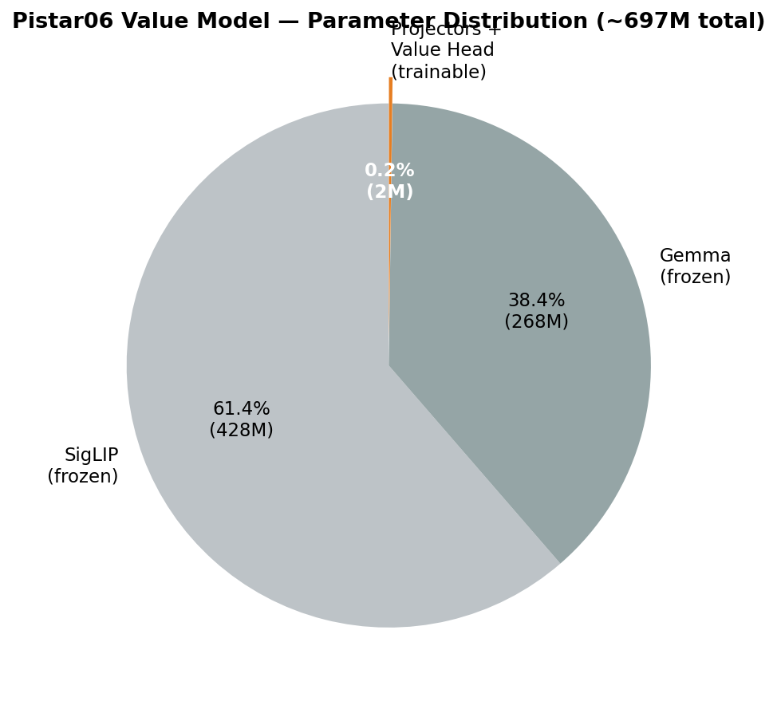
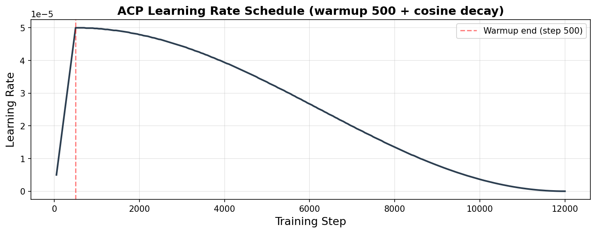
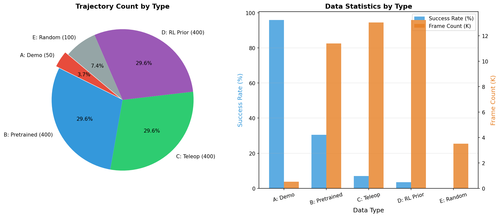
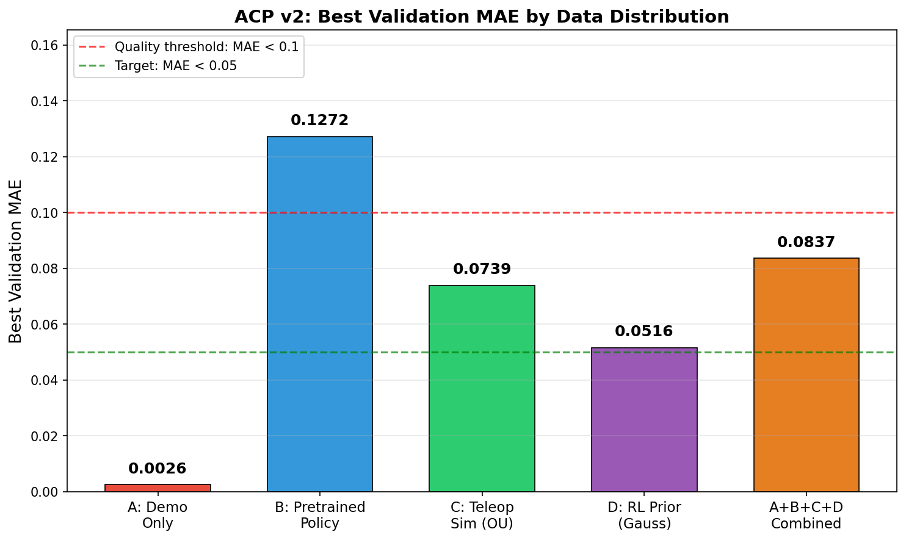
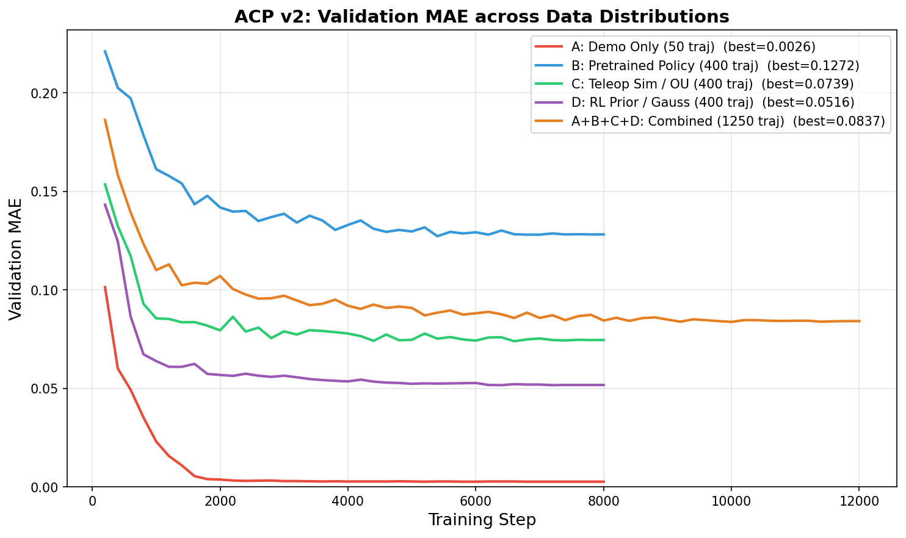
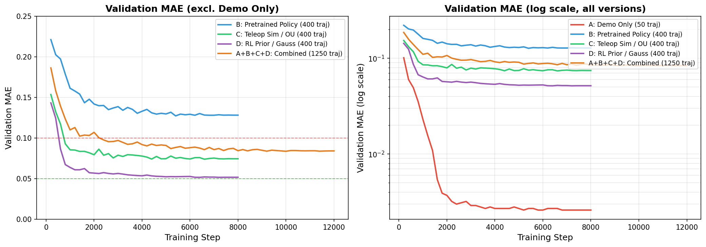
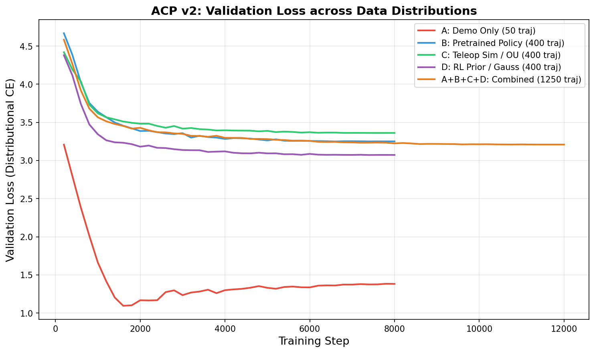
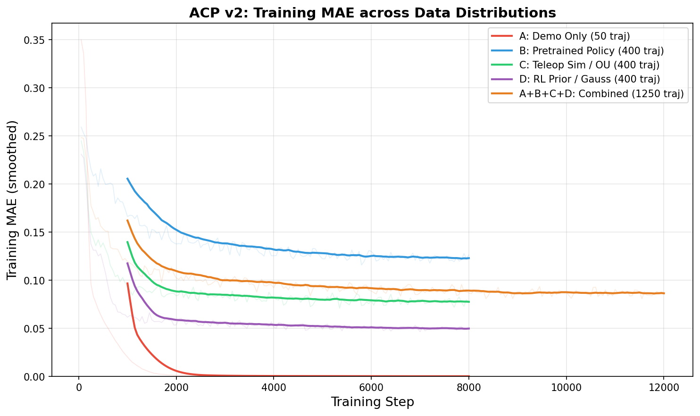

# ACP (Advantage-Conditioned Policy) 模块技术文档

> **模块路径**: `rlft/vlaw/acp/`
> **移植自**: Evo-RL Pistar06 Value Model
> **用途**: 为策略训练提供 per-frame 稠密 advantage 权重，替代 VLM 的 per-trajectory 稀疏二元标注

---

## 目录

1. [概述与动机](#1-概述与动机)
2. [训练标签的生成](#2-训练标签的生成value-targets)
3. [模型架构](#3-模型架构pistar06-value-model)
4. [训练流程](#4-训练流程)
5. [推理与 Advantage 标注](#5-推理与-advantage-标注)
6. [Online RL 集成](#6-online-rl-集成acp-reward-shaping)
7. [训练数据多样化 (ADR-039)](#7-训练数据多样化-adr-039)
8. [训练结果](#8-训练结果)
9. [文件结构与依赖](#9-文件结构与依赖)

---

## 1. 概述与动机

### 问题
VLAW 原始管线使用 VLM（Qwen3-VL） 对每条轨迹进行**二元标注**（成功/失败），然后仅保留成功轨迹进行策略更新。这种方法存在两个核心缺陷：

1. **信用分配粒度过粗**：一条轨迹包含 20-35 帧，其中可能只有少数关键帧对成功起到了决定性作用，但 VLM 只给出整条轨迹的标签
2. **数据利用率低**：失败轨迹被完全丢弃，但其中可能包含局部优质动作

### ACP 解决方案

ACP 训练一个 **value model** 来预测每一帧观察图像的价值 $V(s_t) \in [-1, 0]$，然后通过对比**实际 N-step 回报**与**模型预测值**的差异，得到每帧的 **advantage**（优势值）。Advantage 越高表示此帧动作"出乎意料地好"，这些帧将获得更高的训练权重。

### 核心流程图

```
┌──────────────────────────────────────────────────────────────────────┐
│                        ACP Training Pipeline                         │
├──────────────────────────────────────────────────────────────────────┤
│                                                                      │
│  ┌─────────────┐    ┌─────────────────┐    ┌────────────────────┐   │
│  │  HDF5 轨迹   │───▶│  Value Target    │───▶│  Value Model 训练  │   │
│  │  (env_success│    │  Generation      │    │  (distributional   │   │
│  │   per-frame) │    │  连续值 ∈[-1,0]  │    │   cross-entropy)   │   │
│  └─────────────┘    └─────────────────┘    └────────┬───────────┘   │
│                                                      │               │
│  ┌──────────────────────────────────────────────────┐│               │
│  │              ACP Inference Pipeline               ▼│               │
│  ├──────────────────────────────────────────────────┤│               │
│  │                                                   │               │
│  │  ┌────────────┐   ┌──────────┐   ┌────────────┐  │               │
│  │  │ 批量推理    │──▶│ N-step   │──▶│ Quantile   │  │               │
│  │  │ V̂(sₜ)     │   │ Advantage│   │ 二值化/    │  │               │
│  │  │ 每帧预测值  │   │ A(t)计算 │   │ 连续权重   │  │               │
│  │  └────────────┘   └──────────┘   └─────┬──────┘  │               │
│  │                                         │         │               │
│  └─────────────────────────────────────────┼─────────┘               │
│                                            ▼                         │
│                               ┌─────────────────────┐               │
│                               │  acp_weight 写回     │               │
│                               │  HDF5 per-frame     │               │
│                               └──────────┬──────────┘               │
│                                          │                           │
└──────────────────────────────────────────┼───────────────────────────┘
                                           │
                    ┌──────────────────────┐│┌──────────────────────┐
                    │                      ▼▼│                      │
                    │  Offline Policy      ││  Online RL (RLPD)    │
                    │  compute_weighted_   ││  TD reward shaping:  │
                    │  loss(acp_weight)    ││  r = (V(s')-V(s))*k  │
                    └──────────────────────┘└──────────────────────┘
```

---

## 2. 训练标签的生成（Value Targets）

> **关键回答：ACP 的训练标签不是稀疏的 0/1 成功标签。**
> 它利用 `env_success` 二元信号，但将其转化为 **连续的 per-frame 归一化 value target**，范围 $[-1, 0]$。

### 2.1 输入：env_success 信号

每条轨迹在 HDF5 中有一个 per-frame 的布尔数组 `env_success: (T,) bool`，记录每帧仿真环境的成功判定。轨迹级别的成功判定为 `is_success = any(env_success)`——只要有一帧标记为成功，整条轨迹即为成功。

### 2.2 Value Target 公式

对于一条长度为 $T$ 的轨迹，定义如下符号：

| 符号 | 含义 |
|------|-------|
| $t$ | 当前帧索引 (0-indexed) |
| $T$ | 轨迹实际长度 |
| $T_{\max}$ | 全局最大轨迹长度 |
| $\mathbb{1}_{success}$ | 轨迹是否成功 (0 或 1) |
| $c_{fail}$ | 失败惩罚 $= T_{\max} \times c_{fail\_coef}$（默认 $c_{fail\_coef}=1.0$） |

**核心公式：**

$$V_{target}(t) = \text{clip}\left( \frac{-(T - t - 1) - c_{fail} \cdot (1 - \mathbb{1}_{success})}{T_{\max} + c_{fail}},\ -1,\ 0 \right)$$

其中 $T - t - 1$ 是该帧到轨迹结尾的剩余步数。

### 2.3 直觉理解

以 $T_{\max} = 35$, $c_{fail\_coef} = 1.0$ 为例（分母 $= 70$, $c_{fail} = 35$）：

```
Value Target 示意 (T=35)
     0 ┤ ─ ─ ─ ─ ─ ─ ─ ─ ─ ─ ─ ─ ─ ─ ─ ─ ─ ─ ─ ╱─  ← 成功轨迹末帧: 0
       │                                       ╱
  -0.2 ┤                                   ╱
       │                               ╱
  -0.4 ┤                           ╱                    ← 成功轨迹首帧: -0.486
       │                       ╱
  -0.5 ┤─ ─ ─ ─ ─ ─ ─ ─ ─╱─ ─ ─ ─ ─ ─ ─ ─ ─╱─ ─  ← 失败轨迹末帧: -0.5
       │               ╱                   ╱
  -0.6 ┤           ╱                   ╱
       │       ╱                   ╱
  -0.8 ┤   ╱                   ╱
       │╱                   ╱
  -1.0 ┤ ─ ─ ─ ─ ─ ─ ─ ╱ ─ ─ ─ ─ ─ ─ ─ ─ ─ ─ ─    ← 失败轨迹首帧: -0.986
       └────────────────────────────────────────
        0    5   10   15   20   25   30   35  Frame

       ──── 成功轨迹    ──── 失败轨迹
```

**关键特性：**

| 帧位置 | 成功轨迹 | 失败轨迹 | 差值 |
|--------|---------|---------|------|
| 首帧 (t=0, T=35) | -0.486 | -0.986 | 0.500 |
| 中间帧 (t=17) | -0.243 | -0.743 | 0.500 |
| 末帧 (t=34) | 0.000 | -0.500 | 0.500 |


*左图：成功/失败轨迹的 per-frame value target 曲线，两者之间有恒定 0.5 的 gap。右图：对应的 dense reward（value target 相邻差分），成功和失败在中间帧的 dense reward 几乎相同——真正的区分来自 advantage 计算。*

- 成功/失败轨迹之间有恒定的 0.5 gap，提供清洗的监督信号
- 同一轨迹内，值从负向零单调递增（时间越近末尾，价值越高）
- 范围严格限制在 $[-1, 0]$

### 2.4 代码位置

> `rlft/vlaw/acp/value_targets.py:17-56` — `compute_value_targets()`

---

## 3. 模型架构（Pistar06 Value Model）

### 3.1 总体架构

模型由三个主要组件组成：冻结的视觉编码器、冻结的语言模型、可训练的融合层与价值头。

```
┌─────────────────────────────────────────────────────────────────────┐
│                     Pistar06 Value Model                            │
│                     ~697M 总参数, ~1.55M 可训练 (0.22%)              │
├─────────────────────────────────────────────────────────────────────┤
│                                                                     │
│  ┌─────────────────────┐     ┌────────────────────────┐            │
│  │  📷 Camera Base      │     │  📷 Camera Render       │            │
│  │  128×128 RGB        │     │  128×128 RGB           │            │
│  └────────┬────────────┘     └───────────┬────────────┘            │
│           │  resize 384×384              │  resize 384×384         │
│           │  SigLIP norm                 │  SigLIP norm            │
│           ▼                              ▼                         │
│  ┌────────────────────────────────────────────────────┐            │
│  │          SigLIP-so400m-patch14-384 (FROZEN)        │            │
│  │          ~428M params | Vision Transformer          │            │
│  │          Input: (B*2, 3, 384, 384)                 │            │
│  │          Output: (B*2, D_v) pooled features        │            │
│  └────────────────────┬───────────────────────────────┘            │
│                       │                                            │
│                       ▼                                            │
│  ┌───────────────────────────────────────┐   ┌──────────────────┐ │
│  │  Image Projector (TRAINABLE)          │   │  📝 Task Text     │ │
│  │  Linear(D_v, 512) → GELU → Drop(0.1) │   │  "Pick up the    │ │
│  │  Output: (B, 2, 512)                 │   │   peg and lift   │ │
│  │       ↓ mean-pool over cameras       │   │   it upright."   │ │
│  │  Output: (B, 512)                    │   └────────┬─────────┘ │
│  └────────────────────┬──────────────────┘            │           │
│                       │                               ▼           │
│                       │              ┌──────────────────────────┐ │
│                       │              │  Gemma-3-270M (FROZEN)   │ │
│                       │              │  ~268M params            │ │
│                       │              │  Masked mean pooling     │ │
│                       │              │  Output: (B, D_l)        │ │
│                       │              └─────────────┬────────────┘ │
│                       │                            │              │
│                       │              ┌─────────────▼────────────┐ │
│                       │              │  Lang Projector (TRAIN)  │ │
│                       │              │  Linear(D_l,512)→GELU→  │ │
│                       │              │  Drop(0.1)              │ │
│                       │              │  Output: (B, 512)       │ │
│                       │              └─────────────┬────────────┘ │
│                       │                            │              │
│                       └──────────┬─────────────────┘              │
│                                  │ concat                        │
│                                  ▼                                │
│                       ┌──────────────────────┐                    │
│                       │  LayerNorm(1024)      │                    │
│                       │  Linear(1024, 512)    │                    │
│                       │  GELU                 │    VALUE HEAD      │
│                       │  Dropout(0.1)         │    (TRAINABLE)     │
│                       │  Linear(512, 201)     │                    │
│                       └──────────┬───────────┘                    │
│                                  │                                │
│                                  ▼                                │
│                       ┌──────────────────────┐                    │
│                       │  201 logits          │                    │
│                       │  → softmax → E[V]    │                    │
│                       │  bins: [-1.0, 0.0]   │                    │
│                       │  step: 0.005         │                    │
│                       └──────────────────────┘                    │
└─────────────────────────────────────────────────────────────────────┘
```

### 3.2 Distributional Value Head

模型输出不是单一的标量 value，而是**201 个 bin 上的概率分布**（distributional value）。

**Bin 设计：**
- 范围：$[-1.0, 0.0]$
- Bin 数量：201
- Bin 间距：$\Delta = 0.005$
- Bin 中心：$\{-1.000, -0.995, -0.990, \ldots, -0.005, 0.000\}$

**Two-hot Soft Target：** 将连续 value target 分配到相邻两个 bin：

$$\text{scaled} = \frac{v_{target} - (-1.0)}{0.005}$$

$$p_{low} = 1 - (scaled - \lfloor scaled \rfloor), \quad p_{high} = scaled - \lfloor scaled \rfloor$$

**期望值计算：**

$$\hat{V} = \mathbb{E}[\text{logits}] = \sum_{i=0}^{200} \text{softmax}(z_i) \cdot c_i$$

其中 $c_i$ 是第 $i$ 个 bin 中心值。

### 3.3 损失函数

使用 **distributional cross-entropy loss**（而非 MSE）：

$$\mathcal{L} = -\frac{1}{B}\sum_{b=1}^{B}\sum_{i=0}^{200} p^{(b)}_i \log \text{softmax}(z^{(b)}_i)$$

其中 $p^{(b)}_i$ 是 two-hot soft target，$z^{(b)}_i$ 是模型输出的 logits。

**为什么用 distributional 而不是 MSE？**
- 更好地建模 value 的不确定性（模型可以输出多模态分布）
- 训练更稳定（避免 MSE 在极端值处的梯度爆炸）
- 与 C51/Rainbow DQN 的思想一致

**度量指标：** 训练回报 MAE（Mean Absolute Error） = $\frac{1}{B}\sum|\hat{V}_b - V^{target}_b|$

### 3.4 参数统计

| 组件 | 参数量 | 可训练？ |
|------|--------|---------|
| SigLIP Vision Encoder | ~428M | 冻结（支持顶层解冻） |
| Gemma Language Model | ~268M | 冻结 |
| Image Projector | ~0.4M | ✅ 可训练 |
| Language Projector | ~0.4M | ✅ 可训练 |
| LayerNorm + Value Head | ~0.75M | ✅ 可训练 |
| **总计** | **~697M** | **~1.55M (0.22%)** |



> 代码位置：`rlft/vlaw/acp/value_model.py:142-349`

---

## 4. 训练流程

### 4.1 数据流水线

```
HDF5 files (递归扫描)
    │
    ▼
ACPValueDataset (per-frame indexing)
    │
    ├── Pass 1: 扫描所有轨迹 → 获取长度、成功标志 → 确定全局 max_episode_length
    │
    ├── Pass 2: 对每条轨迹调用 compute_value_targets() → 生成 per-frame value target
    │           构建扁平索引: [(hdf5_idx, traj_key, frame_idx, value_target), ...]
    │
    └── __getitem__(idx):
         ├── 打开 HDF5 → 读取该帧的 RGB 图像 (rgb_base + rgb_render)
         ├── 转置 HWC → CHW
         └── 返回 {images: (2,3,128,128) uint8,
                    image_mask: (2,) bool,
                    value_target: float32}
```

### 4.2 训练超参

| 参数 | 默认值 | 说明 |
|------|--------|------|
| num_steps | 8000 | step-based（非 epoch-based） |
| batch_size | 32 | |
| learning_rate | 5e-5 | AdamW 峰值 LR |
| weight_decay | 1e-5 | |
| warmup_steps | 500 | 线性 warmup |
| grad_clip_norm | 10.0 | |
| val_split | 0.1 | 验证集比例 |
| eval_interval | 200 | 步 |
| save_interval | 1000 | 步 |

### 4.3 学习率调度

```
LR
5e-5 ┤        ╱╲
     │       ╱  ╲
     │      ╱    ╲
     │     ╱      ╲
     │    ╱        ╲
     │   ╱   cosine ╲
     │  ╱   decay    ╲
     │ ╱               ╲
lr_min┤╱─ warmup ─────────╲─────────────────
     └──────┬──────────────────────────────
      0    500                          8000  step
           warmup
```

公式：
$$lr(t) = \begin{cases}
\max(\alpha, \frac{t}{t_{warmup}}) \cdot lr_{peak} & t < t_{warmup} \\
\max\left(\alpha, \frac{1 + \cos(\pi \cdot \frac{t - t_{warmup}}{t_{total} - t_{warmup}})}{2}\right) \cdot lr_{peak} & t \geq t_{warmup}
\end{cases}$$

其中 $\alpha = lr_{min} / lr_{peak}$。



### 4.4 训练循环伪代码

```python
for step in range(num_steps):
    batch = next(train_loader)  # 无限循环 DataLoader

    with autocast(dtype=bfloat16):
        loss, metrics = model.compute_loss(
            images=batch["images"],
            image_mask=batch["image_mask"],
            value_targets=batch["value_target"]
        )

    loss.backward()
    clip_grad_norm_(model.trainable_parameters(), max_norm=10.0)
    optimizer.step()
    scheduler.step()

    if step % eval_interval == 0:
        val_mae = evaluate(val_loader)
        if val_mae < best_mae:
            model.save("best.safetensors")  # 仅保存可训练参数
```

> 代码位置：`rlft/vlaw/acp/train_value_model.py`

---

## 5. 推理与 Advantage 标注

### 5.1 推理流程

```
训练好的 Value Model
         │
         ▼
┌──────────────────────┐
│  批量推理             │  对每帧图像 → V̂(sₜ)
│  DataLoader batch=64 │
└──────────┬───────────┘
           │
           ▼
┌──────────────────────┐
│  逐轨迹处理           │
│  1. Dense Rewards     │  r(t) = V_target(t) - V_target(t+1)
│  2. N-step Advantage  │  A(t) = Σr[t:t+n] + V̂(t+n) - V̂(t)
└──────────┬───────────┘
           │
           ▼
┌──────────────────────┐
│  全局 Quantile 阈值   │  threshold = quantile(A, 0.7)
│  → 二值化/连续权重     │  top 30% 标记为 positive
└──────────┬───────────┘
           │
           ▼
┌──────────────────────┐
│  写回 HDF5 per-frame │
│  • acp_value_target  │  (T,) float32 — GT targets
│  • acp_value_pred    │  (T,) float32 — 模型预测
│  • acp_advantage     │  (T,) float32 — advantage
│  • acp_indicator     │  (T,) int32   — 二值标记
│  • acp_weight        │  (T,) float32 — 连续权重
└──────────────────────┘
```

### 5.2 Dense Reward 推导

从 value target 序列推导 per-frame 稠密奖励：

$$r(t) = \begin{cases}
V_{target}(t) - V_{target}(t+1) & t < T-1 \\
V_{target}(T-1) & t = T-1
\end{cases}$$

对于成功轨迹（线性递增），每帧奖励几乎恒定正值。

### 5.3 N-step Advantage

$$A(t) = \sum_{k=0}^{n-1} r(t+k) + \hat{V}(t+n) - \hat{V}(t)$$

- $n = 4$（默认）
- 当 $t + n \geq T$ 时，bootstrap $\hat{V}(t+n) = 0$
- 无折扣因子（$\gamma = 1$）

**直觉：** Advantage 测量"实际 n-step 回报相对于模型预测的惊喜程度"。高 advantage 意味着模型**低估**了此帧后的实际表现——这些帧对应的动作**出乎意料地好**。

### 5.4 Quantile 阈值与权重

**二值化：**
$$\theta = \text{quantile}(A_{all}, 1 - \rho), \quad \rho = 0.3$$
$$\text{indicator}(t) = \mathbb{1}[A(t) \geq \theta]$$

**连续权重（默认模式）：**
$$w(t) = \text{clip}\left(\frac{A(t) - A_{\min}}{A_{\max} - A_{\min}},\ 0,\ 5.0\right)$$

连续权重保留了 advantage 的相对大小信息，比二值化更加精细。

> 代码位置：`rlft/vlaw/acp/advantage.py`, `rlft/vlaw/acp/infer_values.py`

---

## 6. Online RL 集成（ACP Reward Shaping）

除了离线标注权重，ACP value model 还可以在**在线 RL**（RLPD/SAC/AWSC）中使用 TD-shaped reward 替代仿真器奖励。

### 6.1 Potential-Based Reward Shaping

基于 Ng et al. (1999) 的理论，使用 ACP value model 作为 potential function：

$$r_{ACP}(s_t, s_{t+1}) = \left(\hat{V}(s_{t+1}) - \hat{V}(s_t)\right) \times \text{scale}$$

- **reward_scale** = 100.0（V 值在 $[-1, 0]$，单步差分量级 $\sim 0.005$-$0.05$，缩放后 $\sim 0.5$-$5.0$）
- Potential-based 保证不改变最优策略

### 6.2 双 GPU 部署

```
GPU 0: SAC/AWSC 训练（env + policy + critic）
GPU 1: ACP value model（reward 推理）
```

### 6.3 Wrapper 设计

```python
# 使用顺序：
raw_env → DualCameraRewardWrapper → FlattenRGBDObservationWrapper

# DualCameraRewardWrapper 在 Flatten 之前拦截 raw sensor_data 获取双相机图像
```

> 代码位置：`rlft/envs/acp_reward_wrapper.py`

---

## 7. 训练数据多样化 (ADR-039)

### 7.1 问题

iter1 仅使用 25 条 expert demo（510 帧，100% 成功率）训练 ACP value model，导致 MAE=0.0021——严重过拟合。模型只见过"完美"轨迹，无法泛化到在线 RL 中的探索行为。

### 7.2 解决方案：4 类噪声策略

| 类型 | 代号 | 噪声方法 | 目标分布 | 轨迹数 | 帧数 | 成功率 |
|------|------|---------|---------|--------|------|--------|
| A | demo | Expert demos | GT 专家 | 50 | 510 | 96.0% |
| B | pretrained | AWSC 无噪声 rollout | 预训练策略 | 400 | 11,395 | 30.5% |
| C | teleop_sim | OU噪声 (σ=0.07, pause 4%) | **真机遥操作** | 400 | 13,040 | 7.0% |
| D | rl_prior | Gaussian噪声 (σ=0.25) | **真机RL微调** | 400 | 13,243 | 3.5% |
| E | random | 纯随机 (σ=0.8) | Ablation 下界 | 100 | 3,500 | 0.0% |
| **Total** | — | — | — | **1,350** | **41,688** | — |


*左图：各数据类型的轨迹数量占比。右图：各类型的成功率（蓝）与帧数（橙）对比。*

### 7.3 噪声策略设计

**Type C — OU 噪声（模拟遥操作）：**

$$\epsilon_{t+1} = (1 - \theta)\epsilon_t + \sigma \cdot \mathcal{N}(0, I)$$

$$a_t = \begin{cases}
\pi(s_t) + \epsilon_t & \text{with prob } 1 - p_{pause} \\
[0, 0, 0, 0, 0, 0, \text{gripper}+\epsilon] & \text{with prob } p_{pause}
\end{cases}$$

- $\theta = 0.15$（OU 回复系数）
- $\sigma = 0.07$（OU 噪声幅度）
- $p_{pause} = 0.04$（随机暂停概率）
- 设计理由：OU 产生时间相关的平滑噪声 + 随机暂停模拟人类停顿

**Type D — i.i.d. Gaussian（模拟 RL 探索）：**

$$a_t = \text{clip}(\pi(s_t) + \mathcal{N}(0, \sigma^2 I), -1, 1)$$

- $\sigma = 0.25$
- 设计理由：模拟高熵 SAC 训练早期的宽动作分布

### 7.4 训练的 5 个 ACP 版本

| 版本 | 数据 | 训练步数 | Checkpoint |
|------|------|---------|-----------|
| v2_demo_only | A | 8000 | `checkpoints/vlaw/acp/v2_demo_only/` |
| v2_pretrained_pol | B | 8000 | `checkpoints/vlaw/acp/v2_pretrained_pol/` |
| v2_teleop_sim | C | 8000 | `checkpoints/vlaw/acp/v2_teleop_sim/` |
| v2_rl_prior | D | 8000 | `checkpoints/vlaw/acp/v2_rl_prior/` |
| **v2_combined** | **A+B+C+D** | **12000** | `checkpoints/vlaw/acp/v2_combined/` (**推荐**) |

Type E (random) 被刻意排除——纯负样本损害 value 估计。

> 代码位置：
> - 噪声策略：`rlft/vlaw/data/noisy_policy.py`
> - 采集脚本：`scripts/collect_acp_data.py`, `scripts/collect_acp_data.sh`
> - 训练脚本：`scripts/train_acp_multi.sh`

---

## 8. 训练结果

### 8.1 v2 各版本训练结果（ADR-039 数据多样化实验）

5 个版本的 ACP value model 在不同数据分布上训练的最终结果：

| 版本 | 数据 | 轨迹数 | 帧数 | 训练步数 | Best Val MAE | Final Val Loss | 达标？ |
|------|------|--------|------|---------|-------------|---------------|--------|
| v2_demo_only | A: Expert Demo | 50 | 510 | 8000 | **0.0026** | 1.382 | ⚠️ 过拟合 |
| v2_pretrained_pol | B: Pretrained Policy | 400 | 11,395 | 8000 | **0.1272** | 3.250 | ❌ > 0.1 |
| v2_teleop_sim | C: Teleop Sim (OU) | 400 | 13,040 | 8000 | **0.0739** | 3.361 | ✅ < 0.1 |
| v2_rl_prior | D: RL Prior (Gauss) | 400 | 13,243 | 8000 | **0.0516** | 3.073 | ✅ < 0.05 |
| **v2_combined** | **A+B+C+D** | **1,250** | **38,188** | **12000** | **0.0837** | **3.209** | **✅ < 0.1** |

> **推荐 checkpoint**: `v2_combined`（泛化性最强），或 `v2_rl_prior`（MAE 最低，但仅在高噪声分布上训练）。

#### Best Validation MAE 对比



**关键发现：**

1. **v2_demo_only (MAE=0.0026)** 严重过拟合：仅 50 条轨迹/510 帧，模型记住了所有样本，但无法泛化到在线 RL 中探索策略产生的状态分布。
2. **v2_pretrained_pol (MAE=0.1272)** 未达标：30.5% 成功率的数据中值差异相对 subtle，模型难以区分。
3. **v2_rl_prior (MAE=0.0516)** 表现最佳：高噪声（σ=0.25）产生极端行为，成功/失败之间差异显著，模型更容易学习判别边界。
4. **v2_combined (MAE=0.0837)** 通过门控阈值（<0.1）：多分布联合训练牺牲了单一分布上的精度，但换取了跨分布的泛化能力——这正是 Online RL 所需要的。

### 8.2 训练曲线

#### Validation MAE 收敛曲线



各版本的收敛特性：
- **v2_demo_only**：~1000 步即收敛到接近 0，之后完全过拟合
- **v2_rl_prior**：收敛最快（~3000 步），最终 MAE 最低
- **v2_teleop_sim**：~4000 步收敛，OU 噪声的时间相关性使学习更平滑
- **v2_combined**：由于数据量最大（12000 步），持续缓慢下降，8000 步后趋于稳定
- **v2_pretrained_pol**：收敛最慢、MAE 最高，反映了中等成功率数据的学习难度

#### Validation MAE 收敛对比（线性 vs 对数刻度）



左图排除了 demo_only 以展示其他四版本的细节；右图使用对数刻度对比所有版本（demo_only 的 MAE 比其他版本低两个数量级，进一步确认了过拟合判断）。

#### Validation Loss 曲线



#### Training MAE 曲线（平滑）



### 8.3 历史基线对比

| 实验 | 数据集 | 帧数 | MAE | 备注 |
|------|--------|------|-----|------|
| iter1 (新设备) | 25 demo | 510 | 0.0021 | 严重过拟合（demo-only） |
| iter1 (原设备) | 1200 混合轨迹 (46% SR) | ~41K | 0.1675 | 更具泛化性，未达门控 |
| dry-run (20 步) | 1200 混合 | ~41K | 0.271 | loss: 5.31→5.24 |
| **v2_combined** | **A+B+C+D (1250 traj)** | **38K** | **0.0837** | **✅ 首次通过门控** |

v2_combined 相比 iter1 原设备基线 MAE 提升了 **50%**（0.1675 → 0.0837），首次达到质量门控标准。

### 8.4 质量门控标准

| 指标 | 最低门槛 | 目标值 | 当前最优 | 状态 |
|------|---------|-------|---------|------|
| Value MAE | < 0.1 | < 0.05 | v2_rl_prior: **0.0516** ✅ / v2_combined: **0.0837** ✅ | 达标 |
| Advantage positive_ratio | ~30% | ~30% | 0.300 | ✅ 精准达标 |

### 8.5 模型与运行时统计

- 总参数量：~697M，可训练参数：~1.55M (0.22%)
- GPU 显存：~3GB VRAM/batch (单卡 RTX 4090)
- 训练速度：~1.4 step/s (batch_size=32, bfloat16)
- 推理 positive_ratio：0.300（精准命中 30% 目标）
- 权重范围：$[0, 1]$（连续模式）
- HDF5 写回：5 个 per-frame 字段 + 3 个 group attributes

### 8.6 RLPD Online 实验

| 实验 | 配置 | 状态 |
|------|------|------|
| SAC + ACP iter1 | demo-only ACP，过拟合基线 | ✅ 完成 500K steps |
| SAC + ACP v2_combined | 数据修复后重训 | 🔄 运行中 GPU 0+1 |
| AWSC + pretrained + ACP v2_combined | 策略预训练初始化 | 🔄 运行中 GPU 2+3 |

---

## 9. 文件结构与依赖

### 9.1 核心文件

```
rlft/vlaw/acp/
├── __init__.py
├── config.py              ← 所有 dataclass 配置 (5个: ValueModelConfig,
│                             ValueTargetConfig, AdvantageConfig,
│                             ACPTrainConfig, ACPInferConfig)
├── value_targets.py       ← Value target 生成 (env_success → 连续值)
├── value_model.py         ← Pistar06Model + ManiSkillValueModel
├── advantage.py           ← Dense reward + N-step advantage + quantile
├── hdf5_dataset.py        ← ACPValueDataset (per-frame PyTorch Dataset)
├── train_value_model.py   ← ACPValueTrainer 训练循环
├── infer_values.py        ← ACPAnnotator 推理+标注写回
└── visualize.py           ← 5种诊断可视化图表

rlft/vlaw/scripts/
├── run_acp_train.py       ← 训练入口 (tyro CLI)
└── run_acp_infer.py       ← 推理入口 (tyro CLI)

rlft/vlaw/data/
└── noisy_policy.py        ← OUNoisePolicyWrapper + GaussianNoisePolicyWrapper

rlft/envs/
└── acp_reward_wrapper.py  ← DualCameraRewardWrapper (Online RL 集成)

scripts/
├── collect_acp_data.py    ← 数据采集 CLI
├── collect_acp_data.sh    ← 并行采集 orchestrator
├── train_acp_multi.sh     ← 5版本并行训练 orchestrator
├── run_rlpd_sac_acp_v2.sh ← SAC + ACP v2 实验
└── run_rlpd_awsc_acp.sh   ← AWSC + ACP v2 实验
```

### 9.2 依赖关系图

```
config.py ──────────────────────────────────────────────┐
    │                                                    │
    ▼                                                    │
value_targets.py ──▶ hdf5_dataset.py ──▶ train_value_model.py
                          │                     │
                          │                     ▼
value_model.py ────────────┘               infer_values.py
    │                                          │
    │                                          ▼
    │                                    advantage.py
    │                                          │
    └──────────────────────▶ acp_reward_wrapper.py (Online RL)
                                               │
                                          visualize.py
```

### 9.3 Conda 环境

- **训练/推理 ACP value model**: 原设备用 `vlaw_reward`，新设备用 `rlft_ms3`
- **RLPD Online RL**: `rlft_ms3`

### 9.4 常用命令

```bash
# ACP value model 训练
CUDA_VISIBLE_DEVICES=6,7 conda run -n vlaw_reward python rlft/vlaw/scripts/run_acp_train.py \
    --num_steps 8000 --batch_size 32

# ACP 推理 + advantage 标注
CUDA_VISIBLE_DEVICES=6 conda run -n vlaw_reward python rlft/vlaw/scripts/run_acp_infer.py \
    --checkpoint_path checkpoints/vlaw/acp/v2_combined/best.safetensors

# RLPD + ACP reward (SAC)
CUDA_VISIBLE_DEVICES=0,1 conda run -n rlft_ms3 python -m rlft.online.train_rlpd \
    --reward_mode acp --acp_checkpoint checkpoints/vlaw/acp/v2_combined/best.safetensors \
    --acp_device cuda:1 --total_timesteps 500000

# 多版本训练
bash scripts/train_acp_multi.sh --parallel  # GPU 2-6 并行
```

---

## 附录 A: ACP 与 VLM 标注的对比

| 维度 | VLM 标注 | ACP 标注 |
|------|---------|---------|
| 粒度 | per-trajectory (1 label/traj) | **per-frame** (1 label/frame) |
| 信号类型 | 二元 (success/fail) | **连续权重** [0, 1] |
| 信用分配 | ❌ 无（全轨迹等权） | ✅ advantage-based |
| 失败轨迹 | 完全丢弃 | ✅ 保留局部优质帧 |
| 推理成本 | ~$0.01/traj (VLM API) | ~0.5ms/frame (GPU local) |
| 依赖模态 | 视频理解 | 单帧图像+任务文本 |

## 附录 B: 可视化图表索引

本文档所有图表均由 `docs/vlaw/gen_acp_figures.py` 自动生成，数据来源为 wandb 训练日志。

### B.1 训练结果可视化（`docs/vlaw/figures/`）

| 文件名 | 内容 | 对应章节 |
|--------|------|---------|
| `acp_value_target_illustration.png` | Value target 成功/失败对比 + dense reward | [2.3 直觉理解](#23-直觉理解) |
| `acp_model_params.png` | 模型参数分布（冻结 vs 可训练） | [3.4 参数统计](#34-参数统计) |
| `acp_lr_schedule.png` | 学习率调度：warmup 500 + cosine decay | [4.3 学习率调度](#43-学习率调度) |
| `acp_data_distribution.png` | 4 类噪声数据的轨迹/帧数/成功率统计 | [7.2 解决方案](#72-解决方案4-类噪声策略) |
| `acp_best_mae_bar.png` | 5 版本 Best Val MAE 柱状图 + 门控线 | [8.1 v2 结果](#81-v2-各版本训练结果adr-039-数据多样化实验) |
| `acp_val_mae_curves.png` | 5 版本 Validation MAE 训练曲线 | [8.2 训练曲线](#82-训练曲线) |
| `acp_val_loss_curves.png` | 5 版本 Validation Loss 训练曲线 | [8.2 训练曲线](#82-训练曲线) |
| `acp_train_mae_curves.png` | 5 版本 Training MAE 曲线（平滑） | [8.2 训练曲线](#82-训练曲线) |
| `acp_convergence_comparison.png` | 收敛对比：线性 vs 对数刻度 | [8.2 训练曲线](#82-训练曲线) |

### B.2 ACP 推理诊断图（由 `visualize.py` 生成）

以下图表在运行 ACP 推理后自动生成，用于诊断模型质量：

| 文件名 | 内容 | 诊断用途 |
|--------|------|---------|
| `06_value_scatter.png` | 预测值 vs GT 散点图 | 模型整体拟合质量（MAE, RMSE, Pearson r）。理想状态下所有点应紧贴对角线。 |
| `07_trajectory_values.png` | 抽样成功/失败轨迹的 GT vs 预测曲线 | 检查模型是否捕获了时序递增趋势，以及在成功/失败之间是否有清晰的 gap。 |
| `08_advantage_distribution.png` | Advantage 直方图 + 正负比例饼图 + 连续权重分布 | 验证 positive_ratio 是否接近 30% 目标，权重分布是否合理（非极端二极化）。 |
| `09_success_vs_fail.png` | 成功/失败轨迹的预测值分布 + 分组 MAE 箱线图 | 模型对成功轨迹的预测是否显著高于失败轨迹；两组的 MAE 是否有显著差异。 |
| `10_error_by_timestep.png` | MAE 随 frame index 的变化曲线 | 识别哪些时间步最难预测（通常是首帧和末帧附近）。 |

### B.3 重新生成图表

```bash
# 从 wandb 日志重新生成训练结果图表
conda run -n rlft_ms3 python docs/vlaw/gen_acp_figures.py

# 从 ACP 推理结果生成诊断图表（需要先运行推理）
CUDA_VISIBLE_DEVICES=6 conda run -n vlaw_reward python rlft/vlaw/scripts/run_acp_infer.py \
    --checkpoint_path checkpoints/vlaw/acp/v2_combined/best.safetensors
```
