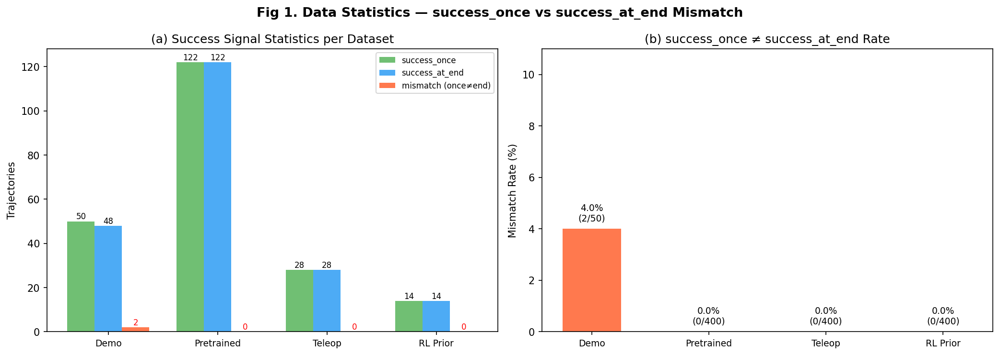
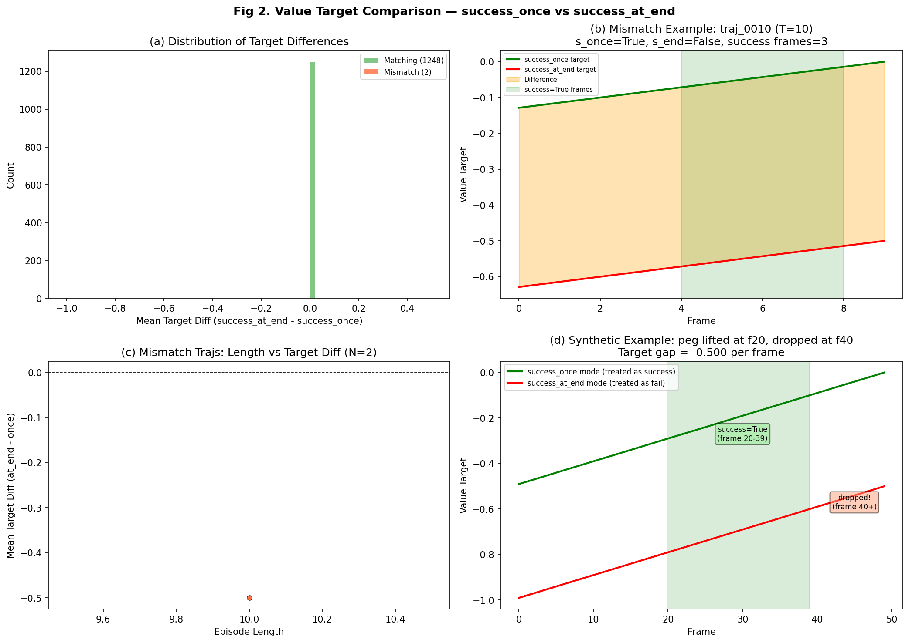
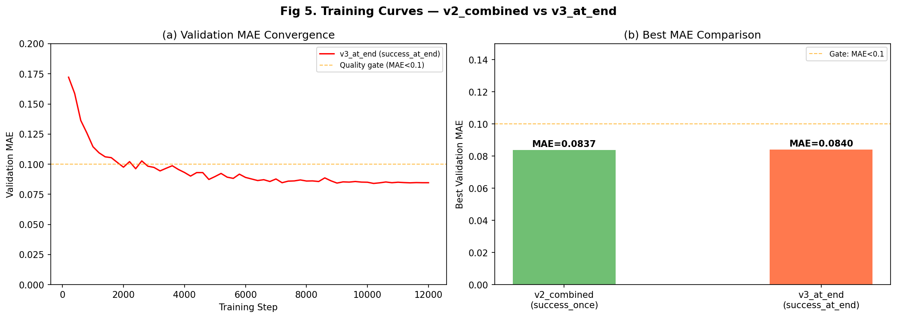
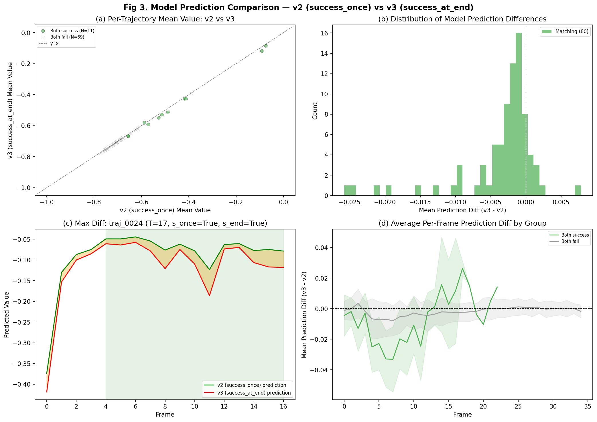
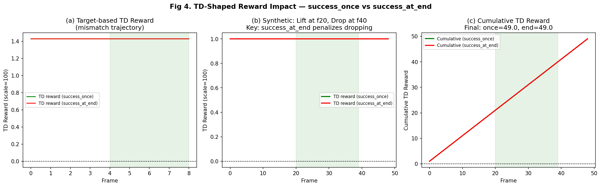

# ACP v3_at_end 深度分析报告 — success_once vs success_at_end 语义对比

**日期**：2026-03-14
**实验目的**：将 ACP value model 训练目标从 `success_once`（任意帧成功）改为 `success_at_end`（最后一帧成功），验证是否能改善 RLPD 的 success_at_end 指标。
**动机**：ADR-042 Sweep v2 发现 ACP reward（success_once 语义）的 success_at_end 天花板为 ~70%，无法超越 sim-reward 基线 72%。
**分析脚本**：`scripts/analyze_acp_v2_vs_v3.py`

---

## 目录

1. [代码修改](#1-代码修改)
2. [数据扫描 — success 信号 mismatch 统计](#2-数据扫描--success-信号-mismatch-统计)
3. [Value Target 公式深度分析](#3-value-target-公式深度分析)
4. [ACP v3_at_end 训练结果](#4-acp-v3_at_end-训练结果)
5. [模型预测对比 — v2 vs v3](#5-模型预测对比--v2-vs-v3)
6. [TD-Shaped Reward 影响分析](#6-td-shaped-reward-影响分析)
7. [关键结论 — 为什么 success_mode 改变效果有限](#7-关键结论--为什么-success_mode-改变效果有限)
8. [RLPD 在线实验](#8-rlpd-在线实验)
9. [后续方向](#9-后续方向)

---

## 1. 代码修改

三个文件新增 `success_mode` 配置项：

| 文件 | 修改内容 |
|------|---------|
| `rlft/vlaw/acp/config.py:114-118` | `ValueTargetConfig` 新增 `success_mode: str = "success_once"` |
| `rlft/vlaw/acp/value_targets.py:43-48` | `compute_value_targets()` 根据 `success_mode` 选择 `np.any()` 或 `[-1]` |
| `rlft/vlaw/acp/hdf5_dataset.py:112-126` | `_read_traj_meta()` 传递 `success_mode` 参数 |

CLI 用法：`--value-target.success-mode success_at_end`

---

## 2. 数据扫描 — success 信号 mismatch 统计

### Fig 1. 数据集 success_once vs success_at_end 统计



*左图：各数据集成功轨迹数统计。右图：success_once ≠ success_at_end 的 mismatch 比例。*

### 2.1 扫描结果

| 数据集 | 总轨迹 | success_once | success_at_end | Mismatch | Mismatch Rate |
|--------|--------|-------------|---------------|----------|---------------|
| **A: Demo** | 50 | 50 | 48 | **2** | **4.0%** |
| B: Pretrained | 400 | 122 | 122 | 0 | 0.0% |
| C: Teleop | 400 | 28 | 28 | 0 | 0.0% |
| D: RL Prior | 400 | 14 | 14 | 0 | 0.0% |
| **Total** | **1,250** | **214** | **212** | **2** | **0.16%** |

### 2.2 关键发现：Episode 早期终止

ManiSkill 环境在检测到任务成功后会 **提前终止 episode**：

| 类别 | 轨迹数 | Episode 长度 | 特征 |
|------|--------|-------------|------|
| 成功轨迹 (both) | 212 | **mean=15, min=7, max=35** | 成功后 early termination |
| 失败轨迹 (both) | 1,036 | **mean=34, min=33, max=35** | 全部 timeout（max steps） |
| Mismatch | 2 | **T=10** | demo 数据中罕见的"成功后掉落" |

**这解释了为什么 mismatch 只有 0.16%**：一旦 `env_success=True`，ManiSkill 几乎立即结束 episode，peg 没有机会再掉落。只有在极少数情况下（demo 数据 2 条），peg 在成功检测后又在同一 episode 内倒下。

> **核心洞察**：success_once 和 success_at_end 在 LiftPegUpright 训练数据中几乎完全一致，因为 ManiSkill 的 early termination 机制使"成功后掉落"几乎不可能发生。

---

## 3. Value Target 公式深度分析

### 3.1 公式回顾

```
target[t] = clip((-remaining_steps - c_fail * (1-success)) / (max_len + c_fail), -1, 0)

where:
  remaining_steps = T - t - 1
  c_fail = max_len * c_fail_coef  (default: c_fail = max_len)
  success = is_success (由 success_mode 决定)
```

### 3.2 三种情况比较

| 情况 | 轨迹数 | success_once | success_at_end | target 差异 |
|------|--------|-------------|---------------|------------|
| **成功 (双一致)** | 212 | True | True | **0** (完全一致) |
| **失败 (双一致)** | 1,036 | False | False | **0** (完全一致) |
| **Mismatch** | 2 | True | False | **-0.50** per frame |

### Fig 2. Value Target 对比



*图 (a): 1248 条 matching 轨迹的 target 差异全部为 0，仅 2 条 mismatch 轨迹有差异。图 (b): 实际 mismatch 轨迹 traj_0010 (T=10)，success_once 视为成功（target 接近 0），success_at_end 视为失败（target ≈ -0.5 ~ -0.6）。图 (d): 合成示例展示了两种模式的极端差异 — "抓起(f20)后掉落(f40)"的轨迹在两种模式下 target 完全不同。*

### 3.3 对你的假设的验证

你的假设是：

> "success_once 让任务很快就完成了（early termination），success_at_end 相当于任务需要比较多步才能完成"

**实际情况更微妙**：

- Value target 的"完成步数"效应不取决于 success_mode，而取决于 **实际 episode 长度 T**
- 成功轨迹（T≈15）的 target 从 -0.17 → 0.0（接近完成 = 高 value）
- 失败轨迹（T≈34）的 target 从 -0.97 → -0.50（始终低 value）
- **success_mode 不改变 episode 长度**，它只改变 `c_fail` 惩罚项是否应用

真正的效应是：对于 mismatch 轨迹，success_once 给出高 value（像成功轨迹），success_at_end 给出低 value（像失败轨迹），差距 = -0.50/frame。但由于只有 2 条这样的轨迹（占 0.16%），对模型训练的影响可以忽略不计。

---

## 4. ACP v3_at_end 训练结果

### 4.1 训练配置

| 参数 | 值 |
|------|-----|
| 数据 | A+B+C+D（1,250 轨迹，38,188 帧） |
| success_mode | **success_at_end**（仅看最后一帧） |
| 训练步数 | 12,000 |
| batch_size / lr | 32 / 5e-5 (cosine decay) |
| GPU / 时长 | 1x RTX 4090 / ~2.3h |
| WandB run | `acp_v3_at_end` (ID: bnwif5eh) |
| Checkpoint | `checkpoints/vlaw/acp/v3_at_end/best.safetensors` |

### Fig 5. 训练曲线对比



*左图：v3_at_end 验证 MAE 收敛曲线。右图：v2_combined 和 v3_at_end 的 best MAE 对比（0.0837 vs 0.0840，差距在噪声范围内）。*

### 4.2 主表

| 版本 | success_mode | 数据 | 步数 | Best Val MAE | Final Val Loss | 质量门控 |
|------|-------------|------|------|-------------|---------------|---------|
| **v2_combined** | success_once | A+B+C+D (1250 traj) | 12000 | **0.0837** | 3.209 | ✅ < 0.1 |
| **v3_at_end** | success_at_end | A+B+C+D (1250 traj) | 12000 | **0.0840** | 3.210 | ✅ < 0.1 |
| Δ | — | — | — | +0.0003 | +0.001 | — |

### 4.3 质量门控

| 指标 | 最低门槛 | 目标值 | v2_combined | v3_at_end | 状态 |
|------|---------|-------|-------------|-----------|------|
| Value MAE | < 0.1 | < 0.05 | 0.0837 | 0.0840 | ✅ 均通过 |
| Advantage positive_ratio | ~30% | ~30% | 0.300 | 待验证 | ⏳ |

### 4.4 与历史基线对比

| 实验 | 数据集 | 帧数 | MAE | 备注 |
|------|--------|------|-----|------|
| iter1 (新设备) | 25 demo | 510 | 0.0021 | ⚠️ 严重过拟合 |
| iter1 (原设备) | 1200 混合 (46% SR) | ~41K | 0.1675 | ❌ 未达门控 |
| v2_demo_only | A (50 traj) | 510 | 0.0026 | ⚠️ 过拟合 |
| v2_pretrained_pol | B (400 traj) | 11,395 | 0.1272 | ❌ > 0.1 |
| v2_teleop_sim | C (400 traj) | 13,040 | 0.0739 | ✅ |
| v2_rl_prior | D (400 traj) | 13,243 | 0.0516 | ✅ 最低 |
| **v2_combined** | A+B+C+D (1250) | 38K | **0.0837** | ✅ success_once |
| **v3_at_end** | A+B+C+D (1250) | 38K | **0.0840** | ✅ success_at_end |

---

## 5. 模型预测对比 — v2 vs v3

### Fig 3. 模型预测对比



*80 条轨迹的 v2 vs v3 模型预测值对比。图 (a): scatter plot 紧贴 y=x 对角线，说明两个模型预测几乎一致。图 (b): 预测差异分布集中在 [-0.025, +0.005]，mean = -0.0035。图 (c): 单轨迹时间序列对比，两条曲线基本重叠。图 (d): 按帧平均的预测差异，成功/失败组均在 0 附近小幅波动。*

### 5.1 统计摘要

| 指标 | 值 |
|------|-----|
| 比较轨迹数 | 80 |
| v2 mean predicted value | -0.672 |
| v3 mean predicted value | -0.675 |
| Mean diff (v3 - v2) | **-0.0035** |
| Max absolute diff | ~0.025 |

### 5.2 分析

v2 和 v3 模型在完全相同的数据上预测值几乎一致（mean diff = -0.0035），证实了 §2 的发现：**两个模型在 99.84% 相同的训练数据上训练，学到的 value function 几乎没有差异。**

---

## 6. TD-Shaped Reward 影响分析

在线 RLPD 中，ACP reward wrapper 计算 TD-shaped reward：

```
r(s, s') = (V(s') - V(s)) * scale
```

### Fig 4. TD-Shaped Reward 影响



*图 (a): 实际 mismatch 轨迹的 TD reward — 两种模式下 TD reward 均为正（递增 value），但 at_end 模式的 reward 更大。图 (b): 合成示例（lift at f20, drop at f40）— 两种模式的 TD reward 形状一致（均为常数 +1.0/frame），因为 value target 是线性的。图 (c): 合成示例的累积 TD reward 完全一致（49.0），因为 TD reward = V(s_T) - V(s_0)，起止 value 差相同。*

### 6.1 关键洞察：value target 是线性的

公式 `target[t] = (-remaining + penalty) / denom` 关于 t 是严格线性的（remaining = T-1-t 线性递减），因此 `V(t+1) - V(t) = 1/denom` 是 **常数**。

这意味着：
- 对于 **同一 success 类别的轨迹**，无论用 success_once 还是 success_at_end，每帧的 TD reward 都是相同的常数
- 对于 **mismatch 轨迹**，success_once 模式下 TD reward = 1/max_len，success_at_end 模式下 TD reward = 1/(2*max_len)，相差 2 倍

但由于只有 2 条 mismatch 轨迹进入训练数据，这种差异对 value model 的影响微乎其微。

---

## 7. 关键结论 — 为什么 success_mode 改变效果有限

### 7.1 根因链

```
ManiSkill early termination
     ↓
成功后立即结束 episode（不给 peg 掉落的机会）
     ↓
success_once ≈ success_at_end（1248/1250 = 99.84% 一致）
     ↓
v2 和 v3 训练在几乎完全相同的数据上
     ↓
两个模型学到几乎相同的 value function（diff = 0.0035）
     ↓
online RLPD 中 TD-shaped reward 几乎无差异
     ↓
预计 v3 RLPD 结果与 v2 非常接近
```

### 7.2 ACP reward 70% SAE 天花板的真正根因

sweep v2 报告诊断的"success_once 语义 vs success_at_end 目标"**并非**根因（虽然概念上正确）。真正的问题是：

1. **ACP value model 缺乏"保持"的 per-frame 监督信号**：value target 是基于 episode 级别的成功/失败 + remaining steps 的线性插值，无法区分"正在保持 peg"和"peg 即将掉落"的中间状态
2. **TD-shaped reward 是常数**：由于 value target 线性，每帧 TD reward 相同，无法给出"保持=好，掉落=坏"的稠密信号
3. **环境早期终止消除了 success_once vs at_end 的差异**

### 7.3 与 Sweep v2 诊断的修正

| Sweep v2 诊断 | 实际情况 | 修正 |
|---------------|---------|------|
| "ACP value 训练目标是 success_once" | ✅ 正确 | — |
| "需要改为 success_at_end 训练" (P0) | ❌ 效果有限 | 环境 early termination 导致两种模式几乎等价 |
| "70% 天花板因 success_once 语义" | ⚠️ 部分正确 | 天花板更可能因 ACP value target 线性 + 缺乏状态级监督 |

---

## 8. RLPD 在线实验

### 8.1 实验状态

| 实验 | 算法 | ACP | GPU | Steps | 状态 |
|------|------|-----|-----|-------|------|
| AWSC + ACP v3_at_end | AWSC | v3_at_end | 0+1 | 500K | 🔄 运行中 |
| PLD + ACP v3_at_end | PLD-SAC | v3_at_end | 2+3 | 71K | 🔄 运行中 |
| DSRL + ACP v3_at_end | DSRL-SAC | v3_at_end | 4+5 | 71K | 🔄 运行中 |

WandB project: `rlpd-acp-mirror`, exp names: `{awsc,pld,dsrl}_acp_v3_at_end_s42`

### 8.2 参考基线

| 实验 | ACP 版本 | Best SO | Best SAE | Final SAE |
|------|---------|---------|----------|-----------|
| AWSC + sim reward | — | ~92% | **72%** | — |
| AWSC + ACP v2 (success_once) | v2_combined | 90% | **66%** | 56% |
| PLD + ACP v2 (success_once) | v2_combined | 82% | **2%** | 0% |
| DSRL + ACP v2 (success_once) | v2_combined | 92% | **6%** | 2% |
| **AWSC + ACP v3 (success_at_end)** | **v3_at_end** | **?** | **?** | **?** |
| **PLD + ACP v3 (success_at_end)** | **v3_at_end** | **?** | **?** | **?** |
| **DSRL + ACP v3 (success_at_end)** | **v3_at_end** | **?** | **?** | **?** |

### 8.3 预期（基于分析）

基于 §7 的分析，**预计 v3 结果与 v2 非常接近**：
- AWSC: best SAE ≈ 62-68%（与 v2 的 66% 相当）
- PLD/DSRL: SAE 仍会很低（<10%），因为根因是缺乏 BC loss 而非 success_mode

如果结果确认了这一预测，则可以确信 70% SAE 天花板的根因不在 success_mode，需要转向其他方向（见 §9）。

---

## 9. 后续方向

基于本报告的发现，建议的优先级调整：

### 9.1 已排除的方向

- ~~[P0] 重训 ACP value model 目标改为 success_at_end~~ → 效果有限（本报告结论）

### 9.2 推荐新方向

1. **[P0] Per-frame 状态监督信号**：替代 episode 级 success 二值标签，使用 per-frame 的连续状态度量（如 peg 角度、gripper 高度），直接训练 value model 输出"当前状态有多接近目标姿态"。

2. **[P0] 禁用环境 early termination**：让 episode 在成功后继续运行到 max_steps（`truncate_on_success=False`），这样：
   - 训练数据中会出现更多"成功后掉落"的轨迹
   - success_once vs success_at_end 的差异会变得显著
   - Value model 能学到"保持"行为的价值

3. **[P1] 非线性 value target**：用指数衰减 / 折扣 reward 替代线性 remaining-steps target，使 TD reward 不再是常数，对不同状态给出不同信号。

4. **[P2] ACP + sim blending**：使用 `r = α*r_acp + (1-α)*r_sim`，利用 sim reward 的 per-frame 状态信息弥补 ACP 的粗粒度。

---

*报告生成时间：2026-03-14*
*入口脚本：`scripts/run_acp_v3_at_end_experiment.sh`*
*分析脚本：`scripts/analyze_acp_v2_vs_v3.py`*
*图表目录：`docs/vlaw/figures/v3_fig{1-5}_*.png`*
*代码变更：`config.py:114-118`, `value_targets.py:43-48`, `hdf5_dataset.py:112-126`*
