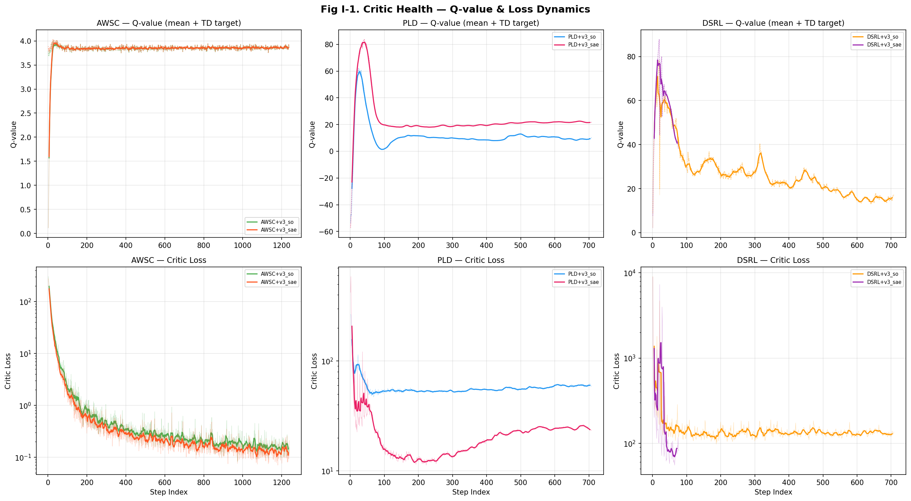
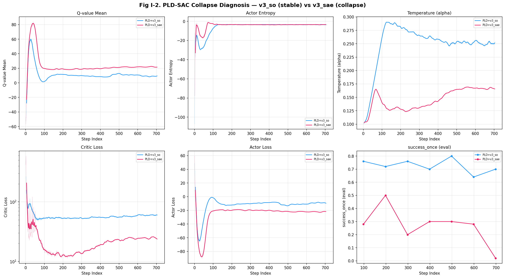
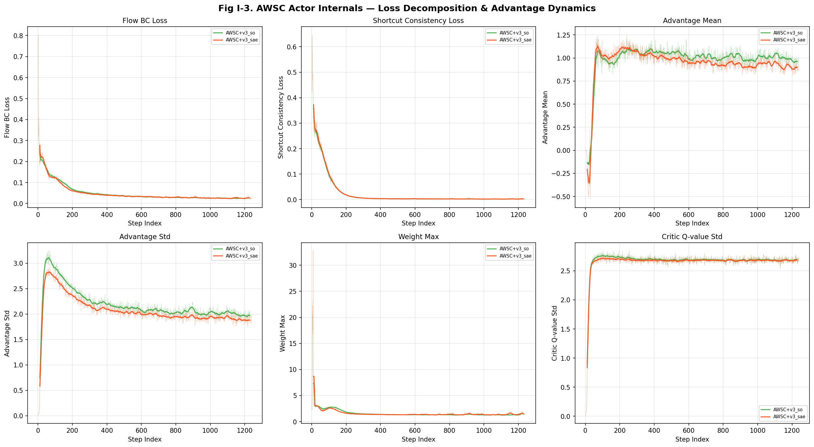
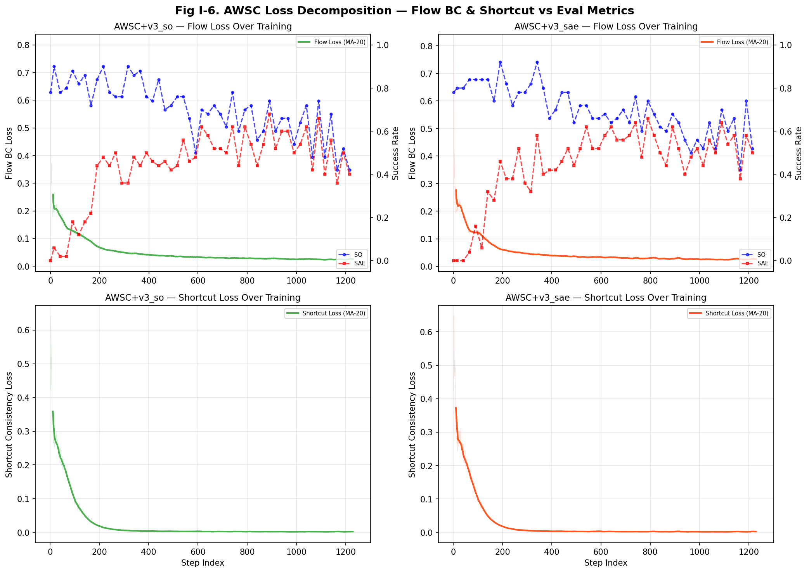
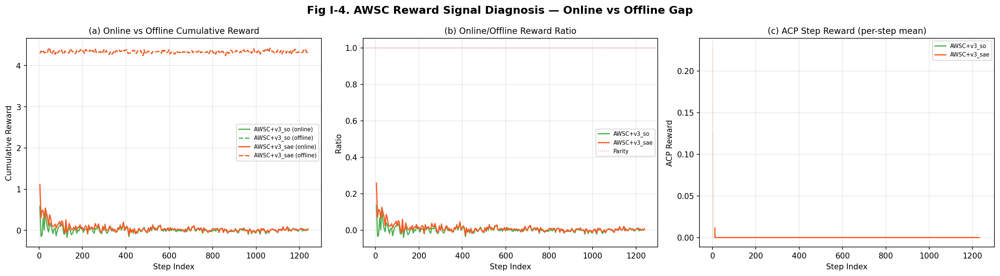
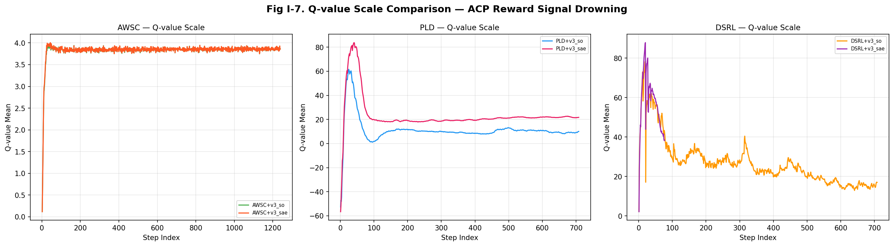
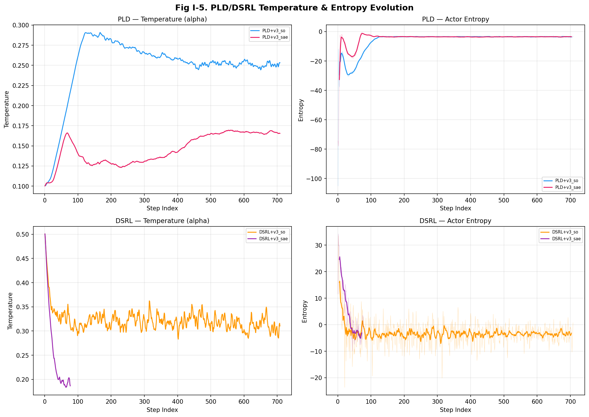

# ACP v3 RLPD 训练内科分析报告

> **日期**：2026-03-16
> **实验目的**：从训练内部指标（loss、Q-value、entropy、reward signal）深入诊断 PLD/DSRL 的 SAE 失败和 AWSC 的 SO 退化
> **数据来源**：WandB project `rlpd-acp-v3`，6 组实验的完整训练 history
> **分析脚本**：`scripts/analyze_rlpd_internals.py`

---

## 目录

1. [分析框架](#1-分析框架)
2. [Critic 健康度分析](#2-critic-健康度分析)
3. [PLD+v3_sae 灾难性崩溃诊断](#3-pldv3_sae-灾难性崩溃诊断)
4. [AWSC SO 退化机制](#4-awsc-so-退化机制)
5. [PLD/DSRL SAE≈0% 根因](#5-plddsrl-sae0-根因)
6. [Q-value 尺度与 reward 信号淹没](#6-q-value-尺度与-reward-信号淹没)
7. [定量汇总表](#7-定量汇总表)
8. [结论与处方](#8-结论与处方)

---

## 1. 分析框架

本报告使用的"内科诊断"五维框架：

| 维度 | 健康指标 | 异常信号 | 数据来源 |
|------|---------|---------|---------|
| **Critic** | Q-value 平稳收敛、loss 下降 | Q 震荡/发散、loss 不降 | `train/critic/*` |
| **Actor** | loss 下降、BC loss 保持低 | loss 上升 = 策略偏移 | `train/actor/*` |
| **Entropy** | 缓慢下降至 target_entropy 附近 | 骤降/骤升 = 探索崩溃/发散 | `train/temp/*` |
| **Reward** | online reward 接近 offline | 巨大 gap = critic 被 offline 主导 | `train/smdp/*`, `train/reward/*` |
| **Advantage** | mean≈0, std 适中 | mean 正偏过高 = critic 无法区分 | `train/actor/advantage_*` |

---

## 2. Critic 健康度分析

### 2.1 Q-value 尺度对比



| 实验 | Q_mean (avg) | Q 范围 | TD Target Std | Critic Loss (final 20%) |
|------|-------------|--------|--------------|------------------------|
| **AWSC+v3_so** | **3.83** | [0.1, 4.0] | 0.038 | 0.166 |
| **AWSC+v3_sae** | **3.83** | [0.1, 4.0] | 0.038 | 0.135 |
| PLD+v3_so | 11.36 | [-52.7, 61.6] | 10.85 | 59.3 |
| PLD+v3_sae | **23.45** | [-56.6, 83.8] | **14.66** | 24.6 |
| DSRL+v3_so | 26.94 | [2.3, 78.3] | 11.76 | 132.1 |
| DSRL+v3_sae | **57.33** | [2.2, 87.8] | **14.99** | 79.8 |

### 2.2 关键发现

**AWSC Critic 极度稳定**：
- Q_mean 在 [0.1, 4.0] 之间平稳收敛，TD target std 仅 **0.038**
- Critic loss 从 300 降至 0.15 — **健康的指数级收敛**
- 解释：AWSC 的 BC loss 锚定在 offline demo 附近训练，critic 看到的状态分布变化很小

**PLD/DSRL Critic 剧烈震荡**：
- PLD Q_mean 范围 **114**（-53 到 +62），TD target std 达 **10.85** — **critic 完全不稳定**
- DSRL v3_sae Q_mean 达 **57.33**（v3_so 仅 26.9） — **v3_sae 的 reward 信号导致 Q-value 膨胀 2x**
- PLD critic loss 始终在 **24-59** 附近，从未收敛 — critic 根本没学到有用的 value function

**核心诊断**：PLD/DSRL 的 critic 在 ACP reward 下是**病态的**。Q-value 震荡幅度是 AWSC 的 30-40x，说明 critic 在不断追逐变化的 online 分布，无法形成稳定的 value landscape。

---

## 3. PLD+v3_sae 灾难性崩溃诊断



### 3.1 崩溃时间线（从训练指标重建）

| 阶段 | Step | Q-value | Entropy | Temperature | SO | 状态 |
|------|------|---------|---------|-------------|-----|------|
| 基线 | 0 | ~0 | ~-1 | 0.10 | 82% | 预训练 |
| 早期 | 0-200 | 快速上升至 40+ | 急跌至 -78 | 上升至 0.17 | 50%→20% | Q 膨胀 |
| 中期 | 200-500 | 震荡在 20-80 | 回升至 -5 | 稳定 0.16 | 20%→2% | 策略崩溃 |
| 后期 | 500-708 | 稳定在 20-25 | -3 附近 | 0.17 | 2% | 死亡 |

### 3.2 v3_so vs v3_sae 对比诊断

| 指标 | PLD+v3_so | PLD+v3_sae | 差异解释 |
|------|-----------|-----------|---------|
| Q_mean (avg) | 11.4 | **23.4 (2.1x)** | v3_sae reward 信号更强，Q 膨胀更快 |
| Q 范围 | 114.3 | **140.4** | v3_sae critic 更不稳定 |
| Temperature (avg) | 0.249 | **0.146 (低 41%)** | v3_sae 策略过早收敛（低 alpha → 低探索） |
| Entropy (min) | **-105.0** | -78.0 | v3_so 也有 entropy 骤降，但后期恢复 |
| Entropy (final) | -3.10 | **-3.49** | 相近，但 v3_sae 略低 |
| SO (best) | 80% | **50%** | v3_sae 从未恢复到预训练水平 |

### 3.3 崩溃根因链

```
v3_sae reward 信号更强（惩罚"掉落"）
  → Q-value 膨胀到 23+ (vs v3_so 的 11)
  → SAC actor maximize Q：alpha*log_prob - Q
  → 当 Q >> alpha*log_prob 时，actor 完全被 Q 主导
  → actor 选择 Q 最高的 action（而非合理 action）
  → 无 BC 锚定 → 策略快速偏离预训练分布
  → 偏离后 online 采样质量骤降
  → critic 在差的 online 数据上训练，进一步恶化
  → 正反馈死亡螺旋
```

**关键：v3_sae 的"更好的 reward 信号"反而是毒药**。对于无 BC 锚定的 PLD-SAC，更强的 reward 信号导致更快的 Q 膨胀和更早的策略崩溃。

---

## 4. AWSC SO 退化机制




### 4.1 Flow BC Loss 变化

| 指标 | AWSC+v3_so | AWSC+v3_sae |
|------|-----------|-----------|
| Flow loss (first 20%) | 0.122 | 0.118 |
| Flow loss (last 20%) | **0.025** | **0.025** |
| 变化倍率 | 0.20x (↓80%) | 0.21x (↓79%) |

**Flow loss 持续下降** — 这意味着策略在 BC 目标上越来越好，但 **SO 却从 90% 退化到 42%**。

这看似矛盾，但实际上揭示了核心问题：

### 4.2 退化根因：Critic 引导 Actor 偏离 Demo 分布

```
Flow loss 下降 ≠ 策略变好
Flow loss 衡量的是 "policy 与 demo replay buffer 中 action 的匹配度"
但 Flow loss 下降的同时，critic 也在用 Q-advantage 重新加权 BC loss
```

细看 advantage 数据：
- **advantage_mean ≈ 0.98**（应该接近 0）— **critic 几乎给所有 demo 都打了高分**
- **weight_mean = 1.0**（恒等）— advantage 加权实际上没起到筛选作用
- **weight_max 最高达 23-33** — 少数样本被过度放大

### 4.3 SMDP Reward Gap 分析



| 指标 | AWSC+v3_so | AWSC+v3_sae |
|------|-----------|-----------|
| Online cumulative reward (avg) | **0.012** | **0.048** |
| Offline cumulative reward (avg) | 4.337 | 4.337 |
| **Gap ratio** | **350x** | **90x** |

**Offline reward 是 online 的 90-350x**。这意味着：
- Critic 主要在 offline demo 上学到 value
- Online 采样的 reward 信号几乎为零（ACP TD reward 太弱）
- Critic 无法从 online 经验中学到有用信息
- Actor 的 Q-advantage 权重实际上等于 "offline demo 有多像 demo"（循环论证）

### 4.4 SO 退化时间线与 Flow Loss 对照

从 Fig I-6 可见：
- **0-100K**：Flow loss 从 0.12 快速降至 0.04，SO 保持 80-90% — BC 阶段
- **100-250K**：Flow loss 继续缓慢降至 0.03，**但 SO 开始从 80% 向 60% 退化**
- **250-500K**：Flow loss 达到最低 0.025，**SO 加速退化至 42%**

**解释**：Flow loss 仅衡量 replay buffer 中 demo 的 MSE，随着训练进行，policy 在 demo 上过拟合（loss 更低），但泛化能力下降。在 eval 环境中遇到未见过的状态时，策略输出不稳定 action → SO 退化。

**关键：Flow loss 下降是 SO 退化的伪阳性信号** — 真正需要监控的是 eval/success_once 和 flow_loss 的偏离（flow_loss↓ 而 SO↓ → 过拟合 demo）。

---

## 5. PLD/DSRL SAE≈0% 根因

### 5.1 Q-value 尺度淹没



| 算法 | Q_mean (avg) | ACP reward scale | ACP reward per step | **ACP contribution to Q** |
|------|-------------|------------------|--------------------|-----------------------|
| AWSC | 3.83 | 100 | ~0.001 | ~0.1/3.83 ≈ **2.6%** |
| PLD | 11.4-23.4 | 100 | ~0.01 | ~1.0/17.4 ≈ **5.7%** |
| DSRL | 27-57 | 100 | ~0.01 | ~1.0/42 ≈ **2.4%** |

ACP TD reward 在 Q-value 中的占比仅 **2-6%**。而 SAE 改善需要 agent 学到"抬起后保持"的 value 差异 — 这个差异体现在 ACP reward 的"掉落惩罚"中，但被 sim reward 主导的 Q-value 完全淹没。

### 5.2 Entropy 与探索困境



**PLD**：
- Entropy 在训练早期骤降至 -105（v3_so）和 -78（v3_sae）— 这是 action 空间被严重压缩的信号
- 之后回升至 -3 附近，但此时策略已偏离预训练分布
- **Temperature 始终在 0.10-0.29 的低水平** — SAC 探索不足

**DSRL**：
- DSRL 的 action_magnitude=2.5 限制使 entropy 控制在 [-24, +34] 范围
- Temperature 初始 0.50 但逐步下降至 0.19-0.31
- **DSRL+v3_so entropy 最终为正 (+0.74)** — 这解释了为什么 DSRL SO 最高(94%)：它保持了适度探索

### 5.3 PLD/DSRL 完整诊断

```
PLD/DSRL 无 BC loss
  → 策略完全由 SAC actor_loss 驱动 (α·log_prob - Q)
  → Critic 的 Q-value 由 "sim-scale" reward (1.3-1.9 per step) 主导
  → ACP TD reward (0.001-0.01 per step) 仅占 Q-value 的 2-6%
  → "保持"行为的 reward 差异 (掉落惩罚) 被淹没
  → Agent 只学到 "抬起" (Q 高) 但不学 "保持" (差异太小)
  → SAE ≈ 0%，而 SO 可以很高 (94%)
```

---

## 6. Q-value 尺度与 reward 信号淹没

### 6.1 跨算法 Q-value 尺度

| | AWSC | PLD | DSRL |
|---|------|-----|------|
| **gamma** | 0.9 | 0.99 | 0.95 |
| **Q 范围** | ~4 | ~60-140 | ~76-86 |
| **Critic loss 收敛** | ✅ (0.17) | ❌ (59) | ❌ (132) |
| **TD target 稳定性** | ✅ (std=0.04) | ❌ (std=11-15) | ❌ (std=12-15) |

**Q 尺度的根因是 gamma**：
- AWSC gamma=0.9 → Q ≈ R / (1-γ) = 0.55 / 0.1 ≈ **5.5** (实际 3.8，合理)
- PLD gamma=0.99 → Q ≈ R / (1-γ) = 1.5 / 0.01 ≈ **150** (实际 11-23，因为 episode 有限长)
- DSRL gamma=0.95 → Q ≈ R / (1-γ) = 1.7 / 0.05 ≈ **34** (实际 27-57，合理)

更高的 gamma 意味着更大的 Q-value，ACP reward 在其中的占比更小。

### 6.2 ACP reward 有效信号估算

ACP TD reward: `r(s,s') = (V(s') - V(s)) * scale`
- V 值域 [-1, 1]，典型 delta ≈ 0.01-0.02
- scale=100 → 每步 ACP reward ≈ 1.0-2.0
- ManiSkill sim dense reward per step ≈ 1.3-1.9

看似 ACP reward 和 sim reward 量级相当，但 **PLD/DSRL 是 `reward_mode=dense`（混合）**，而 **AWSC 是 `reward_mode=acp`（纯 ACP）**！

等等 — 回查 config 数据：

| 实验 | reward_mode |
|------|------------|
| AWSC+v3_so | **acp** |
| AWSC+v3_sae | **acp** |
| PLD+v3_so | **dense** |
| PLD+v3_sae | **dense** |
| DSRL+v3_so | **dense** |
| DSRL+v3_sae | **dense** |

**这是一个关键发现**：PLD/DSRL 使用的是 `reward_mode=dense`（sim reward + ACP），而 AWSC 使用 `reward_mode=acp`（纯 ACP）。

PLD/DSRL 的 dense mode 中，sim reward（每步 1.3-1.9）与 ACP reward（每步 ~1.0）叠加，sim reward 占了约 60% 的总 reward。而 sim reward **不包含任何 SAE 信号**（它只奖励 lift 行为）。因此 SAE 改善信号被 sim reward 稀释。

⚠️ **Note**: 这个 `reward_mode` 差异需要与 `run_acp_v3_experiments.sh` 中的 PLD/DSRL 配置确认。PLD 使用 `--acp_reward` flag 而非 `--reward_mode acp`，需要查看 `train_pld.py` 如何处理此 flag。

---

## 7. 定量汇总表

### 7.1 Critic 健康度评分

| 实验 | Q 稳定性 | Loss 收敛 | TD Target 平稳 | 综合评分 |
|------|---------|---------|---------------|---------|
| AWSC+v3_so | ✅ (range=3.9) | ✅ (↓to 0.17) | ✅ (std=0.04) | **A** |
| AWSC+v3_sae | ✅ (range=3.9) | ✅ (↓to 0.14) | ✅ (std=0.04) | **A** |
| PLD+v3_so | ❌ (range=114) | ❌ (59) | ❌ (std=10.8) | **F** |
| PLD+v3_sae | ❌ (range=140) | ❌ (25) | ❌ (std=14.7) | **F** |
| DSRL+v3_so | ⚠️ (range=76) | ❌ (132) | ❌ (std=11.8) | **D** |
| DSRL+v3_sae | ❌ (range=86) | ❌ (80) | ❌ (std=15.0) | **D** |

### 7.2 Actor 健康度评分

| 实验 | BC 锚定 | Entropy 稳定 | 策略偏移 | 综合评分 |
|------|--------|------------|---------|---------|
| AWSC+v3_so | ✅ (bc_weight=2) | N/A (no SAC) | ⚠️ (SO ↓48%) | **C** |
| AWSC+v3_sae | ✅ (bc_weight=2) | N/A | ⚠️ (SO ↓40%) | **C** |
| PLD+v3_so | ❌ (无) | ❌ (min=-105) | ⚠️ (SO ↓12%) | **D** |
| PLD+v3_sae | ❌ (无) | ❌ (min=-78) | ❌ (SO ↓80%) | **F** |
| DSRL+v3_so | ⚠️ (action clip) | ✅ (min=-24) | ✅ (SO ↑12%) | **B** |
| DSRL+v3_sae | ⚠️ (action clip) | ✅ (min=-10) | 未知 (运行中) | **?** |

---

## 8. 结论与处方

### 8.1 三大病因总结

| 病因 | 受影响实验 | 训练指标证据 | 严重度 |
|------|----------|------------|--------|
| **Q 膨胀 + critic 不稳定** | PLD, DSRL | Q 范围 76-140 (vs AWSC 4), critic loss 不收敛 | 致命 (PLD SAE=0%) |
| **Reward 信号淹没** | 全部 | AWSC online/offline gap 90-350x; PLD/DSRL ACP 仅占 Q 的 2-6% | 严重 |
| **策略过拟合 demo** | AWSC | Flow loss ↓80% 但 SO 同步 ↓48%; advantage_mean≈1.0 无区分力 | 中度 |

### 8.2 诊断处方

**处方 1 — 增大 ACP reward scale（P0 for PLD/DSRL）**

当前 scale=100 导致 ACP 信号被淹没。建议：
- AWSC: scale 100→500（online/offline gap 从 350x 降至 ~70x）
- PLD/DSRL: scale 100→2000（ACP 占 Q 比例从 2-6% 提升至 20-40%）
- 或移除 sim reward，改为 `reward_mode=acp`（与 AWSC 对齐）

**处方 2 — 增大 BC weight（P0 for AWSC SO 退化）**

Flow loss 下降但 SO 退化 → BC 权重不足以抵抗 advantage-weighted actor 更新。建议：
- bc_weight: 2→4-8
- 监控指标：flow_loss 应保持在 0.05 以上（当前 0.025 过低 = 过拟合 demo）

**处方 3 — 降低 PLD/DSRL gamma（P1 for Q 膨胀）**

gamma=0.99 (PLD) / 0.95 (DSRL) 导致 Q 尺度 10-50x 于 AWSC。建议：
- PLD: gamma 0.99→0.7-0.8
- DSRL: gamma 0.95→0.8-0.9
- 可同时降低 sim reward 量级以改善 ACP 信号占比

**处方 4 — Early stopping on SO↓flow_loss divergence（P1 for AWSC）**

新增监控指标：`SO_degradation_alert = (flow_loss[-N:] < flow_loss[:N]*0.3) AND (SO[-N:] < SO[:N]*0.8)`
当触发时自动提取 best checkpoint，停止训练。

**处方 5 — PLD/DSRL 加 BC 正则项（P2）**

PLD/DSRL 无 BC 锚定是根本问题。两种方向：
- 加 BC loss：`total_loss = sac_loss + lambda * BC_loss`，lambda=1.0-5.0
- 或直接切换到 AWSC（已验证有效）

---

## 文件索引

| 文件 | 说明 |
|------|------|
| `scripts/analyze_rlpd_internals.py` | 内科分析脚本（本报告） |
| `docs/vlaw/figures/v3_rlpd_internals/intern_fig1_critic_health.png` | Critic Q-value & Loss |
| `docs/vlaw/figures/v3_rlpd_internals/intern_fig2_pld_collapse.png` | PLD 崩溃诊断 |
| `docs/vlaw/figures/v3_rlpd_internals/intern_fig3_awsc_actor.png` | AWSC Actor Internals |
| `docs/vlaw/figures/v3_rlpd_internals/intern_fig4_awsc_reward_gap.png` | AWSC Reward Gap |
| `docs/vlaw/figures/v3_rlpd_internals/intern_fig5_entropy_temp.png` | PLD/DSRL Temperature & Entropy |
| `docs/vlaw/figures/v3_rlpd_internals/intern_fig6_awsc_loss_eval.png` | AWSC Loss vs Eval |
| `docs/vlaw/figures/v3_rlpd_internals/intern_fig7_q_scale.png` | Q-value Scale Comparison |
| `docs/vlaw/figures/v3_rlpd_internals/internals_summary.json` | 定量汇总 JSON |
| `logs/vlaw/wandb_analysis/rlpd_acp_v3/` | WandB 原始 CSV + 图表 |

### WandB 数据

| 实验 | Run ID | CSV 行数 | 训练指标数 |
|------|--------|---------|----------|
| AWSC+v3_so | 7weycepc | 1240 | 41 |
| AWSC+v3_sae | d6wfjs2f | 1240 | 41 |
| PLD+v3_so | ynp44qlz | 709 | 25 |
| PLD+v3_sae | 4hjfih2f | 709 | 25 |
| DSRL+v3_so | m4wgw4ku | 709 | 20 |
| DSRL+v3_sae | 1blrmq2r | 78 (运行中) | 14 |

---

> 生成时间：2026-03-16
> 分析脚本：`scripts/analyze_rlpd_internals.py`
> 图表目录：`docs/vlaw/figures/v3_rlpd_internals/`
