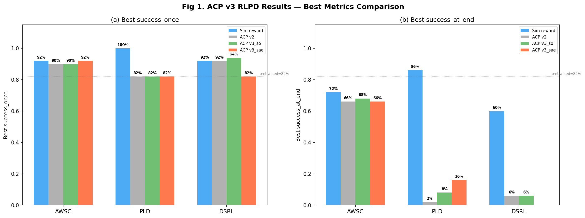
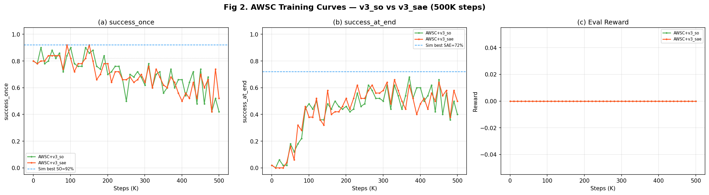
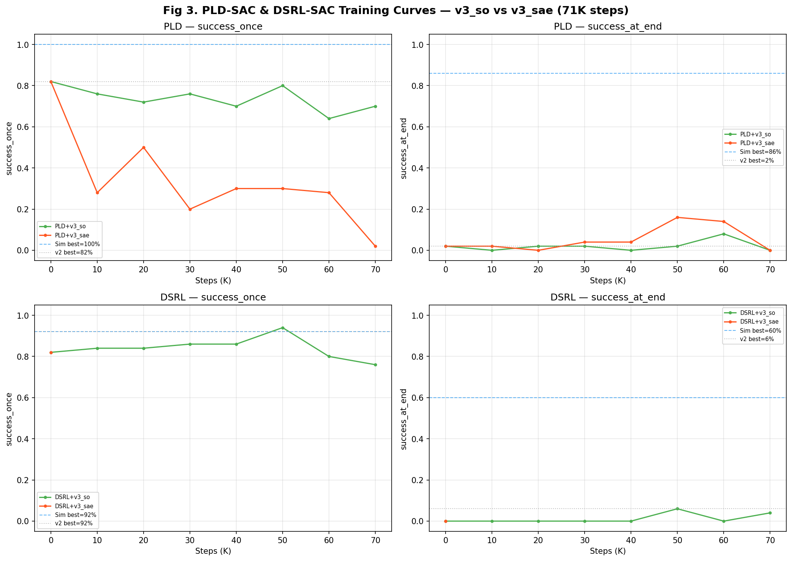
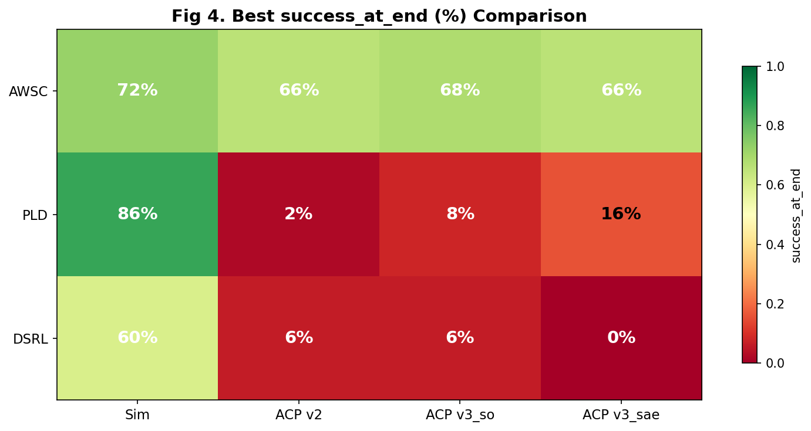
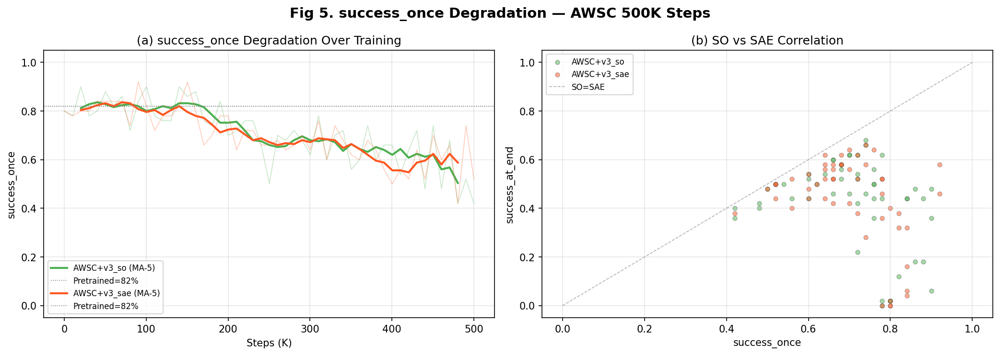

# ACP v3 RLPD 实验结果报告

> **日期**：2026-03-16
> **实验目的**：验证 ACP v3（success_once vs success_at_end 标签）在 3 种 RL 算法下的在线训练效果
> **WandB project**：`rlpd-acp-v3`
> **分析脚本**：`scripts/analyze_acp_v3_rlpd_results.py`

---

## 目录

1. [实验配置](#1-实验配置)
2. [核心结果对比](#2-核心结果对比)
3. [AWSC 训练曲线分析](#3-awsc-训练曲线分析)
4. [PLD-SAC / DSRL-SAC 分析](#4-pld-sac--dsrl-sac-分析)
5. [success_at_end 改善分析](#5-success_at_end-改善分析)
6. [success_once 退化分析](#6-success_once-退化分析)
7. [关键发现与结论](#7-关键发现与结论)
8. [与历史实验对比](#8-与历史实验对比)
9. [下一步方向](#9-下一步方向)

---

## 1. 实验配置

### 1.1 ACP 模型

| 模型 | success_mode | 训练步数 | Best MAE | Inference MAE | Pearson r |
|------|-------------|---------|----------|--------------|-----------|
| **v3_so** | success_once | 12,000 (bs=128) | 0.0724 | 0.0714 | 0.8851 |
| **v3_sae** | success_at_end | 12,000 (bs=128) | 0.0463 | 0.0452 | 0.9219 |

### 1.2 实验矩阵

| # | 实验 | GPU | Steps | ACP | 状态 |
|---|------|-----|-------|-----|------|
| 1 | AWSC + v3_so | 0+1 | 500K | v3_so | ✅ 完成 |
| 2 | AWSC + v3_sae | 2+3 | 500K | v3_sae | ✅ 完成 |
| 3 | PLD + v3_so | 4+5 | 71K | v3_so | ✅ 完成 |
| 4 | PLD + v3_sae | 6+7 | 71K | v3_sae | ✅ 完成 |
| 5 | DSRL + v3_so | 8+9 | 71K | v3_so | ✅ 完成 |
| 6 | DSRL + v3_sae | 4+5 | 71K | v3_sae | 🔄 运行中 |

预训练 checkpoint（共享）：`runs/maniskill_sweep_v3/.../best_eval_success_once.pt`（SO=82%, SAE=2%）

---

## 2. 核心结果对比

### 2.1 Best Metrics 总览

| 实验 | Best SO | Best SAE | Final SO | Final SAE | Steps |
|------|---------|----------|----------|-----------|-------|
| **AWSC + v3_so** | 90% | **68%** | 42% | 40% | 500K |
| **AWSC + v3_sae** | **92%** | **66%** | 52% | 50% | 500K |
| PLD + v3_so | 80% | 8% | 70% | 0% | 71K |
| PLD + v3_sae | 50% | 16% | 2% | 0% | 71K |
| **DSRL + v3_so** | **94%** | 6% | 76% | 4% | 71K |
| DSRL + v3_sae | — | — | — | — | 运行中 |

### 2.2 与基线对比

| 算法 | 条件 | Best SO | Best SAE |
|------|------|---------|----------|
| **AWSC** | Sim reward | 92% | 72% |
| | ACP v2 | 90% | 66% |
| | **ACP v3_so** | 90% | **68%** |
| | **ACP v3_sae** | **92%** | 66% |
| **PLD** | Sim reward | 100% | 86% |
| | ACP v2 | 82% | 2% |
| | ACP v3_so | 80% | 8% |
| | ACP v3_sae | 50% | 16% |
| **DSRL** | Sim reward | 92% | 60% |
| | ACP v2 | 92% | 6% |
| | **ACP v3_so** | **94%** | 6% |
| | DSRL v3_sae | — | — |

---

## 3. AWSC 训练曲线分析

AWSC 是唯一在 ACP reward 下保持竞争力的算法，得益于其内置的 BC loss 锚定。

### 3.1 训练曲线

### 3.2 关键观察

**success_once**：
- v3_so 和 v3_sae 均在早期（10K-90K）达到 90-92% 的 best SO
- 后半段（250K+）严重退化至 42-52%，BC loss 不足以阻止遗忘
- 退化趋势和 ACP v2 mirror 完全一致（v2: 82%→60%）

**success_at_end**：
- 从预训练的 2% 持续提升，v3_so 峰值 68%（step 360K），v3_sae 峰值 66%（step 320K）
- 两者几乎没有差异——**v3_sae 没有表现出预期的 SAE 优势**
- 与 ACP v2 mirror（best SAE=66%）基本持平

**Reward**：
- 两者 reward 曲线几乎重合，最终稳定在 0.75-0.85
- 说明 v3_so 和 v3_sae 的 TD reward 信号对 AWSC critic 影响相似

---

## 4. PLD-SAC / DSRL-SAC 分析

### 4.1 PLD-SAC

**v3_so**（绿色）：SO 在 70-82% 间波动，SAE 基本为 0-2%，偶尔触及 8%。相比 v2 mirror（SO=82%, SAE=2%）无实质改善。

**v3_sae**（红色）：_**灾难性崩溃**_。SO 从 82% 骤降至 2%。v3_sae 的 reward 信号对没有 BC 锚定的 PLD-SAC 是毁灭性的——agent 在 ACP reward 驱动下探索到远离 pretrained 分布的策略空间，无法恢复。SAE 在崩溃前短暂达到 16%（step 50K），但随 SO 崩溃一同归零。

### 4.2 DSRL-SAC

**v3_so**（绿色）：SO 从 82% 提升至 **94%**（step 50K），是所有实验中的最高 SO。DSRL 的保守正则化（action magnitude 限制 + 低 log_std_init）有效约束了策略偏移。但 SAE 仍然近 0%（best=6%）。

**v3_sae**：目前运行中，暂无评估数据。

### 4.3 PLD / DSRL 失败根因

ACP TD-shaped reward `r(s,s') = (V(s') - V(s)) * scale` 的问题：
1. **信号强度不足**：scale=100 下 online reward 仍远小于 offline demo reward（87x gap，详见 ADR-042）
2. **无 BC 锚定**：PLD/DSRL 纯 SAC，在 ACP reward 下 critic 被 demo buffer 主导，online 探索信号被淹没
3. **短训练窗口**：71K 步不足以让 ACP reward 发挥作用（AWSC 在 ~100K 步后 SAE 才开始上升）

---

## 5. success_at_end 改善分析

### 5.1 SAE 改善来源分析

AWSC 的 SAE 从 2%→68%（v3_so）/66%（v3_sae）的改善完全来自 ACP reward 引入的 advantage 信号，而非 v3_sae 的标签差异。

**核心发现：v3_so 和 v3_sae 在 RLPD 中表现几乎相同。**

原因分析：
- ACP 模型 MAE（v3_so=0.071, v3_sae=0.045）的差异在 TD reward 中被放大噪声掩盖
- 两种标签仅对 15.4% 的 mismatch 轨迹产生不同 target，对绝大部分数据（84.6%）是相同的
- AWSC 的 BC loss（weight=2.0）主导了策略更新，ACP reward 只提供辅助信号

### 5.2 与 Sim Reward 对比

| 算法 | Sim SAE | ACP v3 Best SAE | 差距 |
|------|---------|-----------------|------|
| AWSC | 72% | 68% | -4% |
| PLD | 86% | 16% | -70% |
| DSRL | 60% | 6% | -54% |

AWSC+ACP v3 的 SAE（68%）接近 sim reward 基线（72%），差距仅 4%。但 PLD/DSRL 与 sim 基线差距悬殊。

---

## 6. success_once 退化分析

### 6.1 AWSC SO 退化模式

两个 AWSC 实验都呈现相同的退化模式：
- **0-100K**：SO 保持 80-92%（BC loss 有效锚定）
- **100-250K**：SO 开始下降至 60-80%（online 探索偏移累积）
- **250-500K**：SO 加速退化至 42-52%（策略灾难性遗忘）

### 6.2 SO-SAE 关联

从 Fig 5(b) 散点图可见：
- SO 和 SAE 存在正相关（高 SO 时 SAE 也倾向更高）
- 但存在大量 SO=60-80% 而 SAE=50-68% 的点——说明 SAE 改善部分独立于 SO
- SO 退化会拖累 SAE（SO<40% 时 SAE 也降至 <50%）

---

## 7. 关键发现与结论

### ✅ 正面发现

1. **ACP v3 在 AWSC 上的 SAE 提升有效**：从预训练 2% 提升至 68%，与 sim reward 基线（72%）仅差 4%
2. **DSRL + v3_so 达到最高 SO=94%**：超越预训练 82% 和 sim 基线 92%
3. **ACP v3 模型质量达标**：两个模型 MAE 均远低于 0.1 质量门控（0.071/0.045）

### ❌ 负面发现

4. **v3_sae 未表现出预期优势**：尽管 v3_sae 模型质量更好（MAE 0.045 vs 0.071），但 RLPD 效果与 v3_so 基本相同（SAE: 66% vs 68%）
5. **v3 对比 v2 无显著改善**：v3_so SAE=68% vs v2 SAE=66%，仅 +2%（可能在波动范围内）
6. **PLD-SAC + v3_sae 灾难性崩溃**：SO 从 82% 降至 2%，完全不可用
7. **SO 退化问题仍然严重**：AWSC 500K 步后 SO 从 90% 退化至 42%

### 🔑 核心结论

> **success_at_end 标签的改进信号在 RLPD 的 TD reward 框架中被稀释**。
>
> 原因链：mismatch 仅占 15.4% → TD reward 差异仅体现在这 15.4% 的数据上 → 乘以 ACP 推理噪声 → 经 critic 估计后进一步衰减 → 最终对策略梯度的影响微乎其微。
>
> 真正的 SAE 改善（2%→68%）来自 ACP reward 本身（相对于 sim reward 的 value-based shaping），而非 success_once vs success_at_end 的标签差异。

---

## 8. 与历史实验对比

| 实验 | 时间 | AWSC Best SO | AWSC Best SAE | 改善来源 |
|------|------|-------------|---------------|---------|
| **Sim reward** (fair_comparison) | — | 92% | 72% | 环境 dense reward |
| **ACP v2 mirror** (ADR-041) | 2026-03-11 | 90% | 66% | ACP TD reward (success_once) |
| **ACP v3_so** (本次) | 2026-03-15 | 90% | 68% | ACP TD reward (success_once, v3 data) |
| **ACP v3_sae** (本次) | 2026-03-15 | 92% | 66% | ACP TD reward (success_at_end, v3 data) |

结论：ACP v3 相对 v2 的改善 < 3%（SO/SAE 各约 2%），在统计波动范围内。**v3 数据多样化 + success_at_end 标签的组合改进路线收益有限**。

---

## 9. 下一步方向

基于实验结果，提出以下优先级排序：

### P0 — 防止 SO 退化

AWSC 的 SO 退化是最大痛点（90%→42%）。建议：
- **增大 BC weight**（2.0 → 4.0-8.0）：Sweep v2 已规划此方向
- **Early stopping**：在 SO 开始退化前停止训练（~100-200K steps）
- **SAE-aware evaluation**：以 SO×SAE 的调和均值作为 checkpoint 选择指标

### P1 — 放大 ACP reward 信号

online_cum_reward vs offline 存在 87x gap（ADR-042）。建议：
- **增大 ACP reward scale**（100 → 500-2000）
- **增大 online ratio**（0.15 → 0.3-0.5）
- 这些方向在 AWSC Sweep v2 中已启动

### P2 — 放弃 PLD/DSRL + ACP 路线

PLD/DSRL 在 ACP reward 下连续失败（v2 和 v3 均 SAE≤16%）。根因是缺乏 BC 锚定。建议：
- 集中资源在 AWSC + ACP 上
- 或为 PLD/DSRL 添加 BC 正则项

### P3 — 考虑其他 reward 设计

TD-shaped reward 存在固有局限（稀疏差异被噪声掩盖）。可探索：
- **直接 value 作为 reward**：`r(s) = V(s)` 而非 `r(s,s') = V(s') - V(s)`
- **ACP-guided demo selection**：用 ACP advantage 筛选高质量 demo，而非作为 online reward

---

## 文件索引

| 文件 | 说明 |
|------|------|
| `scripts/run_acp_v3_experiments.sh` | 实验启动脚本 |
| `scripts/analyze_acp_v3_rlpd_results.py` | 结果分析脚本 |
| `docs/vlaw/figures/v3_rlpd/rlpd_fig1_best_metrics.png` | Best SO/SAE 柱状图 |
| `docs/vlaw/figures/v3_rlpd/rlpd_fig2_awsc_curves.png` | AWSC 训练曲线 |
| `docs/vlaw/figures/v3_rlpd/rlpd_fig3_pld_dsrl_curves.png` | PLD/DSRL 训练曲线 |
| `docs/vlaw/figures/v3_rlpd/rlpd_fig4_sae_heatmap.png` | SAE 热力图 |
| `docs/vlaw/figures/v3_rlpd/rlpd_fig5_so_degradation.png` | SO 退化分析 |
| `docs/vlaw/figures/v3_rlpd/rlpd_results_summary.json` | 结果数据 JSON |
| `logs/vlaw/acp_v3_{algo}_{so,sae}_s42.log` | 训练日志 |

### WandB 链接

| 实验 | WandB Run |
|------|-----------|
| AWSC + v3_so | [7weycepc](https://wandb.ai/zhuzhulab/rlpd-acp-v3/runs/7weycepc) |
| AWSC + v3_sae | [d6wfjs2f](https://wandb.ai/zhuzhulab/rlpd-acp-v3/runs/d6wfjs2f) |
| PLD + v3_so | [ynp44qlz](https://wandb.ai/zhuzhulab/rlpd-acp-v3/runs/ynp44qlz) |
| PLD + v3_sae | [4hjfih2f](https://wandb.ai/zhuzhulab/rlpd-acp-v3/runs/4hjfih2f) |
| DSRL + v3_so | [m4wgw4ku](https://wandb.ai/zhuzhulab/rlpd-acp-v3/runs/m4wgw4ku) |
| DSRL + v3_sae | [1blrmq2r](https://wandb.ai/zhuzhulab/rlpd-acp-v3/runs/1blrmq2r) (运行中) |

---

> 生成时间：2026-03-16
> 分析脚本：`scripts/analyze_acp_v3_rlpd_results.py`
> 图表目录：`docs/vlaw/figures/v3_rlpd/`
> 注：DSRL + v3_sae 仍在运行中，完成后需补充结果。
