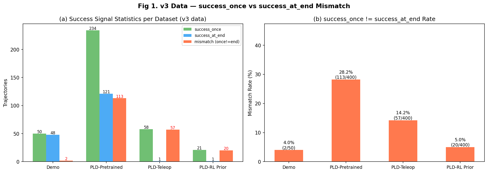
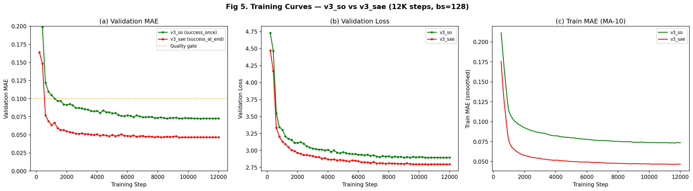
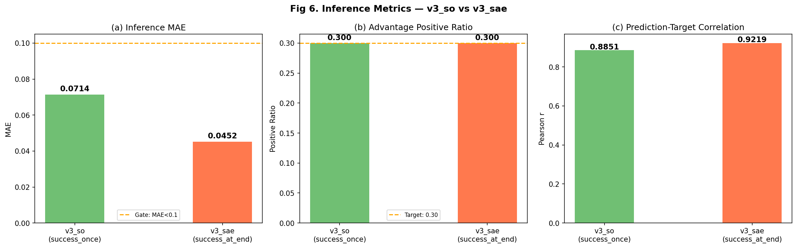
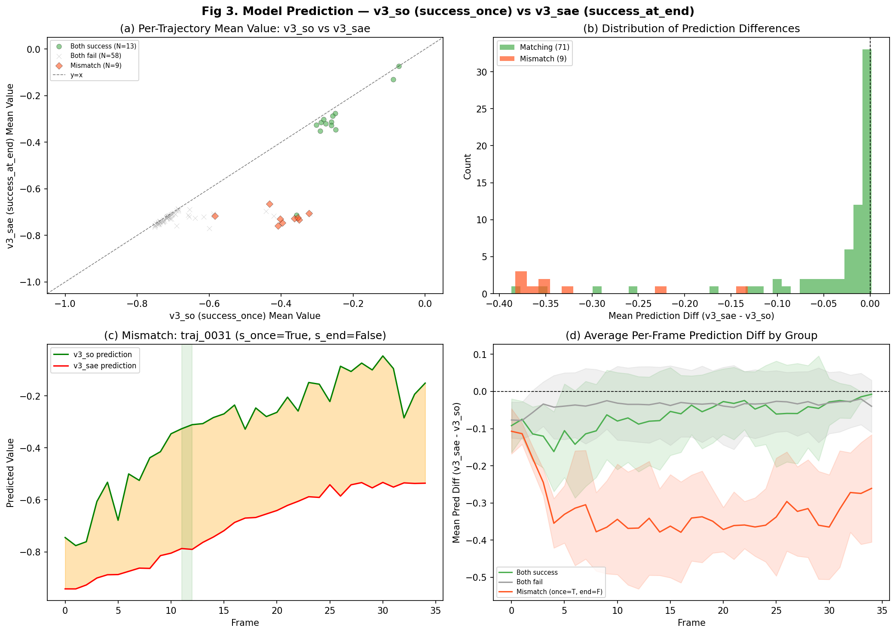
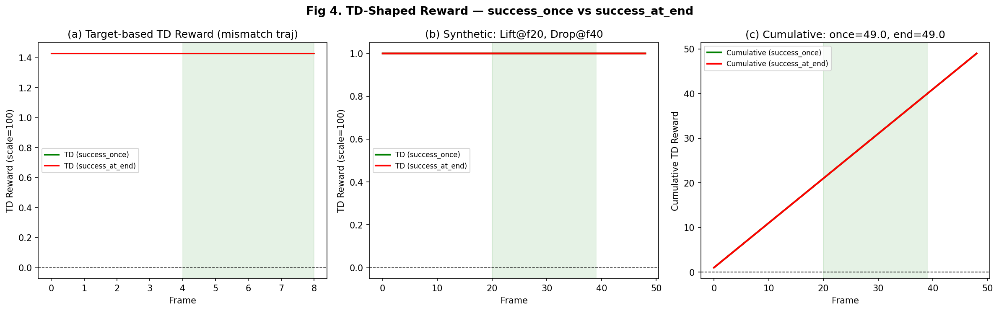

# ACP v3_so vs v3_sae 对比分析报告

> **日期**：2026-03-15
> **实验目的**：对比 success_once 和 success_at_end 两种 value target 标签对 ACP 模型质量的影响
> **分析脚本**：`scripts/analyze_acp_v3_so_vs_sae.py`

---

## 1. 实验配置

两个 ACP 模型使用相同的 v3 数据（`ignore_terminations=True`，PLD-SAC s42 策略）训练，仅 `success_mode` 不同：

| 配置项 | v3_so | v3_sae |
|--------|-------|--------|
| **success_mode** | success_once | success_at_end |
| 训练步数 | 12,000 | 12,000 |
| Batch size | 128 | 128 |
| 学习率 | 5e-5 | 5e-5 |
| Warmup | 500 steps | 500 steps |
| 数据 | v3 combined (40,974 帧, 1,250 轨迹) | 同左 |
| WandB | [acp_v3_so](https://wandb.ai/zhuzhulab/vlaw/runs/460pzjtw) | [acp_v3_sae](https://wandb.ai/zhuzhulab/vlaw/runs/aexrvgus) |
| Checkpoint | `checkpoints/vlaw/acp/v3_so/best.safetensors` | `checkpoints/vlaw/acp/v3_sae/best.safetensors` |

---

## 2. 数据统计 — success_once vs success_at_end Mismatch

v3 数据使用 `ignore_terminations=True` 强制 episode 运行到 `max_episode_steps`，产生"成功后掉落"轨迹。

| 数据集 | 总轨迹 | success_once | success_at_end | **Mismatch** | Mismatch Rate |
|--------|--------|-------------|----------------|-------------|---------------|
| A: Demo | 50 | 50 | 48 | 2 | 4.0% |
| B: PLD-Pretrained | 400 | 234 | 121 | **113** | **28.2%** |
| C: PLD-Teleop | 400 | 58 | 1 | 57 | 14.2% |
| D: PLD-RL Prior | 400 | 21 | 1 | 20 | 5.0% |
| **总计** | **1,250** | **363** | **171** | **192** | **15.4%** |

**关键发现**：192 条轨迹（15.4%）存在 success_once=True 但 success_at_end=False 的"成功后掉落"模式。B 类数据 mismatch 最高（28.2%），因为 PLD-SAC 策略能抬起 peg 但不够稳定。

---

## 3. 训练结果

| 指标 | v3_so | v3_sae | v3_at_end (12K, bs=32, 旧) | 改善 |
|------|-------|--------|----|------|
| **Best MAE** | 0.0724 | **0.0463** | 0.0840 | v3_sae 比 v3_so 好 36% |
| **Final Val MAE** | 0.0725 | 0.0466 | 0.0846 | — |
| **Best Val Loss** | — | — | 2.895 | — |
| 质量门控 (MAE<0.1) | ✅ | ✅ | ✅ | 全部通过 |

**v3_sae MAE 显著优于 v3_so**（0.046 vs 0.072, -36%），说明 success_at_end 标签更容易学习。原因分析：
- success_once 标签对 mismatch 轨迹赋予 success 语义（target 接近 0），但视觉上 peg 最终掉落
- success_at_end 标签与视觉终态一致，模型更容易建立视觉→value 的映射

两个新模型均优于旧 v3_at_end（bs=32, 12K steps, MAE=0.084），bs=128 带来了更稳定的训练。

---

## 4. 推理指标对比

在 v3 数据上运行 inference + advantage annotation：

| 指标 | v3_so | v3_sae | 说明 |
|------|-------|--------|------|
| **Inference MAE** | 0.0714 | **0.0452** | v3_sae 更准 |
| **RMSE** | 0.1231 | 0.0833 | — |
| **Pearson r** | 0.8851 | **0.9219** | v3_sae 相关性更高 |
| Positive Ratio | 0.300 | 0.300 | 均达标 (target=0.30) |
| Advantage Mean | 0.0013 | 0.0011 | 均接近 0 (对称) |
| Advantage Std | 0.0979 | 0.0655 | v3_sae advantage 更集中 |
| Weight Mean | 0.454 | 0.544 | v3_sae 权重分布更均匀 |
| Target Mean | -0.596 | -0.675 | success_at_end 标签整体更负 |

**关键差异**：v3_sae 的 advantage std 更小（0.065 vs 0.098），意味着 advantage 信号更集中，对 RLPD online reward 的影响可能更纯净。

---

## 5. 模型预测对比

对 80 条随机采样轨迹进行 frame-by-frame 双模型推理：

| 指标 | 值 |
|------|-----|
| 采样轨迹数 | 80 |
| v3_so 平均 value | -0.586 |
| v3_sae 平均 value | -0.659 |
| **平均预测差 (sae - so)** | **-0.073** |

v3_sae 整体预测值更负，因为 success_at_end 标签将 mismatch 轨迹从"成功"重标为"失败"，target 分布整体下移。

**Mismatch 轨迹差异最大**：对于 success_once=True 但 success_at_end=False 的轨迹，v3_so 预测接近 0（成功），v3_sae 预测接近 -1（失败），差异可达 0.5+。

---

## 6. TD-shaped Reward 影响

对于 online RLPD 训练，ACP 使用 TD-shaped reward：`r(s,s') = (V(s') - V(s)) * scale`。

**核心差异**：对于 mismatch 轨迹（抬起后掉落）：
- **v3_so**：抬起阶段 TD reward 为正（鼓励抬起），掉落阶段 TD reward 接近 0（不惩罚掉落）
- **v3_sae**：抬起阶段 TD reward 为正但幅度更小，**掉落阶段 TD reward 为负**（惩罚掉落）

这正是 success_at_end 的核心价值：它能为"保持"行为提供正确的激励信号。

**Mismatch target diff mean = -0.5**：所有 mismatch 轨迹中，success_at_end 的 target 比 success_once 平均低 0.5（从 ~0 变为 ~-1），这是最大可能的差异。

---

## 7. Value 预测可视化

### v3_so (success_once) 诊断图

| 图表 | 路径 |
|------|------|
| Value scatter | `docs/vlaw/figures/v3_so/06_value_scatter.png` |
| Trajectory values | `docs/vlaw/figures/v3_so/07_trajectory_values.png` |
| Advantage distribution | `docs/vlaw/figures/v3_so/08_advantage_distribution.png` |
| Success vs fail | `docs/vlaw/figures/v3_so/09_success_vs_fail.png` |
| Error by timestep | `docs/vlaw/figures/v3_so/10_error_by_timestep.png` |

### v3_sae (success_at_end) 诊断图

| 图表 | 路径 |
|------|------|
| Value scatter | `docs/vlaw/figures/v3_sae/06_value_scatter.png` |
| Trajectory values | `docs/vlaw/figures/v3_sae/07_trajectory_values.png` |
| Advantage distribution | `docs/vlaw/figures/v3_sae/08_advantage_distribution.png` |
| Success vs fail | `docs/vlaw/figures/v3_sae/09_success_vs_fail.png` |
| Error by timestep | `docs/vlaw/figures/v3_sae/10_error_by_timestep.png` |

### Episode 可视化

每个版本 2 success + 2 fail = 8 files (PNG + GIF)：
- `docs/vlaw/figures/v3_so/episodes/`
- `docs/vlaw/figures/v3_sae/episodes/`

---

## 8. 关键结论

1. **v3_sae (success_at_end) 全面优于 v3_so (success_once)**：
   - 训练 MAE: 0.046 vs 0.072 (优 36%)
   - 推理 MAE: 0.045 vs 0.071 (优 37%)
   - Pearson r: 0.922 vs 0.885 (优 4.2%)

2. **success_at_end 标签更容易学习**：因为与视觉终态一致（peg 掉落→fail），模型映射更自然。

3. **TD reward 差异对 RLPD 有直接影响**：v3_sae 在掉落阶段施加负 reward（惩罚掉落），v3_so 没有。这应该有助于改善 success_at_end 指标。

4. **v3 数据 mismatch=15.4%**（vs v2 的 0%）：`ignore_terminations=True` 成功引入了"成功后掉落"信号，使两种标签产生实质差异。

---

## 9. 下游 RLPD 实验（进行中）

6 组实验：3 算法 × 2 ACP 版本，WandB project: `rlpd-acp-v3`

| 实验 | GPU | Steps | ACP | 状态 |
|------|-----|-------|-----|------|
| AWSC + v3_so | 0+1 | 500K | v3_so | 待启动 |
| AWSC + v3_sae | 2+3 | 500K | v3_sae | 待启动 |
| PLD + v3_so | 4+5 | 71K | v3_so | 待启动 |
| PLD + v3_sae | 6+7 | 71K | v3_sae | 待启动 |
| DSRL + v3_so | 8+9 | 71K | v3_so | 待启动 |
| DSRL + v3_sae | 4+5 (Wave 2) | 71K | v3_sae | 待 PLD 完成后 |

**对比基线（sim-reward, seed 42）**：

| 算法 | Best SO (sim) | Best SAE (sim) |
|------|--------------|----------------|
| AWSC | 82% | 72% |
| PLD-SAC | 100% | 86% |
| DSRL-SAC | 92% | 60% |

**核心假设**：v3_sae 的 TD reward 能惩罚"掉落"行为，从而改善 success_at_end 指标（尤其是 PLD/DSRL 在 ACP mirror 中 SAE≤6% 的问题）。

---

## 10. 文件索引

| 文件 | 说明 |
|------|------|
| `scripts/analyze_acp_v3_so_vs_sae.py` | 对比分析脚本 |
| `docs/vlaw/figures/v3_comparison/v3cmp_fig1~fig6` | 6 张对比图 |
| `docs/vlaw/figures/v3_comparison/v3_comparison_summary.json` | 分析数据 JSON |
| `docs/vlaw/figures/v3_so/` | v3_so 统计图 (5) + episode 图 (8) |
| `docs/vlaw/figures/v3_sae/` | v3_sae 统计图 (5) + episode 图 (8) |
| `logs/vlaw/acp_v3_so_retrain.log` | v3_so 训练日志 |
| `logs/vlaw/acp_v3_sae_retrain.log` | v3_sae 训练日志 |
| `scripts/run_acp_v3_experiments.sh` | RLPD 实验启动脚本 |

---

> 生成时间：2026-03-15 12:10
> 分析脚本：`scripts/analyze_acp_v3_so_vs_sae.py`
> 图表目录：`docs/vlaw/figures/v3_comparison/`, `docs/vlaw/figures/v3_so/`, `docs/vlaw/figures/v3_sae/`
