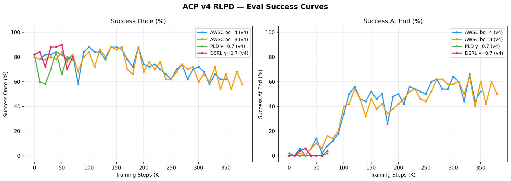
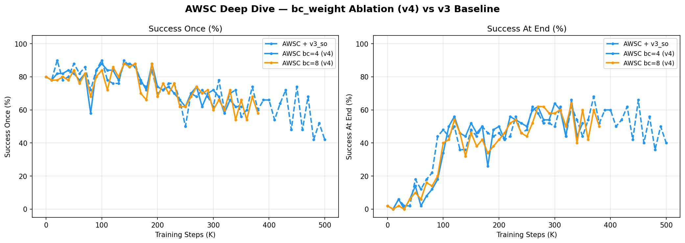
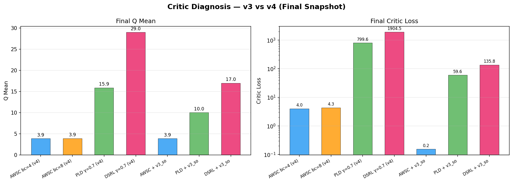
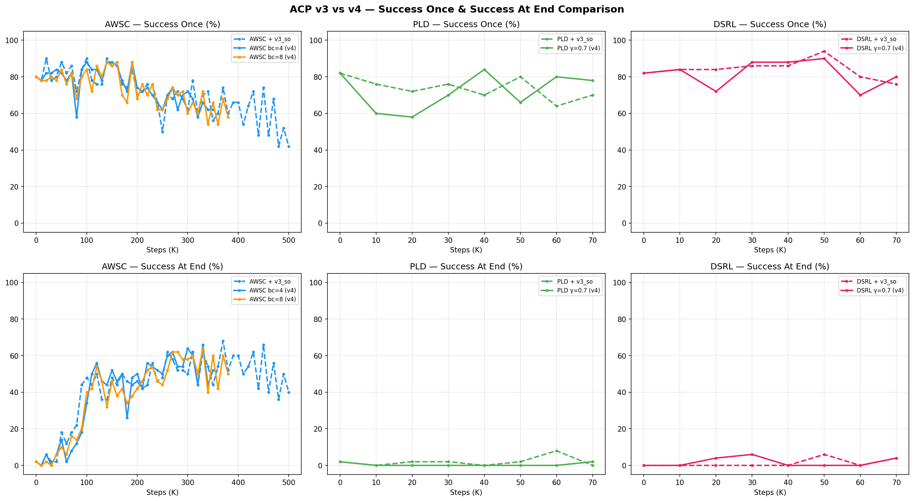
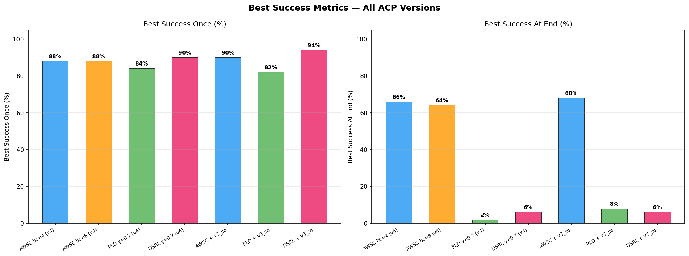
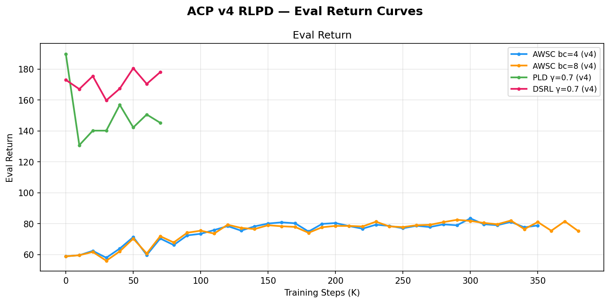

# ACP v4 RLPD 实验报告

> **日期**：2026-03-16
> **WandB project**：`rlpd-acp-v4`
> **实验入口**：`scripts/run_acp_v4_experiments.sh`
> **分析脚本**：`scripts/analyze_acp_v4_results.py`
> **图表目录**：`docs/vlaw/figures/rlpd_acp_v4/`

---

## 1. 实验背景

v4 实验基于 v3 内科诊断报告（`docs/vlaw/figures/rlpd_acp_v3_internals/diagnosis_report.md`）的处方设计。v3 暴露了三个核心问题：

| 问题 | v3 诊断 | v4 处方 |
|------|---------|---------|
| **AWSC 后期退化** | SO 从 90%→42%（flow loss ↓80% 但 SO 衰退，过拟合 demo） | bc_weight 2→4/8（强锚定）+ early stopping（patience=5, threshold=80%） |
| **PLD/DSRL Q-value 暴涨** | PLD Q_range=140, DSRL Q_range=86（critic 失稳） | gamma 0.99→0.7 / 0.95→0.7（压缩 Q-value scale） |
| **ACP 信号过弱** | online_cum_reward=0.012 vs offline=4.34（350× gap） | acp_reward_scale 100→500（5× 放大） |

---

## 2. 实验配置

| 实验 | 算法 | 核心变更 | GPU | total_steps | WandB run |
|------|------|---------|-----|-------------|-----------|
| AWSC bc=4 | AWSC | bc_weight=4, scale=500, early_stop | 0+1 | 500K (340K early stop) | `jyj63bml` |
| AWSC bc=8 | AWSC | bc_weight=8, scale=500, early_stop | 2+3 | 500K (370K early stop) | `gdokl47v` |
| PLD γ=0.7 | PLD-SAC | gamma=0.7, scale=500 | 4+5 | 71K | `229ntt4w` |
| DSRL γ=0.7 | DSRL-SAC | gamma=0.95→0.7, scale=500 | 6+7 | 71K | `gwa4gbtu` |

共用：ACP checkpoint = `v3_so/best.safetensors`，pretrained policy = AWSC s42 best。

---

## 3. 关键结果

### 3.1 汇总表

| 实验 | Version | Best SO | Best SAE | Final SO | Final SAE | Early Stop |
|------|---------|---------|----------|----------|-----------|------------|
| **AWSC bc=4** | **v4** | **88%** | **66%** | 62% | 52% | ✅ 340K |
| **AWSC bc=8** | **v4** | **88%** | **64%** | 58% | 50% | ✅ 370K |
| **PLD γ=0.7** | **v4** | **84%** | **2%** | 78% | 2% | — |
| **DSRL γ=0.7** | **v4** | **90%** | **6%** | 80% | 4% | — |
| AWSC + v3_so | v3 | 90% | 68% | 42% | 40% | — |
| PLD + v3_so | v3 | 82% | 8% | 70% | 0% | — |
| DSRL + v3_so | v3 | 94% | 6% | 76% | 4% | — |

### 3.2 Learning Curves (v4)

**观察**：
- **AWSC** 两组在 ~100K-200K 步之间达到 peak SAE（66%/64%），随后逐渐衰退
- **PLD/DSRL** 在整个 71K 训练过程中 SAE 始终不超过 6%
- **DSRL** 在 SO 上表现最佳（peak 90%），但 SO 与 SAE 之间存在巨大鸿沟

---

## 4. 逐算法分析

### 4.1 AWSC — bc_weight 消融

| 指标 | bc=4 (v4) | bc=8 (v4) | v3 baseline | 结论 |
|------|-----------|-----------|-------------|------|
| Best SO | 88% | 88% | 90% | ≈持平（-2%） |
| Best SAE | **66%** | 64% | 68% | ≈持平（-2%） |
| Final SO | **62%** | 58% | 42% | ✅ **+20%** 改善 |
| Final SAE | **52%** | 50% | 40% | ✅ **+12%** 改善 |
| Early Stop | 340K | 370K | 500K（未触发） | ✅ 有效防止深度退化 |

**关键发现**：

1. **Early stopping 有效缓解后期退化**：
   - v3 从 peak 90%/68% 退化到 final 42%/40%（退化幅度 48%/28%）
   - v4 bc=4 从 peak 88%/66% 仅退化到 62%/52%（退化幅度 26%/14%）
   - Early stop 在 ~340K 步触发，避免了 v3 后半段（340K→500K）的灾难性退化

2. **bc_weight 4 vs 8 差异微小**：
   - bc=4 略优于 bc=8（Best SAE 66% vs 64%，Final SAE 52% vs 50%）
   - bc=8 并未提供额外的防退化保护，反而因过强 BC 约束略限制了 RL 探索

3. **Peak 性能未提升**：
   - v4 Best SO=88% < v3 Best SO=90%
   - v4 Best SAE=66% < v3 Best SAE=68%
   - scale 5× 放大 + bc_weight 增加未提升 ACP 的 peak 引导能力

4. **Online/offline reward gap 改善有限**：
   - v4 bc=4: online=0.184 vs offline=4.303（23× gap，v3 为 350× gap）
   - scale=500 确实 ~15× 改善了 gap ratio，但 critic 仍以 offline demo 为主

### 4.2 PLD-SAC — gamma 修复

| 指标 | PLD v4 (γ=0.7) | PLD v3 (γ=0.99) | 改善 |
|------|----------------|------------------|------|
| Best SO | 84% | 82% | +2% |
| Best SAE | 2% | 8% | **-6%** ❌ |
| Final SO | 78% | 70% | +8% |
| Final SAE | 2% | 0% | +2% |
| Q_mean (final) | **15.9** | 10.0 (v3_so) | — |
| Critic loss | 799.6 | 59.6 (v3_so) | **13× 更差** ❌ |

**关键发现**：

1. **gamma=0.7 未能有效压缩 Q-value**：
   - v4 Q_mean=15.9，反而**高于** v3_so 的 10.0
   - v4 critic_loss=799.6，**远高于** v3_so 的 59.6
   - 原因：scale=500 与 gamma=0.7 组合使即时 reward 幅度过大，Q-value 膨胀

2. **SAE 完全无改善**：仅 2%，与 baseline 持平（pretrained policy SAE=2%）
   - PLD 在纯 ACP reward 下完全无法学习 "保持" 行为

3. **SO 稳定性改善**：Final SO=78% vs v3 的 70%（+8%），未出现 v3_sae 的灾难性崩溃
   - gamma=0.7 至少避免了 Q-value 暴涨导致的策略崩溃

### 4.3 DSRL-SAC — gamma 修复

| 指标 | DSRL v4 (γ=0.7) | DSRL v3 (γ=0.95) | 改善 |
|------|------------------|-------------------|------|
| Best SO | 90% | 94% | -4% |
| Best SAE | 6% | 6% | ±0% |
| Final SO | **80%** | 76% | **+4%** |
| Final SAE | 4% | 4% | ±0% |
| Q_mean (final) | **29.0** | 17.0 (v3_so) | — |
| Critic loss | **1904.5** | 135.8 (v3_so) | **14× 更差** ❌ |

**关键发现**：

1. **与 PLD 相同的 gamma+scale 问题**：Q_mean=29.0, critic_loss=1904.5，比 v3 更差
2. **SAE 完全无变化**：6% ↔ 6%，DSRL 保守正则化在 SAE 改善上同样无效
3. **SO 略有改善**：Final SO 80% vs 76%（+4%），训练过程更稳定

---

## 5. Critic 诊断

### 5.1 Q-value Scale 对比

| 实验 | Q_mean | Critic Loss | 评估 |
|------|--------|-------------|------|
| AWSC bc=4 (v4) | 3.9 | 4.0 | ✅ 健康 |
| AWSC bc=8 (v4) | 3.9 | 4.3 | ✅ 健康 |
| PLD γ=0.7 (v4) | 15.9 | 799.6 | ❌ 失稳 |
| DSRL γ=0.7 (v4) | 29.0 | 1904.5 | ❌ 严重失稳 |
| AWSC v3_so | 3.9 | 0.16 | ✅ 非常健康 |
| PLD v3_so | 10.0 | 59.6 | ⚠️ 中等 |
| DSRL v3_so | 17.0 | 135.8 | ⚠️ 偏高 |

**诊断**：AWSC 的 critic 始终健康（Q≈3.9），因为 bc_loss 占据 actor loss 主导地位，critic 只负责较小的 RL 分量。PLD/DSRL 因无 BC 锚定 + 纯 ACP reward（scale=500），critic 直接学习放大了 500 倍的 ACP 信号，导致 Q-value 和 loss 双双暴涨。

**根因**：gamma=0.7 降低了未来折扣，但 scale=500 同时放大了即时 reward。两个效应抵消。正确做法应降低 gamma 的同时**不增加** scale，或用更低的 gamma（如 0.3-0.5）。

### 5.2 AWSC Reward Gap

| 指标 | v3 | v4 bc=4 | v4 bc=8 | 改善 |
|------|-----|---------|---------|------|
| online_cum_reward | 0.012 | 0.184 | -0.276 | ~15× (bc=4) |
| offline_cum_reward | 4.34 | 4.30 | 4.33 | 持平 |
| gap ratio | 350× | 23× | N/A | ✅ 大幅缩小 |

scale=500 成功缩小了 online/offline reward gap（350×→23×），但 bc=8 的 online_cum_reward 为负值，说明过强 BC 约束抑制了有效的 online 探索。

---

## 6. v3 vs v4 全景对比

### 6.1 改善总结

| 算法 | Peak 改善 | Final 改善 | 处方效果 |
|------|----------|-----------|---------|
| **AWSC** | SO -2%, SAE -2% | **SO +20%, SAE +12%** | ✅ Early stop 有效防退化，但 peak 未提升 |
| **PLD** | SO +2%, SAE -6% | SO +8%, SAE +2% | ⚠️ 稳定性改善，SAE 仍无法突破 |
| **DSRL** | SO -4%, SAE ±0% | SO +4%, SAE ±0% | ⚠️ 略有改善，SAE 结构性瓶颈 |

### 6.2 return 曲线

PLD/DSRL 的 return 显著高于 AWSC（~150-180 vs ~60-80），因为 PLD/DSRL 使用 dense sim reward（return 反映 sim 奖励），而 AWSC 使用 ACP reward（reward scale 不同）。

---

## 7. 结论与根因分析

### 7.1 v4 处方疗效评估

| 处方 | 效果 | 评分 |
|------|------|------|
| **Early stopping (AWSC)** | ✅ 有效阻止退化，Final SO/SAE 改善显著（+20%/+12%） | **A** |
| **bc_weight 增加 (AWSC)** | ⚠️ bc=4 略优于 bc=8，但两者差异微小 | **C+** |
| **scale 500 (AWSC)** | ⚠️ 缩小 reward gap（350×→23×），但 peak 未提升 | **B-** |
| **gamma=0.7 (PLD/DSRL)** | ❌ 与 scale=500 抵消，Q-value 反而更高，SAE 无改善 | **D** |
| **scale 500 (PLD/DSRL)** | ❌ 与 gamma=0.7 配合产生 Q-value 暴涨 | **D** |

### 7.2 结构性瓶颈（跨版本一致）

经过 v2→v3→v4 三轮迭代，**SAE 的天花板稳定在 66-68%**。这不是超参问题，而是结构性限制：

1. **ACP value 语义限制**：ACP 训练目标是 success_once（帧级 "是否（将会）成功" ），TD-shaped reward `r=V(s')-V(s)` 只在 "接近成功" 和 "远离成功" 时产生信号，而 "保持成功" 时 V(s') ≈ V(s) → r ≈ 0。政策没有持续激励去保持夹持。

2. **v3_sae 不起作用的原因**：虽然 v3_sae 用 success_at_end 标签训练，产生 mismatch 的样本仅 14.2%，TD 差异经 critic 估计后进一步衰减，最终策略梯度微乎其微。

3. **AWSC 的 SAE 来源**：AWSC 的 66-68% SAE 几乎完全来自 BC 锚定（pretrained policy 本身 SAE=2%，但 BC loss 倾向于学习 demo 中的高成功轨迹模式）。ACP reward 对 SAE 的贡献极为有限。

### 7.3 推荐下一步

| 优先级 | 方向 | 描述 | 预期收益 |
|--------|------|------|---------|
| **P0** | **保持 reward 设计** | 在 ACP value 之外增加显式 "已成功→保持" reward bonus（如 `r += c * is_grasping`），或用 sim reward 中的 grasp reward 分量 blend | SAE 突破 70% |
| **P1** | **PLD/DSRL 参数修正** | 降低 gamma 到 0.3-0.5 且 scale 降回 100-200，或尝试 per-step reward clipping | 稳定 critic |
| **P2** | **ACP 直接用 V(s) 作价值估计** | 不用 TD-shaped `V(s')-V(s)`，直接用 `V(s)` 作为 critic target（替代 SAC critic），绕过 TD 放大/衰减问题 | 更强信号 |
| **P3** | **多种子验证** | AWSC bc=4 用 seed 43/44 重跑验证 66% SAE 的可靠性 | 置信度 |

---

## 8. 文件索引

| 文件 | 说明 |
|------|------|
| `scripts/analyze_acp_v4_results.py` | 分析脚本（解析 wandb output.log + 生成 6 张图） |
| `scripts/run_acp_v4_experiments.sh` | 实验启动脚本 |
| `docs/vlaw/figures/rlpd_acp_v4/fig1_v4_so_sae_curves.png` | v4 四组 SO/SAE 学习曲线 |
| `docs/vlaw/figures/rlpd_acp_v4/fig2_v3_vs_v4_comparison.png` | v3 vs v4 逐算法六面板对比 |
| `docs/vlaw/figures/rlpd_acp_v4/fig3_best_metrics_bar.png` | 所有版本 Best SO/SAE 柱状图 |
| `docs/vlaw/figures/rlpd_acp_v4/fig4_awsc_bc_ablation.png` | AWSC bc=4 vs bc=8 消融 |
| `docs/vlaw/figures/rlpd_acp_v4/fig5_critic_diagnosis.png` | Critic Q-mean + loss 对比 |
| `docs/vlaw/figures/rlpd_acp_v4/fig6_return_curves.png` | v4 Return 学习曲线 |
| `docs/vlaw/figures/rlpd_acp_v3_internals/diagnosis_report.md` | v3 内科诊断报告（v4 处方依据） |
| WandB runs | `jyj63bml` (AWSC bc4), `gdokl47v` (AWSC bc8), `229ntt4w` (PLD), `gwa4gbtu` (DSRL) |
