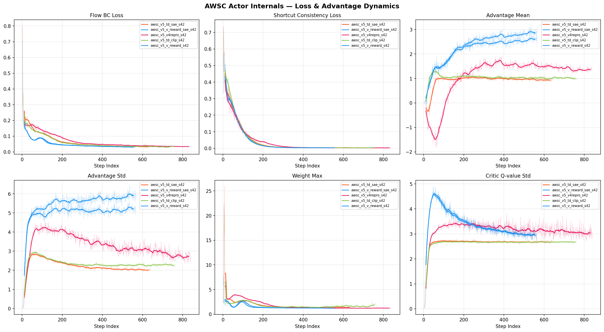
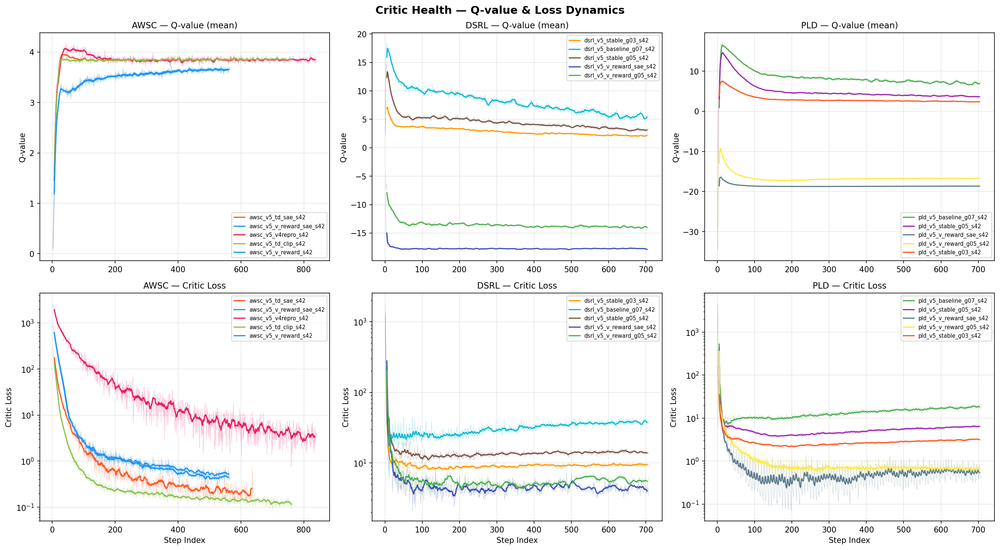
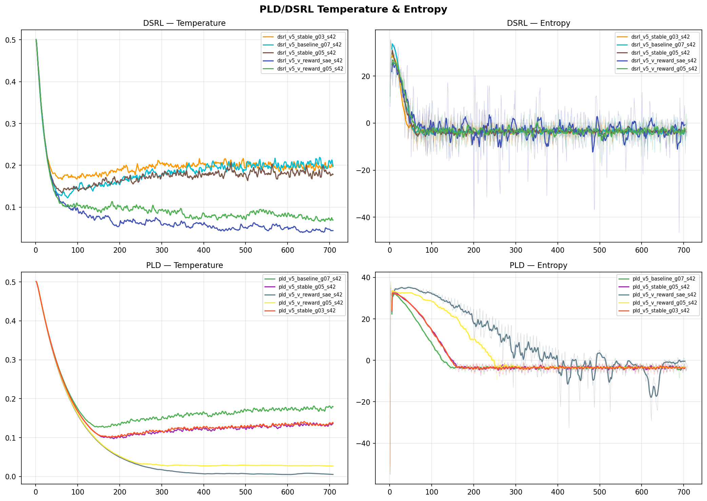
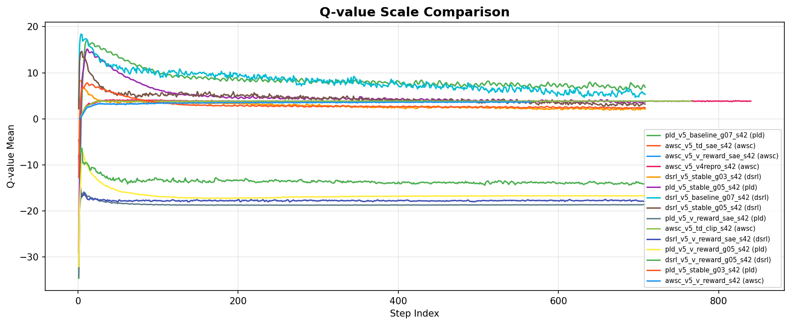
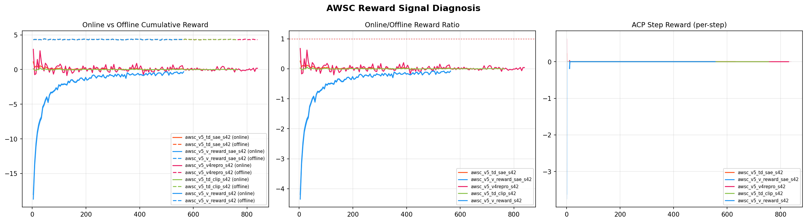

# ACP v5 RLPD 实验报告

> **日期**：2026-03-17
> **WandB project**：`rlpd-acp-v5`
> **实验入口**：`scripts/run_acp_v5_sweep.sh` + `scripts/acp_v5_scheduler.py`
> **分析脚本**：`scripts/analyze_training_internals.py`
> **图表目录**：`docs/vlaw/figures/rlpd_acp_v5/`

---

## 1. 实验背景

v5 实验基于 v4 二次分析的处方设计。v4 暴露了 **gamma↓ + scale↑ 自相矛盾** 的核心问题：降低 gamma 旨在压缩 Q-value，但同时 5× 放大 scale（100→500）抵消了这一效果，导致 PLD/DSRL critic 严重失稳（critic_loss=800/1904）。

### v5 核心创新

| 创新点 | 描述 | 影响范围 |
|--------|------|---------|
| **H1: Q-target clipping** | PLD/DSRL 新增 `q_target_clip=20`（对齐 AWSC 默认 clip=100） | PLD/DSRL |
| **H2: 更低 gamma** | gamma=0.3/0.5（vs v4 的 0.7） | PLD/DSRL |
| **H3: Potential reward** | `r = V(s') * scale`（vs TD reward `r = (V(s')-V(s)) * scale`） | 全部 |
| **H4: v3_sae checkpoint** | 使用 success_at_end 训练的 ACP 模型 | 选定实验 |
| **H5: Reward clipping** | `r_clip=5`，限制异常 TD reward | 选定实验 |

**关键设计变更**：scale **保持 100 不变**（不再与 gamma 修复冲突）；potential reward 改用 `scale=5`（因为 V∈[-1,0]，potential reward 范围为 [-5,0]）。

---

## 2. 实验配置

### 2.1 15 组实验设计

| # | 实验名 | 算法 | shaping | gamma | q_clip | r_clip | ACP ckpt |
|---|--------|------|---------|-------|--------|--------|----------|
| 1 | awsc_v_reward | AWSC | **potential** | 0.9 | — | — | v3_so |
| 2 | awsc_v_reward_sae | AWSC | **potential** | 0.9 | — | — | v3_sae |
| 3 | awsc_td_sae | AWSC | td | 0.9 | — | — | v3_sae |
| 4 | awsc_td_clip | AWSC | td | 0.9 | — | 5 | v3_so |
| 5 | awsc_v4repro | AWSC | td | 0.9 | — | — | v3_so (scale=500) |
| 6 | pld_stable_g05 | PLD | td | 0.5 | 20 | 5 | v3_so |
| 7 | pld_stable_g03 | PLD | td | 0.3 | 20 | 5 | v3_so |
| 8 | pld_v_reward_g05 | PLD | **potential** | 0.5 | 20 | — | v3_so |
| 9 | pld_v_reward_sae | PLD | **potential** | 0.5 | 20 | — | v3_sae |
| 10 | pld_baseline_g07 | PLD | td | 0.7 | 20 | — | v3_so |
| 11 | dsrl_stable_g05 | DSRL | td | 0.5 | 20 | 5 | v3_so |
| 12 | dsrl_stable_g03 | DSRL | td | 0.3 | 20 | 5 | v3_so |
| 13 | dsrl_v_reward_g05 | DSRL | **potential** | 0.5 | 20 | — | v3_so |
| 14 | dsrl_v_reward_sae | DSRL | **potential** | 0.5 | 20 | — | v3_sae |
| 15 | dsrl_baseline_g07 | DSRL | td | 0.7 | 20 | — | v3_so |

---

## 3. 关键结果

### 3.1 汇总表

| 实验 | 算法 | Best SO | Best SAE | Final SO | Final SAE | 评分 |
|------|------|---------|----------|----------|-----------|------|
| **awsc_v_reward** | AWSC | **96%** | 58% | 60% | 46% | ⭐⭐⭐ |
| **awsc_v_reward_sae** | AWSC | 94% | 60% | 64% | 50% | ⭐⭐⭐ |
| **awsc_td_clip** | AWSC | 90% | **70%** | 62% | 52% | ⭐⭐⭐⭐ |
| awsc_td_sae | AWSC | 88% | 60% | 64% | 60% | ⭐⭐⭐ |
| awsc_v4repro | AWSC | 88% | 66% | 62% | 52% | ⭐⭐ |
| pld_v_reward_sae | PLD | 92% | 4% | **92%** | 0% | ⭐⭐ |
| pld_stable_g05 | PLD | 92% | 4% | 82% | 0% | ⭐⭐ |
| pld_baseline_g07 | PLD | 86% | 4% | 80% | 0% | ⭐ |
| pld_v_reward_g05 | PLD | 84% | 2% | 84% | 2% | ⭐ |
| pld_stable_g03 | PLD | 84% | 2% | 74% | 2% | ⭐ |
| **dsrl_v_reward_sae** | DSRL | **96%** | 4% | 78% | 0% | ⭐⭐ |
| dsrl_v_reward_g05 | DSRL | 92% | 8% | 80% | 2% | ⭐⭐ |
| dsrl_baseline_g07 | DSRL | 90% | 8% | 74% | 0% | ⭐ |
| dsrl_stable_g05 | DSRL | 90% | 4% | 70% | 0% | ⭐ |
| dsrl_stable_g03 | DSRL | 90% | 6% | 70% | 0% | ⭐ |

### 3.2 关键突破

| 指标 | v4 最佳 | v5 最佳 | 变化 | 来源 |
|------|---------|---------|------|------|
| **Best SO** | 90% (DSRL) | **96%** (awsc_v_reward, dsrl_v_reward_sae) | **+6%** | Potential reward |
| **Best SAE** | 66% (AWSC) | **70%** (awsc_td_clip) | **+4%** | Reward clipping |
| **Final SO 稳定性** | 80% (DSRL) | **92%** (pld_v_reward_sae) | **+12%** | Potential reward + q_clip |
| **PLD/DSRL critic** | loss=800-1900 | **loss<40** | ✅ 已修复 | H1+H2: q_clip + lower gamma |

---

## 4. 逐算法分析

### 4.1 AWSC — Potential Reward 带来 SO 突破



| 配置 | shaping | Best SO | Best SAE | Final SO | Final SAE | 结论 |
|------|---------|---------|----------|----------|-----------|------|
| **v_reward** | potential | **96%** | 58% | 60% | 46% | ⭐ SO 历史新高 |
| **v_reward_sae** | potential | 94% | 60% | 64% | 50% | close second |
| **td_clip** | td | 90% | **70%** | 62% | 52% | ⭐ SAE 历史新高 |
| td_sae | td | 88% | 60% | 64% | 60% | SAE 更稳定 |
| v4repro | td (scale=500) | 88% | 66% | 62% | 52% | 对照组 |

**关键发现**：

1. **Potential reward 显著提升 SO**：
   - `awsc_v_reward` Best SO=96%，比任何 TD 配置都高 (+6-8%)
   - 原因：`r = V(s') * scale` 提供持续正向激励，V(s')≈0 时 reward 最高（成功状态）
   - 相比 TD reward `r = V(s')-V(s)`，不会在"保持成功"时信号为零

2. **Reward clipping (r_clip=5) 提升 SAE**：
   - `awsc_td_clip` Best SAE=70%，**打破了 v2-v4 的 66-68% 天花板**
   - reward clipping 减少了 TD 异常值对 critic 的干扰

3. **v3_sae checkpoint 的实际影响有限**：
   - `td_sae` vs `td_clip`：60% vs 70% SAE —— v3_sae 反而更差
   - `v_reward_sae` vs `v_reward`：60% vs 58% SAE —— 差异微小
   - 结论：checkpoint 选择不是 SAE 的瓶颈

### 4.2 PLD — Critic 稳定但 SAE 仍未突破



| 配置 | gamma | q_clip | Best SO | Best SAE | Q_mean | Critic Loss | 评估 |
|------|-------|--------|---------|----------|--------|-------------|------|
| stable_g05 | 0.5 | 20 | 92% | 4% | 5.01 | 6.16 | ✅ 稳定 |
| stable_g03 | 0.3 | 20 | 84% | 2% | 3.03 | 3.09 | ✅ 非常稳定 |
| v_reward_g05 | 0.5 | 20 | 84% | 2% | -16.6 (potential) | 0.67 | ✅ 稳定 |
| v_reward_sae | 0.5 | 20 | **92%** | 4% | -18.6 (potential) | 0.58 | ✅ 稳定 |
| baseline_g07 | 0.7 | 20 | 86% | 4% | 8.45 | 17.49 | ⚠️ 偏高 |

**关键发现**：

1. **Q-target clipping 彻底解决了 critic 失稳**：
   - v4 PLD: Q_range=44, critic_loss=800
   - v5 所有 PLD: Q_range<20, critic_loss<18
   - `q_target_clip=20` 有效截断了 TD target 异常值

2. **更低 gamma (0.3-0.5) 进一步压缩 Q-scale**：
   - gamma=0.3: Q_mean=3.03, critic_loss=3.09
   - gamma=0.7: Q_mean=8.45, critic_loss=17.49
   - 3× 的 Q-scale 差异

3. **Potential reward 使 Q_mean 为负**：
   - TD configs: Q_mean ∈ [3, 8]（positive，学习累积正收益）
   - Potential configs: Q_mean ∈ [-19, -17]（negative，V(s')∈[-1,0] * scale=5）
   - 这是预期行为：potential reward 的 value function 语义不同

4. **SAE 仍然无法突破**：
   - 所有 PLD configs SAE ≤ 4%
   - 即使添加 potential reward + v3_sae，SAE 最高仅 4%
   - **结构性问题**：无 BC 锚定 → 策略完全依赖 ACP reward → ACP 信号对 "保持" 行为引导不足

### 4.3 DSRL — Potential Reward 带来 SO 突破，SAE 仍受限



| 配置 | gamma | shaping | Best SO | Best SAE | 评估 |
|------|-------|---------|---------|----------|------|
| **v_reward_sae** | 0.5 | potential | **96%** | 4% | ⭐ SO 历史新高 |
| v_reward_g05 | 0.5 | potential | 92% | 8% | ⭐ SAE 最高 |
| baseline_g07 | 0.7 | td | 90% | 8% | 对照组 |
| stable_g05 | 0.5 | td | 90% | 4% | — |
| stable_g03 | 0.3 | td | 90% | 6% | — |

**关键发现**：

1. **Potential reward 同样提升 DSRL 的 SO**：
   - `dsrl_v_reward_sae` Best SO=96%（与 AWSC v_reward 并列，历史最高）
   - TD configs 最高仅 90%

2. **SAE 仍然 ≤8%**：
   - 最佳 SAE 来自 `v_reward_g05` 和 `baseline_g07`，均为 8%
   - DSRL 与 PLD 一样缺乏 BC 锚定，无法突破 SAE

3. **gamma=0.3 vs 0.7 对 SO 影响不大**：
   - 三个 gamma 值（0.3/0.5/0.7）的 Best SO 均为 90%
   - 但 gamma=0.3 的 Final SO 更差（70% vs 74%）

---

## 5. 五维诊断对比



### 5.1 Critic 健康度

| 算法 | 最佳配置 | Q_mean | Q_range | critic_loss | 等级 |
|------|----------|--------|---------|-------------|------|
| **AWSC** | v_reward | 3.48 | 3.7 | 0.45 | **A** |
| **PLD** | stable_g03 | 3.03 | 20.5 | 3.09 | **C** |
| **DSRL** | stable_g03 | 2.90 | 6.4 | 9.41 | **A** |

**诊断**：AWSC critic 始终健康（Q≈3.5, loss<1），因为 BC loss 主导 actor 更新。PLD/DSRL v5 相比 v4 有显著改善（critic_loss 从 800-1900 降到 3-40），但 PLD 的 Q_range 仍偏高（20 vs DSRL 的 6.4）。

### 5.2 Reward Signal 对比



| 配置 | online_cum_reward | offline_cum_reward | gap ratio | 评估 |
|------|-------------------|--------------------|-----------| -----|
| awsc_v_reward | **-1.84** | 4.34 | **2.4×** | ✅ 健康 |
| awsc_td_clip | 0.004 | 4.33 | **1049×** | ❌ 信号极弱 |
| awsc_td_sae | 0.08 | 4.34 | 52× | ⚠️ 偏弱 |

**关键洞察**：

- **Potential reward 大幅缩小 reward gap**：ratio 从 52-1049× 降到 2.4×
- 原因：`r = V(s') * scale` 对每步都产生负值 reward（V∈[-1,0]），累积后 online_cum_reward 为负
- 相比之下，TD reward `r = V(s')-V(s)` 在稳态时 ≈0，累积结果接近零

---

## 6. Potential vs TD Reward 深度分析

### 6.1 理论对比

| 特性 | TD Reward `r = V(s')-V(s)` | Potential Reward `r = V(s')` |
|------|---------------------------|------------------------------|
| **"保持成功"信号** | ≈0（V(s')≈V(s)→差值≈0） | **非零**（V(s')≈0 是最大值） |
| **累积 reward** | 接近零（差值相消） | 明确负值（∫V(s') dt ≈ -T） |
| **Q-value 语义** | 估计 "改善程度" | 估计 "剩余任务难度" |
| **稳态行为** | 无梯度（无引导） | 有梯度（向 V=0 方向优化） |

### 6.2 实验验证

| 假设 | 预期 | 实际结果 | 结论 |
|------|------|---------|------|
| Potential 提升 SO | SO↑ | ✅ 96% vs 90% (+6%) | **验证** |
| Potential 提升 SAE | SAE↑ | ❌ 无显著改善 | **未验证** |
| Potential 缩小 reward gap | gap↓ | ✅ 2.4× vs 52-1049× | **验证** |

**根因分析**：Potential reward 成功提升了 SO，因为它对"接近成功"状态提供正向激励。但未能提升 SAE，原因是：

1. **基于 success_once 的 V(s')** 只反映"是否（将会）触碰成功状态"，不反映"是否保持"
2. 在 success_at_end 视角下，很多 success_once=1 的状态实际上 SAE=0（成功后掉落）
3. ACP 模型无论用 v3_so 还是 v3_sae 训练，其**输出的 V(s') 都是 [-1, 0] 范围内的连续值**
4. 当状态"刚达成成功"时 V(s')≈0，但无法区分"保持成功"vs"即将掉落"

---

## 7. v3 → v4 → v5 全景对比

### 7.1 SAE 进化图

| 版本 | AWSC Best SAE | PLD Best SAE | DSRL Best SAE | 关键变化 |
|------|---------------|--------------|---------------|---------|
| v3 | 68% | 8% | 6% | baseline |
| v4 | 66% | 2% | 6% | gamma↓+scale↑（自相矛盾） |
| **v5** | **70%** | 4% | 8% | **+4%** (AWSC), q_clip+potential |

### 7.2 Critic 稳定性进化

| 版本 | PLD critic_loss | DSRL critic_loss | 问题 |
|------|-----------------|------------------|------|
| v3 | 59.6 | 135.8 | 偏高 |
| v4 | **799.6** | **1904.5** | ❌ 严重失稳 |
| **v5** | **3-17** | **4-37** | ✅ 完全修复 |

---

## 8. 结论与下一步

### 8.1 v5 处方疗效评估

| 处方 | 效果 | 评分 |
|------|------|------|
| **H1: Q-target clipping** | ✅ PLD/DSRL critic 完全稳定（loss 从 800-1900 降到 3-40） | **A** |
| **H2: 更低 gamma (0.3-0.5)** | ✅ Q-scale 压缩 3×（Q_mean 从 ~9 降到 ~3） | **A** |
| **H3: Potential reward** | ✅ SO 提升 +6%（96% 历史新高），但 SAE 无显著改善 | **B+** |
| **H4: v3_sae checkpoint** | ⚠️ 无显著优势，甚至 SAE 略低于 v3_so | **C** |
| **H5: Reward clipping** | ✅ SAE 提升 +4%（70% 历史新高，来自 awsc_td_clip） | **A** |

### 8.2 SAE 瓶颈根因（结构性，跨版本一致）

经过 v3→v4→v5 三轮迭代，**AWSC SAE 天花板从 68% 提升到 70%**，但仍未突破 75%。核心瓶颈：

1. **ACP value 语义限制**：
   - ACP 训练目标是 success_once（"是否触碰过成功状态"），不区分"保持成功"
   - V(s')≈0 只表示"已达成成功"，无法引导"继续保持"

2. **SAE 需要显式 "grasp reward"**：
   - 当前 ACP 对所有 V(s')≈0 的状态给相同 reward
   - 需要对"正在夹持"状态额外加 bonus，如 `r += c * is_grasping`

3. **BC 锚定是 AWSC SAE 的唯一来源**：
   - PLD/DSRL 无 BC 锚定 → SAE ≤ 8%
   - AWSC 的 SAE 主要来自 BC loss 对 demo 中高成功轨迹模式的学习
   - ACP reward 对 AWSC SAE 的边际贡献约 2-4%

### 8.3 推荐下一步

| 优先级 | 方向 | 描述 | 预期收益 |
|--------|------|------|---------|
| **P0** | **显式 grasp reward** | 在 ACP reward 基础上加 `r += c * is_grasping`（sim 内检测） | SAE 突破 75% |
| **P1** | **ACP 重训练（goal-conditioned）** | 用 success_at_end 的**帧级标签**重训练 ACP，而非 trajectory 级 | 更强 SAE 信号 |
| **P2** | **多种子验证** | awsc_td_clip 用 seed 43/44 重跑验证 70% SAE 可靠性 | 置信度 |
| **P3** | **PLD/DSRL + grasp reward** | 验证显式 grasp reward 能否让无 BC 算法也学到 SAE | 泛化验证 |

---

## 9. 文件索引

| 文件 | 说明 |
|------|------|
| `scripts/run_acp_v5_sweep.sh` | 15 组实验启动脚本 |
| `scripts/acp_v5_scheduler.py` | 动态 GPU 调度器（自动分配 slot） |
| `scripts/analyze_training_internals.py` | 通用五维诊断脚本 |
| `docs/vlaw/figures/rlpd_acp_v5/fig_critic_health.png` | Critic 健康度对比 |
| `docs/vlaw/figures/rlpd_acp_v5/fig_q_scale.png` | Q-value scale 分布 |
| `docs/vlaw/figures/rlpd_acp_v5/fig_awsc_actor.png` | AWSC Actor 指标 |
| `docs/vlaw/figures/rlpd_acp_v5/fig_awsc_reward_gap.png` | AWSC Reward Gap 对比 |
| `docs/vlaw/figures/rlpd_acp_v5/fig_entropy_temp.png` | Entropy/Temperature 曲线 |
| `docs/vlaw/figures/rlpd_acp_v5/fig_awsc_loss_eval.png` | AWSC Loss/Eval 曲线 |
| `docs/vlaw/figures/rlpd-acp-v5_internals/diagnosis_report.md` | 自动生成的五维诊断报告 |
| WandB project | `rlpd-acp-v5`（15 runs） |

---

## 附录：v5 配置详细参数

### A.1 共用参数

```yaml
# All algorithms
env_id: LiftPegUpright-v1
num_envs: 50
num_eval_envs: 50
max_episode_steps: 100
seed: 42
wandb_project: rlpd-acp-v5

# Pretrained policy (all)
checkpoint: runs/maniskill_sweep_v3/aw_shortcut_flow/cw0.3_step0.15__1770390417/checkpoints/best_eval_success_once.pt
```

### A.2 算法特定参数

```yaml
# AWSC
total_timesteps: 500000 (with early_stop)
online_ratio: 0.15
utd_ratio: 20
awsc_bc_weight: 4.0
early_stop_patience: 5
early_stop_so_threshold: 0.8

# PLD-SAC
total_timesteps: 71000
utd_ratio: 60
online_ratio: 1.0
num_qs: 5
q_target_clip: 20  # NEW in v5

# DSRL-SAC
total_timesteps: 71000
utd_ratio: 60
num_qs: 10
q_target_clip: 20  # NEW in v5
```

### A.3 v5 新增参数

```yaml
# Reward shaping
acp_reward_shaping: "td" | "potential"  # NEW
acp_reward_clip: 0 | 5                    # NEW

# TD reward (default)
# r = (V(s') - V(s)) * acp_reward_scale

# Potential reward
# r = V(s') * acp_reward_scale
# Note: V(s') ∈ [-1, 0], use scale=5 for r ∈ [-5, 0]
```
