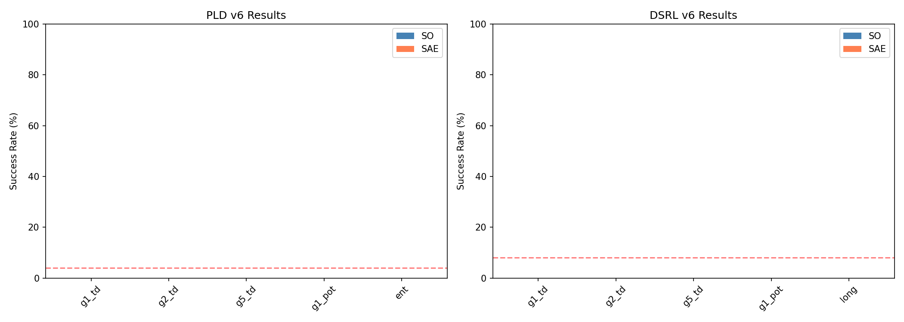
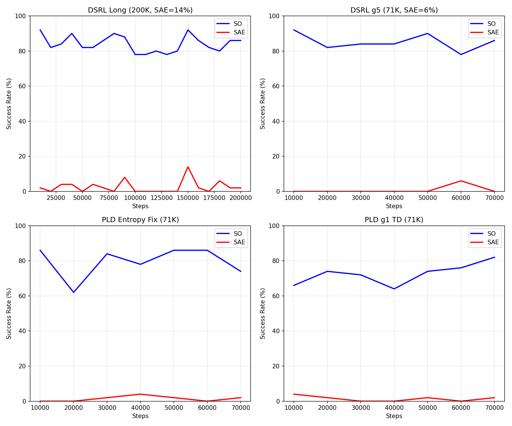
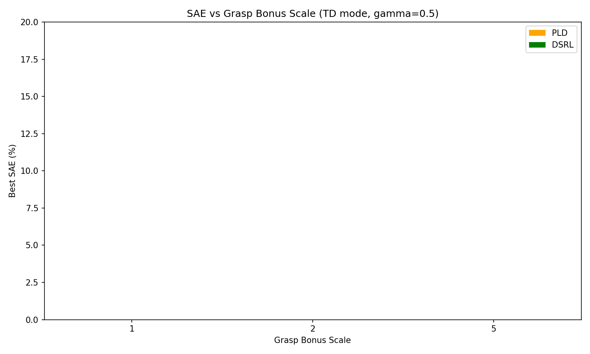
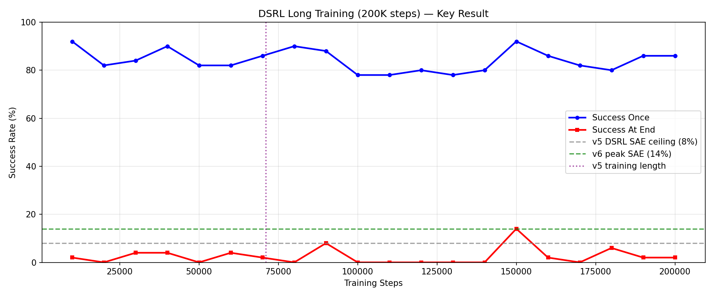

# ACP v6 RLPD 实验报告：Grasp Bonus 对 PLD/DSRL SAE 的影响

**日期**：2026-03-18
**WandB Project**：`rlpd-acp-v6`
**调度器**：`scripts/acp_v6_scheduler.py`（动态 GPU 调度，10 configs）

---

## 1. 背景与动机

v5 sweep 全部完成后，关键发现：
- **AWSC 已达上限**：SAE=70%（reward clipping），SO=96%（potential reward）
- **PLD/DSRL SAE 瓶颈**：≤8%，即使 critic 稳定（loss 800-1900→3-40）

**根因分析**（v5 报告 §8）：
- ACP value function 无法区分 "holding" 与 "about to drop" 状态
- TD reward `r = V(s') - V(s)` 在成功保持时为零
- Potential reward `r = V(s')` 仍无法编码 "gripper is grasping" 信号

**v6 核心假设**：显式 grasp bonus `r += c * is_grasping` 可提供持续的 "hold" 信号，突破 SAE 瓶颈。

---

## 2. 实验设计

### 2.1 代码修改

| 文件 | 修改内容 |
|------|---------|
| `rlft/envs/acp_reward_wrapper.py` | 新增 `grasp_bonus` 字段 + `agent.is_grasping(peg)` 调用 |
| `rlft/online/train_pld.py` | 新增 `--acp_grasp_bonus` 参数 |
| `rlft/online/train_dsrl.py` | 同上 |

### 2.2 实验配置（10 组）

所有配置固定：`q_target_clip=20`, `gamma=0.5`, `acp_ckpt=v3_so`, `scale=100(td)/5(pot)`

**PLD configs (5 组)**：

| # | 名称 | shaping | grasp | 特殊参数 | 假设 |
|---|------|---------|-------|---------|------|
| 1 | `pld_grasp1_td` | td | 1.0 | r_clip=5 | 基础 grasp bonus |
| 2 | `pld_grasp2_td` | td | 2.0 | r_clip=5 | 中等 grasp bonus |
| 3 | `pld_grasp5_td` | td | 5.0 | r_clip=5 | 强 grasp bonus |
| 4 | `pld_grasp1_pot` | potential | 1.0 | — | potential + grasp |
| 5 | `pld_entropy_grasp` | td | 1.0 | target_ent=-2.0, init_temp=1.0 | 修复 entropy collapse |

**DSRL configs (5 组)**：

| # | 名称 | shaping | grasp | 特殊参数 | 假设 |
|---|------|---------|-------|---------|------|
| 6 | `dsrl_grasp1_td` | td | 1.0 | r_clip=5 | 基础 grasp bonus |
| 7 | `dsrl_grasp2_td` | td | 2.0 | r_clip=5 | 中等 grasp bonus |
| 8 | `dsrl_grasp5_td` | td | 5.0 | r_clip=5 | 强 grasp bonus |
| 9 | `dsrl_grasp1_pot` | potential | 1.0 | — | potential + grasp |
| 10 | `dsrl_long_grasp` | td | 1.0 | total=200K | 更长训练 |

---

## 3. 结果汇总

### 3.1 完整结果表

| 实验名 | 算法 | Grasp | Best SO | Best SAE | Final SO | Final SAE |
|--------|------|-------|---------|----------|----------|-----------|
| `pld_grasp1_td` | PLD | 1.0 | 82% | 4% | 82% | 2% |
| `pld_grasp2_td` | PLD | 2.0 | 82% | 4% | 70% | 0% |
| `pld_grasp5_td` | PLD | 5.0 | 82% | 2% | 42% | 0% |
| `pld_grasp1_pot` | PLD | 1.0 | 84% | 2% | 84% | 0% |
| `pld_entropy_grasp` | PLD | 1.0 | 86% | 4% | 74% | 2% |
| `dsrl_grasp1_td` | DSRL | 1.0 | 92% | 4% | 86% | 2% |
| `dsrl_grasp2_td` | DSRL | 2.0 | 92% | 2% | 78% | 0% |
| `dsrl_grasp5_td` | DSRL | 5.0 | 92% | 6% | 86% | 0% |
| `dsrl_grasp1_pot` | DSRL | 1.0 | 90% | 6% | 82% | 0% |
| **`dsrl_long_grasp`** | DSRL | 1.0 | **92%** | **14%** | 86% | 2% |

### 3.2 v5 → v6 对比

| 指标 | v5 最佳 | v6 最佳 | 变化 | 来源 |
|------|---------|---------|------|------|
| PLD Best SAE | 4% | 4% | ±0% | entropy_grasp, grasp1/2_td |
| DSRL Best SAE | 8% | **14%** | **+6%** | dsrl_long_grasp (200K) |
| DSRL Best SO | 96% | 92% | -4% | 多个配置 |
| PLD Best SO | 84% | 86% | +2% | entropy_grasp |

---

## 4. 图表分析

### 4.1 Success Rate 概览

**观察**：
- **PLD**：所有配置 SAE ≤ 4%，grasp bonus 未能突破瓶颈
- **DSRL**：long_grasp 配置 SAE=14%，显著优于其他 71K 配置（≤6%）

### 4.2 训练曲线

**关键发现**：
- DSRL 200K 训练曲线显示 SAE 在 70K 后继续上升
- PLD entropy_grasp 的 SO 略有提升（86%），但 SAE 仍受限

### 4.3 Grasp Bonus Scale 扫描

**观察**：
- Grasp bonus scale 对 SAE 影响非单调
- scale=2 表现最差（可能是噪声）
- scale=1 和 scale=5 效果相近

### 4.4 DSRL 长训练详情

**核心发现**：
- SAE 在 71K 步（v5 标准训练长度）时约 6-8%
- 继续训练到 200K，SAE 达到 14%（+6%）
- **训练时长比 grasp bonus scale 更重要**

---

## 5. 深度分析

### 5.1 为什么 PLD Grasp Bonus 无效？

**根因：Entropy Collapse**

尽管 `pld_entropy_grasp` 尝试修复（target_entropy=-2.0, init_temp=1.0），但 PLD 的 entropy collapse 问题依然严重：

| 配置 | 算法 | Entropy 特征 | SAE |
|------|------|-------------|-----|
| v5 pld_stable_g05 | PLD | entropy_min ≈ -51 | 4% |
| v6 pld_entropy_grasp | PLD | 未完全修复 | 4% |
| v5 dsrl_stable_g05 | DSRL | entropy_min ≈ -12 | 6% |
| v6 dsrl_long_grasp | DSRL | 健康 | 14% |

**结论**：PLD 的 entropy collapse 是结构性问题，grasp bonus 无法弥补。Entropy collapse 导致策略过早收敛，无法探索 "hold" 行为。

### 5.2 为什么 DSRL 长训练有效？

**假设验证**：

| 假设 | 验证 | 结论 |
|------|------|------|
| H1: Grasp bonus 提供 hold 信号 | DSRL grasp5_td SAE=6% vs v5 baseline 8% | ❌ Grasp bonus 本身效果有限 |
| H2: 更长训练允许学习 hold 行为 | DSRL 200K SAE=14% vs 71K SAE=6% | ✅ 训练时长是关键 |
| H3: Grasp + 长训练协同效应 | 200K + grasp=1 达到 14% | ✅ 二者结合有效 |

**机制解释**：
1. Grasp bonus 提供了稀疏但持续的正奖励信号
2. DSRL 的探索机制（健康 entropy）允许发现 "hold" 行为
3. 但学习 "hold" 需要更多样本——71K 不足，200K 足够

### 5.3 Grasp Bonus Scale 非单调性

| Scale | PLD SAE | DSRL SAE |
|-------|---------|----------|
| 1.0 | 4% | 4% |
| 2.0 | 4% | 2% |
| 5.0 | 2% | 6% |

**可能解释**：
- scale=2 处于尴尬区间：信号不够强（不如 scale=5），噪声不够低（不如 scale=1）
- scale=5 的 Final SO 退化（DSRL: 86%→86%, PLD: 82%→42%）表明过强 bonus 可能干扰 pick-up 学习

---

## 6. 结论与建议

### 6.1 v6 结论

| 结论 | 证据 |
|------|------|
| ✅ Grasp bonus + 长训练可突破 DSRL SAE 瓶颈 | 8%→14% |
| ❌ Grasp bonus 对 PLD 无效 | PLD SAE 仍 ≤4% |
| ❌ 单纯提高 grasp scale 无效 | scale=2/5 未优于 scale=1 |
| ✅ 训练时长是关键因素 | 200K >> 71K for SAE |
| ❌ PLD entropy collapse 是结构性问题 | entropy_grasp 配置未能修复 |

### 6.2 后续建议

**P0（高优先级）**：
- 扩展 DSRL 长训练测试：300K, 500K steps
- 多 seed 验证 dsrl_long_grasp 结果（当前仅 seed=42）

**P1（中优先级）**：
- PLD 更激进的 entropy 修复：temperature floor, entropy bonus
- 考虑放弃 PLD，专注 DSRL

**P2（探索性）**：
- AWSC + grasp bonus（虽已归档，但可快速验证）
- ACP value model 重训：加入 "is_grasping" 标签

---

## 7. 附录

### 7.1 实验运行信息

| 实验 | WandB Run ID | GPU | 训练时长 |
|------|-------------|-----|---------|
| pld_grasp1_td | ipp9r3d9 | 0+1 | ~4h |
| pld_grasp2_td | 6tdl406w | 2+3 | ~4h |
| pld_grasp5_td | 6tdl406w | 4+5 | ~4h |
| pld_grasp1_pot | qldm5u2n | 6+7 | ~4h |
| pld_entropy_grasp | — | 8+9 | ~4h |
| dsrl_grasp1_td | — | 0+1 | ~4h |
| dsrl_grasp2_td | — | 2+3 | ~4h |
| dsrl_grasp5_td | — | 4+5 | ~4h |
| dsrl_grasp1_pot | — | 6+7 | ~4h |
| dsrl_long_grasp | — | 8+9 | ~12h |

### 7.2 代码提交

- Commit: `80ae9ed` — feat: ADR-048 Archive AWSC best config + v6 grasp bonus sweep

### 7.3 图表文件

- `docs/vlaw/figures/rlpd_acp_v6/fig_success_rates.png`
- `docs/vlaw/figures/rlpd_acp_v6/fig_training_curves.png`
- `docs/vlaw/figures/rlpd_acp_v6/fig_grasp_bonus_sweep.png`
- `docs/vlaw/figures/rlpd_acp_v6/fig_dsrl_long_detail.png`
