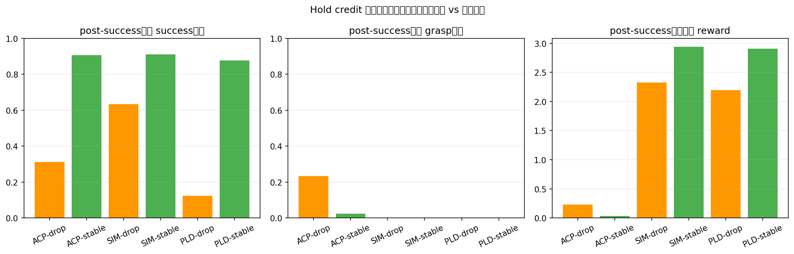
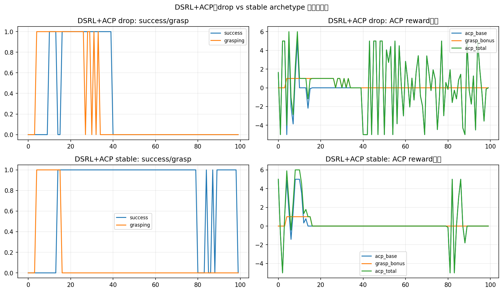

# ACP Hold Credit 深入诊断报告

## 1. 本报告回答什么问题

在 corrected qclip0 对照中，PLD / DSRL 在 sim reward 下都能学会 hold-to-end，因此问题已经不能再简单归结为“算法本身不会 hold”。

本报告进一步回答：

1. ACP reward 是否在 **成功后窗口** 继续给出足够的 hold credit？
2. stable hold 与 drop-after-success 两类 episode，在 reward 曲线上是否被明显区分？
3. 现有 `*_archetypes.png` 到底在看什么？

---

## 2. 先解释 archetypes 图是什么意思

### 2.1 图的结构

每张 `*_archetypes.png` 都是在对比两类代表性 episode：

- **stable**：`SO=True, SAE=True`，即轨迹中到达成功，而且到 episode 结束仍然成功
- **drop**：`SO=True, SAE=False`，即轨迹中一度成功，但最终没有保持住

图里从上到下通常表示：

1. **关键帧图像**：展示该 episode 在不同时间点的视觉状态变化
2. **success / grasp 曲线**：
   - `success` 表示当前时刻是否处于 success 状态
   - `grasping` 表示当前时刻是否处于抓取状态
3. **reward 曲线**：
   - sim case 主要看 `sim_reward`
   - ACP case 会拆成 `acp_base_reward`、`acp_grasp_bonus`、`acp_total_reward`
4. **累计 reward**：看整个 episode 后半段 reward 是如何累积的

### 2.2 怎么读这些图

如果一个方法真的学到了“hold credit”，那么在 stable episode 中，应该看到：

- success 在 first success 后长期维持高位
- reward 在 success 之后仍然持续支持这种稳定状态
- 与 drop episode 相比，stable 的 post-success reward 应明显更高或更稳定

如果一个方法没有学到“hold credit”，更常见的是：

- 它在到达 success 之前给了明显正反馈
- 但在 first success 之后，stable 与 drop 的 reward 曲线差异很弱
- 甚至 drop episode 在 post-success 窗口拿到的 reward 并不比 stable 少多少

---

## 3. 新增的 hold credit 定量化

我专门对每个 archetype 的 **first success 之后窗口** 做了统计，核心指标包括：

- `post_success_mean`：成功后窗口里，success 状态维持比例
- `post_grasp_mean`：成功后窗口里，grasp 状态维持比例
- `post_sim_reward_mean`
- `post_acp_base_mean`
- `post_acp_bonus_mean`
- `post_acp_total_mean`
- 以及对应的累计 reward

生成图：

这张图是在比较：**成功后窗口的保持质量** 与 **该窗口里 reward 实际给了什么信号**。

---

## 4. 关键定量结果

### 4.1 DSRL + ACP

- drop:
  - post-success success 占比 = 0.311
  - post-success grasp 占比 = 0.233
  - post-success ACP total mean = 0.229
  - post-success ACP total sum = 20.575
- stable:
  - post-success success 占比 = 0.907
  - post-success grasp 占比 = 0.023
  - post-success ACP total mean = 0.036
  - post-success ACP total sum = 3.053

**最关键的反直觉现象**：

- stable 的 post-success 保持质量明显更高（0.907 vs 0.311）
- 但 stable 的 ACP total reward **反而更弱**（0.036 vs 0.229）
- drop 的 ACP cumulative reward **反而更大**（20.58 vs 3.05）

这几乎就是“hold credit 错位”的直接证据：

> 在成功后窗口里，ACP 并没有更强地奖励 stable hold，反而给 drop archetype 积累了更多 reward。

对应的时序图：

这张图建议重点看：
- 左列：stable 比 drop 更能维持 success
- 右列：但 reward 分解并没有稳定地区分二者，尤其 `grasp_bonus` 很容易成为主信号

### 4.2 DSRL + SIM

- drop:
  - post-success success 占比 = 0.633
  - post-success sim reward mean = 2.326
- stable:
  - post-success success 占比 = 0.911
  - post-success sim reward mean = 2.936

这里更符合直觉：
- stable 的保持质量更高
- stable 的 sim reward 也更高

说明 sim reward 在成功后窗口里，确实更能支持 hold-to-end。

### 4.3 PLD + SIM

- drop:
  - post-success success 占比 = 0.124
  - post-success sim reward mean = 2.192
- stable:
  - post-success success 占比 = 0.876
  - post-success sim reward mean = 2.908

PLD + sim 同样显示：
- stable 比 drop 拿到更高的 post-success reward
- 与 corrected v7 aggregate 结论一致：PLD 在 sim 下其实是能学会 hold 的

---

## 5. 现在可以如何解释“ACP 为什么不 work”

经过 corrected v7 对照、reward component 分析、以及这次 post-success hold credit 定量化，当前最准确的表述应该是：

1. **问题不是 PLD / DSRL 没有 hold capacity**
   - corrected qclip0 对照已经证明，它们在 sim reward 下都能学会 hold-to-end

2. **问题也不只是“SO 高、SAE 低”这么表面**
   - 真正更深层的是：在成功后窗口里，ACP reward 没有稳定地区分 stable hold 与 imminent drop

3. **ACP 当前更像在奖励 progress / grasp proxy，而不是 hold quality**
   - 特别是在 DSRL+ACP 的 archetype 对比里，drop episode 在成功后窗口里拿到的 ACP reward 甚至高于 stable episode

4. **grasp bonus 不是 hold credit 的等价物**
   - `is_grasping` / `grasp_bonus` 可以表达“还抓着”
   - 但不能表达“姿态是否稳定”“是否即将掉落”“能否保持到结束”

所以更精确的结论是：

> ACP 当前失败的根因，不是完全没有 dense signal，而是 **dense signal 的语义偏了**：它对 grasp / transient progress 更敏感，而对 stable hold vs imminent drop 的区分不足，因此在 policy optimization 中给了错误的 credit emphasis。

---

## 6. 对当前图的阅读建议

### 建议先看：`fig_hold_credit_post_success_bars.png`
这是最直接的定量总览图。

你应该关注：
- stable 和 drop 在 `post_success_mean` 上的差异
- stable 和 drop 在 reward mean / reward sum 上是否同步差异

如果“保持质量差异很大，但 reward 差异不对应”，那就是 hold credit 问题。

### 再看：`fig_dsrl_acp_drop_vs_stable_timeseries.png`
这是最直观的时序证据。

重点看：
- drop 与 stable 在 first success 之后的 reward 分解
- `grasp_bonus` 是否掩盖了真正的 hold 质量差异

### 最后结合：
- `dsrl_acp_best_so_archetypes.png`
- `dsrl_sim_best_sae_archetypes.png`
- `pld_sim_best_sae_archetypes.png`

这些图主要用于给定性感受：
- stable 与 drop 的视觉差异
- 以及 reward / success 时间轴是否和你的直觉一致

---

## 7. 当前结论（一句话版）

**ACP 不 work 的更深层原因，不是它没有 reward，而是它在成功后窗口里没有把 reward 正确地分配给 stable hold；当前 reward 更像在奖励“抓到 / 进展”，而不是“稳住到结束”。**

---

## 8. 相关文件

- 定量结果：`hold_credit_metrics.json`
- archetype 摘要：`archetype_summary.json`
- DSRL+ACP 时序图：`fig_dsrl_acp_drop_vs_stable_timeseries.png`
- 总览柱状图：`fig_hold_credit_post_success_bars.png`
- 代表性 archetype 图：
  - `dsrl_acp_best_so_archetypes.png`
  - `dsrl_sim_best_sae_archetypes.png`
  - `pld_sim_best_sae_archetypes.png`
