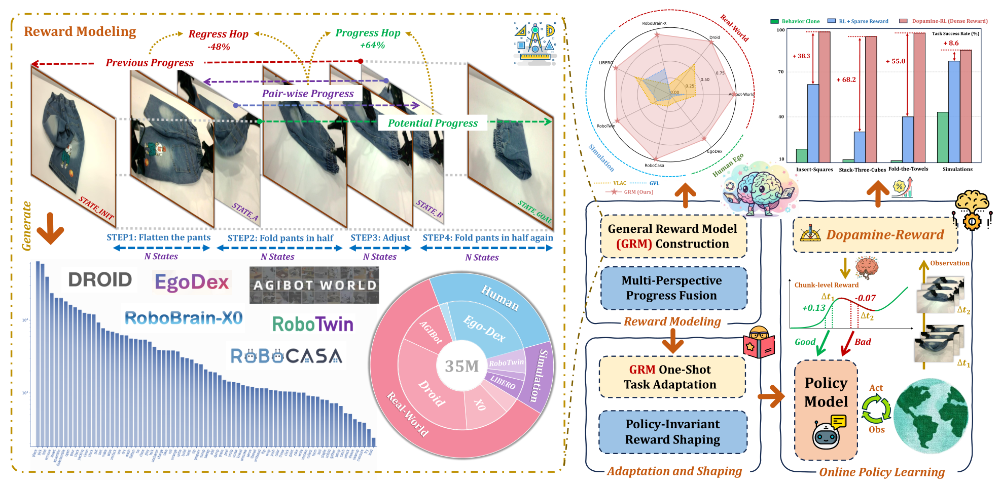
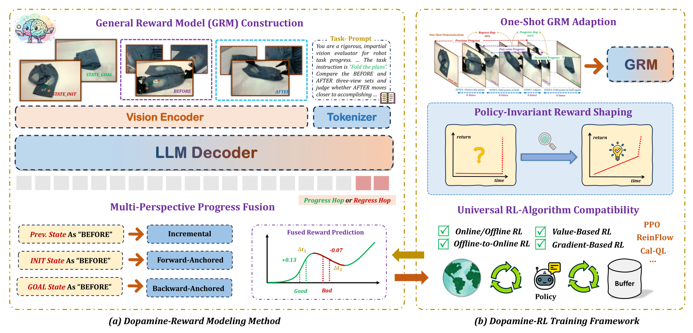
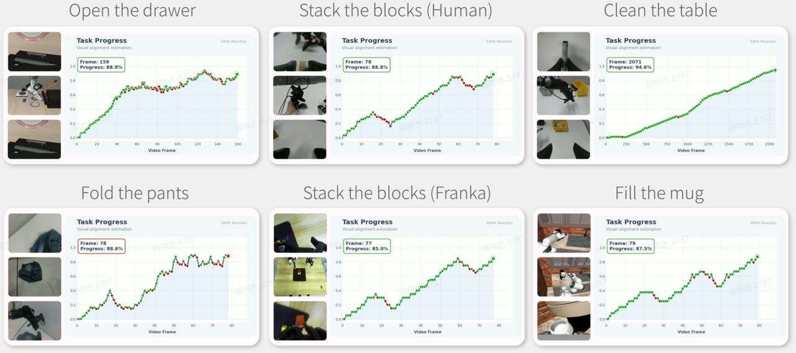
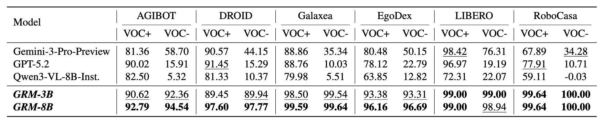

<h1 align="center">Robo-Dopamine: General Process Reward Modeling for High-Precision Robotic Manipulation</h1>

<h3 align="center">Joy is dopamine’s handiwork—whether in humans or in robotics.</h3>


<p align="center">
  <a href="https://arxiv.org/pdf/2512.23703"></a>
  &nbsp;
  <a href="https://robo-dopamine.github.io/"></a>
  &nbsp;
  <a href="https://huggingface.co/collections/tanhuajie2001/robo-dopamine"></a>
  &nbsp;
  <a href="#"></a>
  &nbsp;
  <a href="https://huggingface.co/datasets/tanhuajie2001/Robo-Dopamine-Bench"></a>
  &nbsp;

</p>


<div style="text-align: center; background-color: white;">
    
</div>


## 🗞️ News
- **`2026-03-05`**: 🔥🔥🔥 We released [Robo-Dopamine-GRM-2.0-8B-Preview](https://huggingface.co/tanhuajie2001/Robo-Dopamine-GRM-2.0-8B-Preview) model in HF. **Highly recommend trying the more versatile and stable GRM-2.0-preview version**. It currently supports ***single-view/multi-view*** use cases, ***both with and without reference target images***, please refer to [Quick Start](https://github.com/FlagOpen/Robo-Dopamine/tree/main?tab=readme-ov-file#-simple-usage) for details.
- **`2026-03-02`**: 🤗 We released [Robo-Dopamine-GRM-8B](https://huggingface.co/tanhuajie2001/Robo-Dopamine-GRM-8B) model in HF.
- **`2026-02-22`**: 🔥🔥🔥 **Robo-Dopamine** gets accepted to **CVPR 2026**! See you in Denver, Colorado, USA!
- **`2026-02-10`**: ⚡  We released data generation pipeline and finetune codes. ***Try to finetune with your own data***.
- **`2026-01-26`**: 🔍 We released [Robo-Dopamine-Bench](https://huggingface.co/datasets/tanhuajie2001/Robo-Dopamine-Bench) benchmark and evaluation codes.
- **`2026-01-08`**: 🤗 We released [Robo-Dopamine-GRM-3B](https://huggingface.co/tanhuajie2001/Robo-Dopamine-GRM-3B) model and inference codes.
- **`2025-12-30`**: ✨ Codes, Dataset and Weights are coming soon! Stay tuned for updates.
- **`2025-12-30`**: 🔥 We released our [Project Page](https://robo-dopamine.github.io/) of **Robo-Dopamine**.


## 🎯 TODO
- [x] Release Robo-Dopamine-GRM-3B model and inference codes.
- [x] Release Robo-Dopamine-Bench benchmark and evaluation codes.
- [x] Release data generation pipeline and finetune codes.
- [x] Release Robo-Dopamine-GRM-8B model.
- [x] Release more powerful and stable Robo-Dopamine-GRM-2.0-8B-Preview model.
- [ ] Release final version of Robo-Dopamine-GRM-2.0-8B model *(About 2 week)*.
- [ ] Release full GRM dataset and GRM pre-training codes *(About 1 months)*.
- [ ] Release Dopamine-RL training codes for simulator and real-world settings *(Maybe 1 months or more)*.


## 🤖 Overview

**Robo-Dopamine** is composed of two core components: ***(a) Dopamine-Reward Modeling Method --*** At the heart of our reward modeling is to build the General Reward Model (GRM), a vision-language model that is prompted with a task description and conditioned on multi-view images of initial, goal, "BEFORE," and "AFTER" states to predict a relative progress or regress hop. To ensure a stable and accurate signal, we employ *Multi-Perspective Progress Fusion*, which combines incremental, forward-anchored, and backward-anchored predictions into a final fused reward. And ***(b) Dopamine-RL Training Framework --*** The Dopamine-RL framework first adapts the pre-trained GRM to a novel task using a single demonstration, i.e., *One-Shot GRM Adaptation*. Subsequently, it uses a theoretically-sound *Policy-Invariant Reward Shaping* method to convert the GRM's dense output into a reward signal that accelerates learning without altering the optimal policy. 
This approach is universally compatible with a wide range of RL algorithms.

<div align="center"> 
    
</div>

<div align="center"> 
    
</div>


## 🤗 Model Zoo


| Models                   | Checkpoint                                                     | Description                                           | 
|--------------------------|----------------------------------------------------------------|-------------------------------------------------------|
| GRM-3B     | [🤗 tanhuajie2001/Robo-Dopamine-GRM-3B](https://huggingface.co/tanhuajie2001/Robo-Dopamine-GRM-3B)   | Full-trained GRM from RoboBrain-2.0-3B      | 
| GRM-8B     | [🤗 tanhuajie2001/Robo-Dopamine-GRM-8B](https://huggingface.co/tanhuajie2001/Robo-Dopamine-GRM-8B)   | Full-trained GRM from RoboBrain-2.0-8B      |
| 🔥 GRM-2.0-8B-Prewiew | [🤗 tanhuajie2001/Robo-Dopamine-GRM-2.0-8B-Preview](https://huggingface.co/tanhuajie2001/Robo-Dopamine-GRM-2.0-8B-Preview) | *More Powerful and Stable GRM with ST Modeling, supporting single-view/multi-view cases, both with and without reference target images*     |

## 🛠️ Setup

```bash
# clone repo.
git clone https://github.com/FlagOpen/Robo-Dopamine.git
cd Robo-Dopamine

# build conda env., and require `cuda >=12.8`
conda create -n robo-dopamine python=3.10
conda activate robo-dopamine
pip install -r requirements.txt
```

## 💡 Simple Usage

The following are simple and practical examples of the three inference modes (Incremental-Mode, Forward-Mode, and Backward-Mode). In practice, to predict the task state reward more accurately, ***we highly recommend averaging the inference reward results from all three modes to use as the final reward in RL***.

```python
import os
from examples.inference import GRMInference

model = GRMInference("tanhuajie2001/Robo-Dopamine-GRM-2.0-8B-Preview")

TASK_INSTRUCTION = "organize the table"
BASE_DEMO_PATH = "./examples/demo_table"
OUTPUT_ROOT = "./results"

## Note: If no reference/goal image is provided, 
## please replace `GOAL_IMAGE_PATH` with the blank image "./examples/blank_goal.png".
GOAL_IMAGE_PATH = "./examples/demo_table/goal_image.png" # "./examples/blank_goal.png"

# select prediction model: Forward-Mode, Incremental-Mode or Backward-Mode
PREDICTION_MODE = "forward" # "incremental" or "backward"

# multi-view usage:
output_dir = model.run_pipeline(
    cam_high_path  = os.path.join(BASE_DEMO_PATH, "cam_high.mp4"),
    cam_left_path  = os.path.join(BASE_DEMO_PATH, "cam_left_wrist.mp4"),
    cam_right_path = os.path.join(BASE_DEMO_PATH, "cam_right_wrist.mp4"),
    out_root       = OUTPUT_ROOT,
    task           = TASK_INSTRUCTION,
    frame_interval = 10, # modify frame_interval as desired, but it shouldn't be set too small if using 'incremental'.
    batch_size     = 1, # please increase batch_size > 1, if you have enough GPU memory.
    goal_image     = GOAL_IMAGE_PATH,
    eval_mode      = PREDICTION_MODE,
    visualize      = True
)
print(f"Episode ({BASE_DEMO_PATH}) processed with multi-view {PREDICTION_MODE}-mode. Output at: {output_dir}")

# single-view usage:
output_dir = model.run_pipeline(
    cam_high_path  = os.path.join(BASE_DEMO_PATH, "cam_high.mp4"),
    cam_left_path  = os.path.join(BASE_DEMO_PATH, "cam_high.mp4"), # repeat cam_high
    cam_right_path = os.path.join(BASE_DEMO_PATH, "cam_high.mp4"), # repeat cam_high
    out_root       = OUTPUT_ROOT,
    task           = TASK_INSTRUCTION,
    frame_interval = 10, # modify frame_interval as desired, but it shouldn't be set too small if using 'incremental'.
    batch_size     = 1, # please increase batch_size > 1, if you have enough GPU memory.
    goal_image     = GOAL_IMAGE_PATH,
    eval_mode      = PREDICTION_MODE,
    visualize      = True
)
print(f"Episode ({BASE_DEMO_PATH}) processed with single-view {PREDICTION_MODE}-mode. Output at: {output_dir}")

```

## ✨ More Cases for Testing
Many thanks to [Robometer](https://github.com/robometer/robometer) for providing more interesting test examples 🤗. To better demonstrate the usage of **'single-view without goal image'** with our latest [Robo-Dopamine-GRM-2.0-8B-Preview](https://huggingface.co/tanhuajie2001/Robo-Dopamine-GRM-2.0-8B-Preview) model, we also provide the following reference script for your easy tests.

```python
import os
from examples.inference import GRMInference

model = GRMInference("tanhuajie2001/Robo-Dopamine-GRM-2.0-8B-Preview")

## Note: If no target/goal image is provided, 
## please replace `GOAL_IMAGE_PATH` with the blank image!
GOAL_IMAGE_PATH = "./examples/blank_goal.png" 

# select prediction mode: Forward-Mode, Incremental-Mode or Backward-Mode
PREDICTION_MODE =  "forward" # "incremental" or "backward"

OUTPUT_ROOT = "./results"

# 1. open red drawer
output_dir = model.run_pipeline(
    cam_high_path  = "./examples/more_demos/open_red_drawer_wrist.mp4",
    cam_left_path  = "./examples/more_demos/open_red_drawer_wrist.mp4",
    cam_right_path = "./examples/more_demos/open_red_drawer_wrist.mp4",
    out_root       = OUTPUT_ROOT,
    task           = "open red drawer",
    frame_interval = 5, 
    batch_size     = 1, 
    goal_image     = GOAL_IMAGE_PATH,
    eval_mode      = PREDICTION_MODE,
    visualize      = True
)
print(f"Episode processed with single-view {PREDICTION_MODE}-mode. Output at: {output_dir}")

# 2. put marker in cup (fail case)
output_dir = model.run_pipeline(
    cam_high_path  = "./examples/more_demos/put_marker_in_cup_fail.mp4",
    cam_left_path  = "./examples/more_demos/put_marker_in_cup_fail.mp4",
    cam_right_path = "./examples/more_demos/put_marker_in_cup_fail.mp4",
    out_root       = OUTPUT_ROOT,
    task           = "put marker in cup",
    frame_interval = 5, 
    batch_size     = 1, 
    goal_image     = GOAL_IMAGE_PATH,
    eval_mode      = PREDICTION_MODE,
    visualize      = True
)
print(f"Episode processed with single-view {PREDICTION_MODE}-mode. Output at: {output_dir}")

# 3. push green block in green bowl
output_dir = model.run_pipeline(
    cam_high_path  = "./examples/more_demos/push_green_block_in_green_bowl.mp4",
    cam_left_path  = "./examples/more_demos/push_green_block_in_green_bowl.mp4",
    cam_right_path = "./examples/more_demos/push_green_block_in_green_bowl.mp4",
    out_root       = OUTPUT_ROOT,
    task           = "push green block in green bowl",
    frame_interval = 5, 
    batch_size     = 1, 
    goal_image     = GOAL_IMAGE_PATH,
    eval_mode      = PREDICTION_MODE,
    visualize      = True
)
print(f"Episode processed with single-view {PREDICTION_MODE}-mode. Output at: {output_dir}")

# 4. put apple in tray
output_dir = model.run_pipeline(
    cam_high_path  = "./examples/more_demos/put_apple_in_tray.mp4",
    cam_left_path  = "./examples/more_demos/put_apple_in_tray.mp4",
    cam_right_path = "./examples/more_demos/put_apple_in_tray.mp4",
    out_root       = OUTPUT_ROOT,
    task           = "put apple in tray",
    frame_interval = 5, 
    batch_size     = 1, 
    goal_image     = GOAL_IMAGE_PATH,
    eval_mode      = PREDICTION_MODE,
    visualize      = True
)
print(f"Episode processed with single-view {PREDICTION_MODE}-mode. Output at: {output_dir}")

```
We have attached the visualization results from these tests below. ***Please feel free to open an issue if you have any questions when testing the provided examples or your own test cases.*** 🤗 🤗 🤗

[Demo Result 1](https://github.com/user-attachments/assets/23474262-e61a-4f86-b2e5-c3b426292536) | [Demo Result 2](https://github.com/user-attachments/assets/85adb149-0589-4237-907a-faedc9034058) | [Demo Result 3](https://github.com/user-attachments/assets/3e1db271-688e-4e2b-9847-076e0d358f70) | [Demo Result 4](https://github.com/user-attachments/assets/46588f92-6004-4aec-91c6-a0775a0890d2)


## 🔍 Evaluation

### 0. Download `Robo-Dopamine-Bench` from huggingface.
```bash 
# download benchmark
huggingface-cli download --repo-type dataset --resume-download tanhuajie2001/Robo-Dopamine-Bench --local-dir ./Robo-Dopamine-Bench

# unzip images
cd Robo-Dopamine-Bench
unzip image.zip
cd ..
```

### 1. Evaluate local GRM with vLLM.
```bash
# GRM-3B
export CUDA_VISIBLE_DEVICES=0 
python -m eval.evaluation_grm \
  --model_path tanhuajie2001/Robo-Dopamine-GRM-3B \
  --input_json_dir ./Robo-Dopamine-Bench/jsons \
  --base_dir ./Robo-Dopamine-Bench/images \
  --out_root_dir ./eval_results/results_Robo-Dopamine-GRM-3B \
  --batch_size 16

# GRM-8B
export CUDA_VISIBLE_DEVICES=0 
python -m eval.evaluation_grm \
  --model_path tanhuajie2001/Robo-Dopamine-GRM-8B \
  --input_json_dir ./Robo-Dopamine-Bench/jsons \
  --base_dir ./Robo-Dopamine-Bench/images \
  --out_root_dir ./eval_results/results_Robo-Dopamine-GRM-8B \
  --batch_size 16
```

### 2. Evaluate other models with API.
```bash
python -m eval.evaluation_api \
  --model_name <MODEL-NAME, e.g., gpt-4o, gemini-3-pro> \
  --api_key <OPENAI-API-KEY> \
  --base_url <OPENAI-BASE-URL> \
  --input_json_dir ./Robo-Dopamine-Bench/jsons \
  --base_dir ./Robo-Dopamine-Bench/images \
  --out_root_dir ./eval_results/results_{MODEL-NAME} \
  --max_workers 16
```

***EVALUATION RESULTS***
<div align="center"> 
    
</div>


## ⚡ Fine-Tuning
### Step 1. Reconstruct Your Own Dataset

***Raw Data Directory Structure***: The [`dataset/example_raw_data`](https://github.com/FlagOpen/Robo-Dopamine/tree/main/dataset/example_raw_data) directory serves as **an EXAMPLE** to demonstrate the required structure for your own raw data, ensuring compatibility with our provided data processing scripts.
```
example_raw_data/
├── episode_001/
│   ├── annotated_keyframes.json   # Keyframe annotations for subtask segmentation
│   ├── cam_high.mp4               # Video from the high-mounted camera
│   ├── cam_left_wrist.mp4         # Video from the left wrist-mounted camera
│   └── cam_right_wrist.mp4        # Video from the right wrist-mounted camera
├── episode_002/
│   ├── annotated_keyframes.json
│   ├── cam_high.mp4
│   ├── cam_left_wrist.mp4
│   └── cam_right_wrist.mp4
├── episode_003/
│   ├── annotated_keyframes.json
│   ├── cam_high.mp4
│   ├── cam_left_wrist.mp4
│   └── cam_right_wrist.mp4
├── ...
├── episode_xxx/                   # Generalized episode directory (xxx = episode number)
│   ├── annotated_keyframes.json
│   ├── cam_high.mp4
│   ├── cam_left_wrist.mp4
│   └── cam_right_wrist.mp4
└── task_instruction.json          # Natural language task instructions (shared across all episodes)
```

### Step 2. Process Your Own Dataset 

Here, we use [`dataset/example_raw_data`](https://github.com/FlagOpen/Robo-Dopamine/tree/main/dataset/example_raw_data) as an example.

```bash
cd dataset

# first, pre-process the raw data with sample_factor
python -m utils.0_preprocess_data \
  --raw_dir ./example_raw_data \
  --cvt_dir ./train_data \
  --sample_factor 20

# then, generate training data with bin-sampling strategy
python -m utils.1_generate_data \
  --base-dir ./train_data \
  --score-bins 25 \
  --gap-bins 4 \
  --oversample-factor 100 \
  --zero-ratio 0.05 \
  --max_sample_num 1000

# finally, post-process the sampled data for fine-tuning
python -m utils.2_posprocess_data \
  --root-dir ./train_data \
  --merged-json ./train_data/train_jsons/finetune_data_wo_replace.json \
  --final-json ./train_data/train_jsons/finetune_data_final.json \
  --replace-prob 0.75

```

### Step 3. Fine-Tune GRM with Your Own Dataset 

**Add the meta-info of your own dataset to `train/qwenvl/data/__init__.py`**
```python
# modified here
EXAMPLE_GRM_FINETUNE = {
    "annotation_path": "./dataset/train_data/train_jsons/finetune_data_final.json",
    "data_path": "./dataset",
}

# modified here
data_dict = {
    "example_grm_finetune": EXAMPLE_GRM_FINETUNE,
}
```

**Modify the path of training script `train/scripts/finetune_grm.sh`**
```python
# ======================
# Path Configuration
# ======================
MODEL_PATH="tanhuajie2001/Robo-Dopamine-GRM-3B" # modified here
OUTPUT_DIR="./checkpoints/example_grm_finetune" # modified here
DATASETS=example_grm_finetune                   # modified here
```

**Launch the training script**
```bash
cd ../train
bash scripts/finetune_grm.sh
```


## 🤖 Dopamine-RL Infra
***Coming soon ...***


## 📑 Citation

If you find our work helpful, feel free to cite it:
```
@article{tan2025robo,
  title={Robo-Dopamine: General Process Reward Modeling for High-Precision Robotic Manipulation},
  author={Tan, Huajie and Chen, Sixiang and Xu, Yijie and Wang, Zixiao and Ji, Yuheng and Chi, Cheng and Lyu, Yaoxu and Zhao, Zhongxia and Chen, Xiansheng and Co, Peterson and others},
  journal={arXiv preprint arXiv:2512.23703},
  year={2025}
}
```
