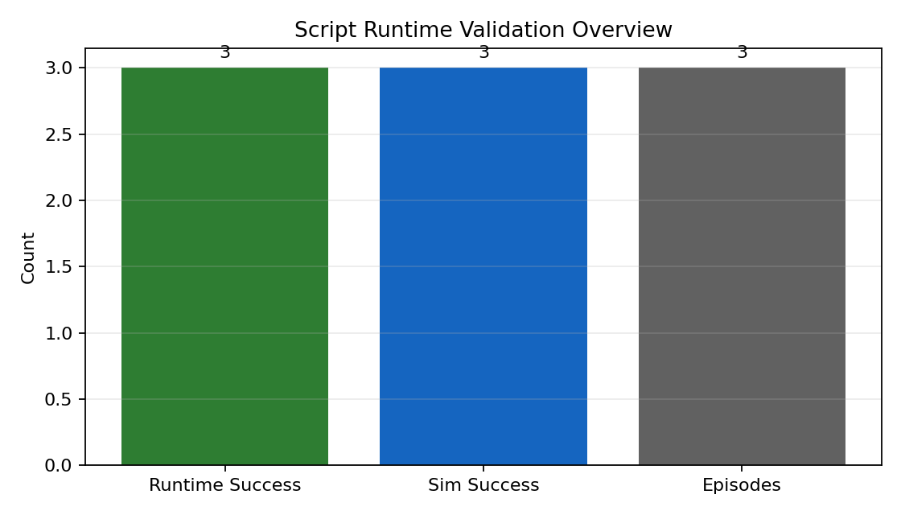
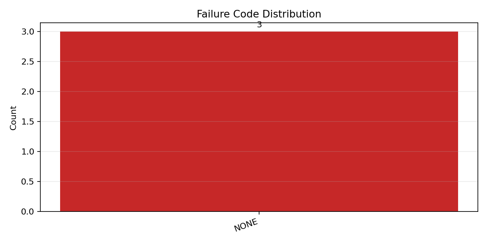
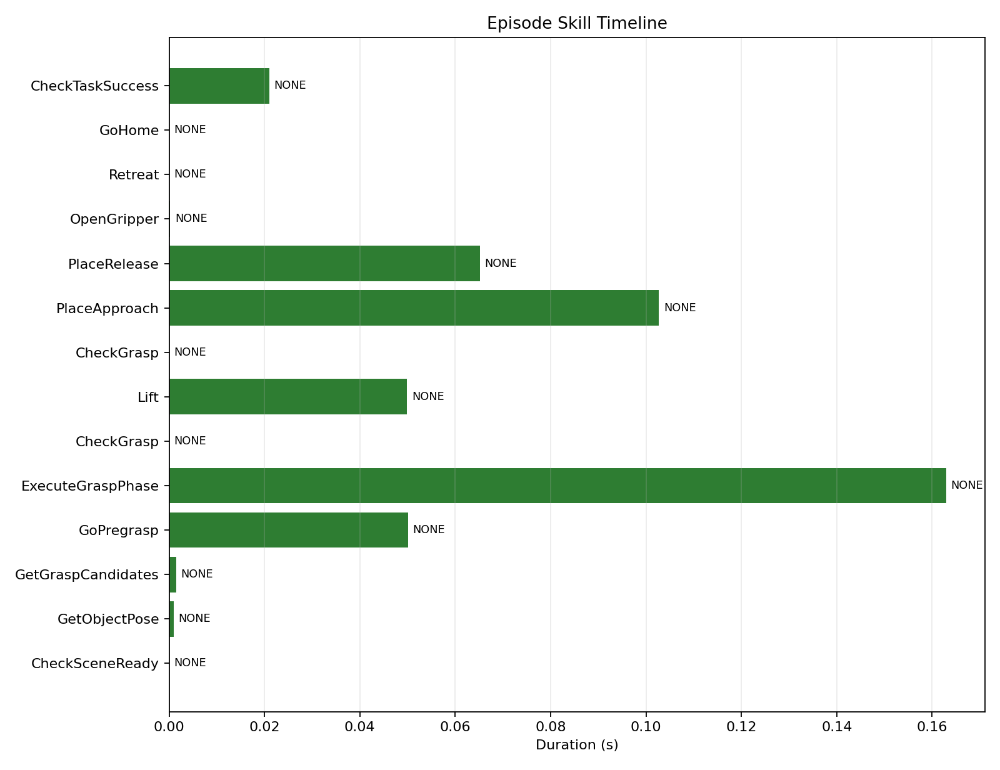

# Script Runtime Validation Report

- Episodes: 3
- Runtime successes: 3
- Sim successes: 3
- Failure code counts: `{'NONE': 3}`
- Failed skill counts: `{}`

## Visuals

- Timeline source: `script_runtime/artifacts/maniskill_validation/episode_000.jsonl`

## Episodes

- Episode 0: task=SUCCESS sim_success=True
  rollout: `script_runtime/artifacts/maniskill_validation/episode_000_rollout.gif`
  grounding: `script_runtime/artifacts/maniskill_validation/episode_000_grounding_topdown.png`
  grounding_json: `script_runtime/artifacts/maniskill_validation/episode_000_grounding.json`
- Episode 1: task=SUCCESS sim_success=True
  rollout: `script_runtime/artifacts/maniskill_validation/episode_001_rollout.gif`
  grounding: `script_runtime/artifacts/maniskill_validation/episode_001_grounding_topdown.png`
  grounding_json: `script_runtime/artifacts/maniskill_validation/episode_001_grounding.json`
- Episode 2: task=SUCCESS sim_success=True
  rollout: `script_runtime/artifacts/maniskill_validation/episode_002_rollout.gif`
  grounding: `script_runtime/artifacts/maniskill_validation/episode_002_grounding_topdown.png`
  grounding_json: `script_runtime/artifacts/maniskill_validation/episode_002_grounding.json`
