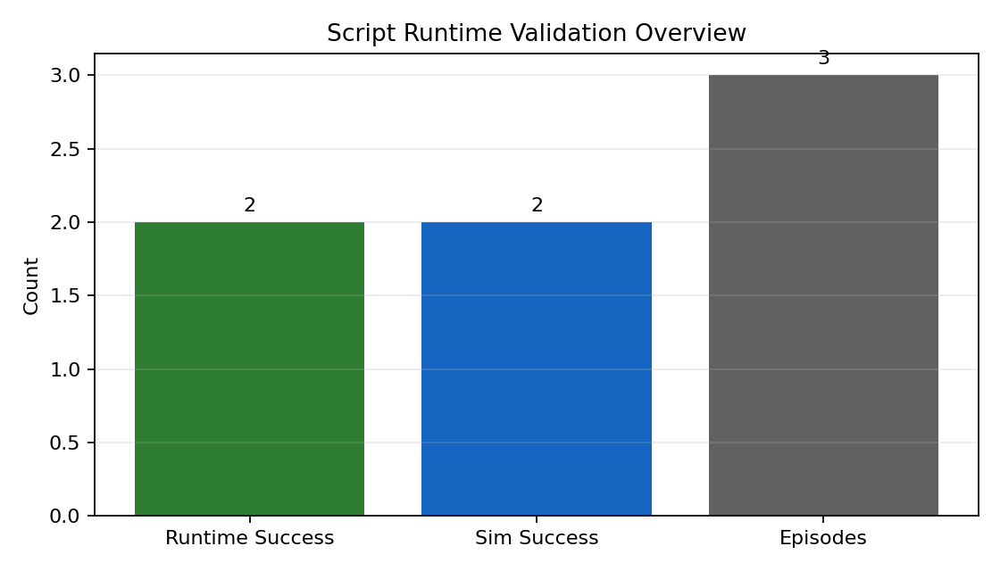
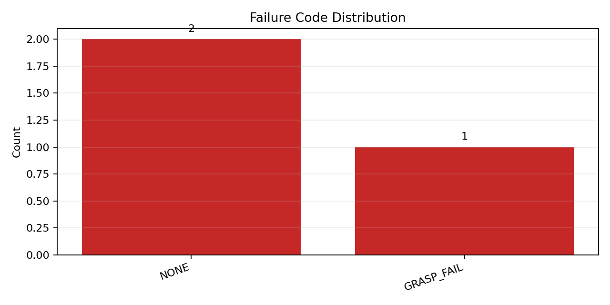
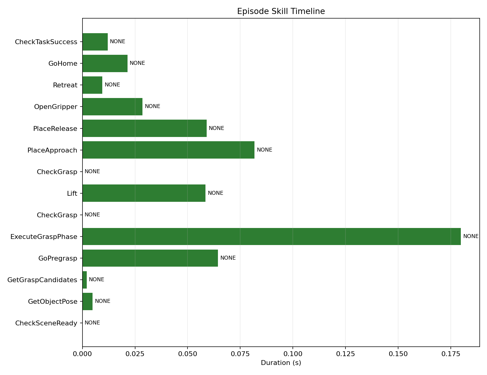

# Script Runtime Validation Report

- Episodes: 3
- Runtime successes: 2
- Sim successes: 2
- Failure code counts: `{'NONE': 2, 'GRASP_FAIL': 1}`
- Failed skill counts: `{'ExecuteGraspPhase': 6}`

## Visuals

- Timeline source: `script_runtime/artifacts/stack_cube_validation/episode_000.jsonl`

## Episodes

- Episode 0: task=SUCCESS sim_success=True
  rollout: `script_runtime/artifacts/stack_cube_validation/episode_000_rollout.gif`
  grounding: `script_runtime/artifacts/stack_cube_validation/episode_000_grounding_topdown.png`
  grounding_json: `script_runtime/artifacts/stack_cube_validation/episode_000_grounding.json`
- Episode 1: task=SUCCESS sim_success=True
  rollout: `script_runtime/artifacts/stack_cube_validation/episode_001_rollout.gif`
  grounding: `script_runtime/artifacts/stack_cube_validation/episode_001_grounding_topdown.png`
  grounding_json: `script_runtime/artifacts/stack_cube_validation/episode_001_grounding.json`
- Episode 2: task=FAILURE sim_success=False
  rollout: `script_runtime/artifacts/stack_cube_validation/episode_002_rollout.gif`
  grounding: `script_runtime/artifacts/stack_cube_validation/episode_002_grounding_topdown.png`
  grounding_json: `script_runtime/artifacts/stack_cube_validation/episode_002_grounding.json`
